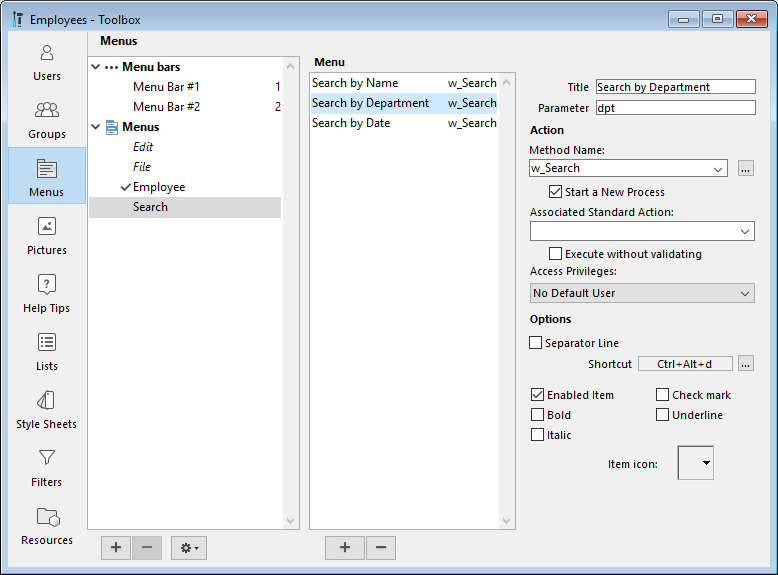

You can create menu bars and menus for your 4D applications. Because pull-down menus are a standard feature of any desktop application, their addition will make your applications easier to use and will make them feel familiar to users. 

A **menu bar** is a group of menus that can be displayed on a screen together. Each **menu** on a menu bar can have numerous menu commands in it, including some that call cascading submenus (or hierarchical submenus). When the user chooses a menu or submenu command, it calls a project method or a standard action that performs an operation.

You can have many separate menu bars for each application. For example, you can use one menu bar that contains menus for standard operations on the database and another that becomes active only for reporting. One menu bar may contain a menu with menu commands for entering records. The menu bar appearing with the input form may contain the same menu, but the menu commands are disabled because the user doesn’t need them during data entry.

You can use the same menu in several menu bars or other menus, or you can leave it unattached and manage it only by programming (in this case, it is known as an independent menu). 

When you design menus, keep the following two rules in mind:
- Use menus for functions that are suited to menus: Menu commands should perform tasks such as adding a record, searching for records, or printing a report.
- Group menu commands by function: For example, all menu commands that print reports should be in the same menu. For another example, you might have all the operations for a certain table in one menu.

To create menus and menu bars, you can use either:

- the Menu editor from the Toolbox,
- language commands for the "Menus" theme,
- a combination of both.

## Menu editor
The Menu editor is accessed using the **Menus** button of the Toolbox. 

Menus and menu bars are displayed as two items of the same hierarchical list, on the left side of the dialog box. Each menu can be attached to a menu bar or to another menu. In the second case, the menu becomes a sub-menu.

4D assigns menu bar numbers sequentially — Menu Bar #1 appears first. You can rename menu bars but you cannot change their numbers. These numbers are used by the language commands.
