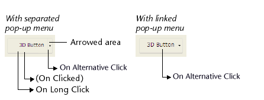

|Code|Can be called by|Definition|  
|---|---|---|
|38|[Button](FormObjects/button_overview.md) - [List Box](FormObjects/listbox_overview.md) - [List Box Column](FormObjects/listbox_overview.md#list-box-columns)|<li>Buttons: The "arrow" area of a button is clicked</li><li>List boxes: In a column of an object array, an ellipsis button ("alternateButton" attribute) is clicked</li>|

## Description

### Buttons

Some button styles can be [linked to a pop-up menu](FormObjects/properties_TextAndPicture.md#with-pop-up-menu) and display an triangle. Clicking on this triangle causes a selection pop-up to appear that provides a set of alternative actions in relation to the primary button action.

4D allows you to manage this type of button using the `On Alternative Click` event. This event is generated when the user clicks on the triangle (as soon as the mouse button is held down):

- If the pop-up menu is **separated**, the event is only generated when a click occurs on the portion of the button with the arrow. Note that the [standard action](https://doc.4d.com/4Dv19R7/4D/19-R7/Standard-actions.300-6013479.en.html) assigned to the button (if any) is not executed in this case.
- If the pop-up menu is **linked**, the event is generated when a click occurs on any part of the button. Note that the [`On Long Click`](onLongClick.md) event cannot be generated with this type of button.

### List box

This event is generated in columns of [object array type list boxes](FormObjects/listbox_overview.md#object-arrays-in-columns-4d-view-pro), when the user clicks on a widget ellipsis button ("alternateButton" attribute).

See the [description of the "alternateButton" attribute](FormObjects/listbox_overview.md#alternatebutton).
