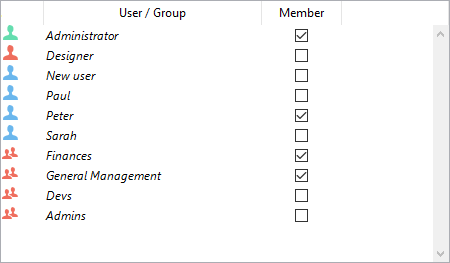

In multi-user applications, 4D provides users with certain standard access privileges and certain powers. Once a users and groups system has been initiated, these standard privileges take effect. 

## Users and groups in projects

In project applications (.4DProject or .4dz files), 4D users and groups can be configured in both single-user and multi-user environments. However, **access control** is only effective with 4D Server. The following table lists the main users and groups features and their availability:

||4D (single-user)|4D Server|  
|---|---|---|
|Adding/editing users and groups|yes|yes|
|Assigning user/group access to servers|yes|yes|
|User identification|no (all users are Designer)|yes|
|Access control once the Designer has been assigned a password|no (all access are Designer)|yes|

> For information about user identification and access control in single-user deployments, see [this paragraph](overview.md#access-control-in-single-user-applications). 

## Designer and Administrator

The most powerful user is named **Designer**. No aspect of the application is closed to the Designer. 
The Designer can:
- access all application servers without restriction,
- create users and groups, 
- assign access privileges to groups, 
- access the Design environment.
In single-user environment, Designer access rights are always used. 
In client/server environment, assigning a password to the Designer activates the display of the 4D user login dialog.  Access to Design environment is read-only.

After the Designer, the next most powerful user is the **Administrator**, who is usually given the tasks of managing the access system and administration features.

The Administrator can:
- create users and groups, 
- access the 4D Server Administration window and monitor 
- access the MSC window to monitor backup, restore, or server. 

The Administrator cannot:
- edit the Designer user
- by default, access to protected parts of the application. In particular, the Administrator cannot access to the Design mode if it is restricted. The Administrator must be part of one or more groups to have access privileges in the application. The Administrator is placed in every new group, but you can remove the Administrator’s name from any group.

Both the Designer and Administrator are available by default in all applications. In the [user management dialog box](#users-and-groups-editor), the icons of the Designer and Administrator are displayed in red and green respectively:

- Designer icon: 
- Administrator icon: 

You can rename the Designer and Administrator users. In the language, the Designer ID is always 1 and the Administrator ID is always 2.

The Designer and Administrator can each create up to 16,000 groups and 16,000 users.

## Users editor

The editor for users is located in the Toolbox of 4D. 

> Users and groups editor can be displayed at runtime using the [EDIT ACCESS](https://doc.4d.com/4dv19R/help/command/en/page281.html) command. 
> The whole users and groups configuration can also be edited during application execution using 4D language commands of the `Users and Groups` theme.  

### Adding and modifying users

You use the users editor to create user accounts, set their properties and assign them to various groups. 

To add a user from the Toolbox :

1. Select **Tool Box > Users** from the **Design** menu or click on the **Tool Box** button of the 4D toolbar.
4D displays the users editor. 

The list of users displays all the users, including the [Designer and the Administrator](#designer-and-administrator).

2. Click on the  button located below the list of users.
OR
Right-click in the list of users and choose **Add** or **Duplicate** in the context menu.

> The **Duplicate** command can be used to create several users having the same characteristics quickly.

4D adds a new user to the list, named "New userX" by default.

3. Enter the user name. 
This name will be used by the user to open the application. You can rename a user at any time using the **Rename** command of the context menu, or by using the Alt+click (Windows) or Option+click (macOS) shortcuts, or by clicking twice on the name you want to change.

4. To enter a password for the user, click the **Edit...** button in the user properties area and enter the password twice in the dialog box. 
You can use up to 15 alphanumeric characters for a password. The password editor is case sensitive.

> Users can change their password at any time according to the options in the "Security" page of the structure settings, or using the `CHANGE PASSWORD` command. 

5. Set the group(s) to which the user belongs using the "Member of Groups" table.
You can add or remove the selected user to/from a group by checking the corresponding option in the Member column.

The membership of users to different groups can also be set by group on the [Groups page](#configuring-access-groups).

### Deleting a user

To delete a user, select it then click the deletion button or use the **Delete** command of the context menu.

Deleted user names no longer appear in the Users editor. Note that the IDs for deleted users are reassigned when new user accounts are created. 

### User properties

- **User Kind**: The User Kind field contains "Designer", "Administrator", or (for all other users) "User".

- **Startup Method**: Name of an associated method that will be automatically executed when the user opens the application (optional). This method can be used for example to load the user preferences. 

## Groups editor

The editor for groups is located in the Toolbox of 4D. 

### Configuring groups  

You use the groups editor to set the elements that each group contains (users and/or other groups) and to distribute access to plug-ins. 

Keep in mind that once a group has been created, it cannot be deleted. If you want to deactivate a group, you just need to remove any users it contains. 

To create a group:

1. Select **Tool Box > Groups** in the **Design** menu or click  on the **Tool Box** button of the 4D toolbar then on the **Groups** button.
4D displays the groups editor window. The list of groups displays all the groups of the application project.

2. Click on the  button located below the list of groups.  
OR  
Right-click in the list of groups and choose the **Add** or **Duplicate** command in the context menu.

> The Duplicate command can be used to create several groups having the same characteristics quickly.

4D adds a new group to the list, named "New groupX" by default.

3. Enter the name of the new group.
The group name can be up to 15 characters long.
You can rename a group at any time using the **Rename** command of the context menu, or by using the Alt+click (Windows) or Option+click (macOS) shortcuts, or by clicking twice on the name you want to change.

### Placing users or groups into groups  

You can place any user or group into a group, and you can also place the group itself into several other groups. It is not mandatory to place a user in a group. 

To place a user or group in a group, you simply need to check the "Member" option for each user or group in the member attribution area:

If you check the name of a user, this user is added to the group. If you check the name of a group, all the users of the group are added to the new group.
The affiliated user or group will then have the same access privileges as those assigned to the new group. 

Placing groups into other groups lets you create a user hierarchy. The users of a group placed in another group will have the access privileges of both groups. See "[An access hierarchy scheme](#an-access-hierarchy-scheme)" below.

To remove a user or group from another group, you just need to deselect the corresponding option in the member attribution area.

### Assigning a group to a plug-in or to a server  

You can assign a group privileges to any plug-ins installed in the project. This includes all the 4D plug-ins and any third-party plug-ins. 
 
Distributing access to the plug-ins lets you control the use of the licenses you possess for these plug-ins. Any users that do not belong to the access group of a plug-in cannot load this plug-in.

> Used licenses remain attached to 4D user accounts in the group for the whole 4D session. 

The “Plug-in” area on the Groups page of the tool box lists all the plug-ins loaded by the 4D application. To give a group access to a plug-in, you simply need to check the corresponding option. 

The **4D Client Web Server** and **4D Client SOAP Server** items lets you control the possibility of Web and SOAP (Web Services) publication for each 4D in remote mode. These licenses are considered as plug-in licenses by 4D Server. Therefore, in the same way as for plug-ins, you can restrict the right to use these licenses to a specific group of users.

### An access hierarchy scheme

The best way to ensure the security of your application and provide users with different levels of access is to use an access hierarchy scheme. Users can be assigned to appropriate groups and groups can be nested to create a hierarchy of access rights. This section discusses several approaches to such a scheme.

In this example, a user is assigned to one of three groups depending on their level of responsibility. Users assigned to the Accounting group are responsible for data entry. Users assigned to the Finances group are responsible for maintaining the data, including updating records and deleting outdated records. Users assigned to the General Management group are responsible for analyzing the data, including performing searches and printing analytical reports.

The groups are then nested so that privileges are correctly distributed to the users of each group. 

- The General Management group contains only “high-level” users.

- The Finances group contains data maintenance users as well as General Management users, thus the users in General Management have the privileges of the Finances group as well.

- The Accounting group contains data entry users as well as Finances group users, so the users who belong to the Finances group and the General Management group enjoy the privileges of the Accounting group as well.

You can decide which access privileges to assign to each group based on the level of responsibility of the users it includes.

Such a hierarchical system makes it easy to remember to which group a new user should be assigned. You only have to assign each user to one group and use the hierarchy of groups to determine access.

## Assigning group access

Groups are assigned access privileges to specific parts or features of the application: 

- Design and Runtime Explorer access, 
- HTTP server, 
- REST server, 
- SQL server. 

These accesses are defined in the Settings dialog. The following example shows Design and Runtime explorer access rights being assigned to the "Devs" group: 

You also use groups to [distribute available licenses](#assigning-a-group-to-a-plug-in-or-to-a-server). This distribution is defined in the Groups editor.

## Directory.json file

Users, groups, as well as their access rights are stored in a specific project file named **directory.json**.

This file can be stored at the following locations, depending on your needs:

- If you want to use the same directory for all data files (or if you use a single data file), store the **directory.json** file in the user settings folder, i.e. in the "Settings" folder at the [same level as the "Project" folder](Project/architecture.md#project-folder) (default location). 
- If you want to use a specific directory file per data file, store the **directory.json** file in the data settings folder, i.e. in the ["Settings" folder of the "Data" folder](Project/architecture.md#settings). If a **directory.json** file is present at this location, it takes priority over the file in the user settings folder. This custom/local Users and Groups configuration will left untouched by an application upgrade.  

> To allow for safe changes of passwords and group memberships in a deployed environment, you can include your **directory.json** file in the server application during the build, using the [corresponding build application option](../Desktop/building.md#embed-the-project-users-and-groups-in-built-server-application).

