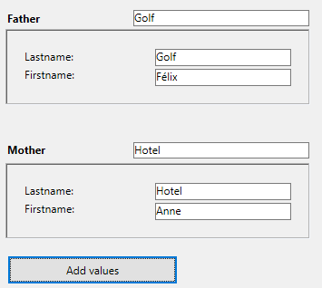

A subform is a form included in another form.


## Terminology  

In order to clearly define the concepts implemented with subforms, here are some definitions for certain terms used:

*	**Subform**: a form intended for inclusion in another form, itself called the parent form.
*	**Parent form**: a form containing one or more subform(s).
*	**Subform container**: an object included in the parent form, displaying an instance of the subform.
*	**Subform instance**: the representation of a subform in a parent form. This concept is important because it is possible to display several instances of the same subform in a parent form.
*	**List form**: instance of subform displayed as a list.
*	**Detail form**: page-type input form associated with a list-type subform that can be accessed by double-clicking in the list.


## List subforms

A list subform lets you enter, view, and modify data in other tables. You usually use list subforms in databases in which you have established One to Many relations. A list subform on a form in a related One table lets you view, enter, and modify data in a related Many table. You can have several subforms coming from different tables in the same form. However, it is not possible to place two subforms that belong to the same table on the same page of a form. 

For example, a Contacts manager database might use a list subform to display all the telephone numbers for a particular contact. Although the telephone numbers appear on the Contacts screen, the information is actually stored in a related table. Using a One to Many relation, this database design makes it easy to store an unlimited number of telephone numbers per contact. With automatic relations, you can support data entry directly into the related Many table without programming.

Although list subforms are generally associated with Many tables, a subform instance can display the records of any other database table.

You can also allow the user to enter data in the List form.
Depending on the configuration of the subform, the user may display the detail form by double-clicking on a subrecord or by using the commands for adding and editing subrecords.

> 4D offers three standard actions to meet the basic needs for managing subrecords: `Edit Subrecord`, `Delete Subrecord`, and `Add Subrecord`. When the form includes several subform instances, the action will apply to the subform that has the focus. 


## Page subforms

Page subforms can display the data of the current subrecord or any type of pertinent value depending on the context (variables, pictures, and so on). One of the main advantages of using page subforms is that they can include advanced functionalities and can interact directly with the parent form (widgets). Page subforms also have their own specific properties and events; you can manage them entirely by programming.

The page subform uses the input form indicated by the [Detail Form](properties_Subform.md#detail-form) property. Unlike a list subform, the form used can come from the same table as the parent form. It is also possible to use a project form. When executed, a page subform has the same standard display characteristics as an input form.

> 4D Widgets are predefined compound objects based upon page subforms. They are described in detail in a separate manual, [4D Widgets](https://doc.4d.com/4Dv19/4D/19/4D-Widgets.100-5462909.en.html).


### Using the bound variable or expression

You can bind [a variable or an expression](properties_Object.md#variable-or-expression) to a subform container object. This is very useful to synchronize values from the parent form and its subform(s). 

By default, 4D creates a variable or expression of [object type](properties_Object.md#expression-type) for a subform container, which allows you to share values in the context of the subform using the `Form` command ([see below](#using-the-subform-bound-object)). However, you can use a variable or expression of any scalar type (time, integer, etc.) especially if you only need to share a single value:

- Define a bound variable or expression of a scalar type and call the `OBJECT Get subform container value` and `OBJECT SET SUBFORM CONTAINER VALUE` commands to exchange values when [On Bound Variable Change](../Events/onBoundVariableChange.md) or [On Data Change](../Events/onDataChange.md) form events occur. This solution is recommended to synchronize a single value.
- Define a bound variable or expression of the **object** type and use the `Form` command to access its properties from the subform. This solution is recommended to synchronize several values.


### Synchronizing parent form and subform (single value)

Binding the same variable or expression to your subform container and other objects of the parent form lets you link the parent form and subform contexts to put the finishing touches on sophisticated interfaces. Imagine a subform that contains a clock displaying a static time, inserted into a parent form containing an [input area](input_overview.md):


In the parent form, both objects (input area and subform container) **have the same value as *Variable or Expression***. It can be a variable (e.g. `parisTime`), or an expression (e.g. `Form.parisTime`). 

:::info

To display a static time, you must use the appropriate [data type](properties_DataSource.md#data-type-expression-type) for the [variable or expression](properties_Object.md#variable-or-expression):

- If you use a variable (e.g. `parisTime`), it must be of the `text` or `time` type.
- If you use an expression (e.g. `Form.myValue`), it must contain a `text` value.

The text value must be formatted "hh:mm:ss".

:::

In the subform, the clock object is managed through the `Form.clockValue` property.


#### Updating the contents of a subform

Case 1: The value of the parent form variable or expression is modified and this modification must be passed on to a subform. 

`parisTime` or `Form.parisTime` changes to "12:15:00" in the parent form, either because the user entered it, or because it was updated dynamically (via the `String(Current time)` statement for example). This triggers the [On Bound Variable Change](../Events/onBoundVariableChange.md) event in the subform's Form method. 

The following code is executed:

```4d  
// Subform form method
If (Form event code=On Bound Variable Change) //bound variable or expression was modified in the parent form
	Form.clockValue:=OBJECT Get subform container value //synchonize the local value
End if
```

It updates the value of `Form.clockValue` in the subform:


The [On Bound Variable Change](../Events/onBoundVariableChange.md) form event is generated:

- as soon as a value is assigned to the variable/expression of the parent form, even if the same value is reassigned
- if the subform belongs to the current form page or to page 0.

Note that, as in the above example, it is preferable to use the `OBJECT Get subform container value` command which returns the value of the expression in the subform container rather than the expression itself because it is possible to insert several subforms in the same parent form (for example, a window displaying different time zones contains several clocks). 

Modifying the bound variable or expression triggers form events which let you synchronize the parent form and subform values:

- Use the [On Bound Variable Change](../Events/onBoundVariableChange.md) form event to indicate to the subform (form method of subform) that the variable or expression was modified in the parent form.
- Use the [On Data Change](../Events/onDataChange.md) form event to indicate to the subform container that the variable or expression value was modified in the subform.


#### Updating the contents of a parent form

Case 2: The contents of the subform are modified and this modification must be passed on to the parent form. 

Inside the subform, the button changes the value of the `Form.clockValue` expression of type Text attached to the clock object. This triggers the [On Data Change](../Events/onDataChange.md) form event inside the clock object (this event must be selected for the object), which updates the `Form.parisTime` value in the main form. 

The following code is executed:

```4d  
// subform clock object method
If (Form event code=On Data Change) //whatever the way the value is changed
	OBJECT SET SUBFORM CONTAINER VALUE(Form.clockValue) //Push the value to the container
End if
```


Everytime the value of `Form.clockValue` changes in the subform, `parisTime` or `Form.parisTime` in the subform container is also updated.


> If the variable or expression value is set at several locations, 4D uses the value that was loaded last. It applies the following loading order: 1-Object methods of subform, 2-Form method of subform, 3-Object methods of parent form, 4-Form method of parent form


### Synchronizing parent form and subform (multiple values)

By default, 4D binds a variable or expression of [object type](properties_Object.md#expression-type) to each subform. The contents of this object can be read and/or modified from within the parent form and from the subform, allowing you to share multiple values in a local context.

When bound a the subform container, this object is returned by the `Form` command directly in the subform. Since objects are always passed by reference, if the user modifies a property value in the subform, it will automatically be saved in the object itself and thus, available to the parent form. On the other hand, if a property of the object is modified by the user in the parent form or by programming, it will be automatically updated in the subform. No event management is necessary.

For example, in a subform, inputs are bound to the `Form` object properties (of the subform form):


In the parent form, you display the subfom twice. Each subform container is bound to an expression which is a property of the `Form` object (of the parent form):


The button only creates `mother` and `father` properties in the parent's `Form` object:

```4d
//Add values button object method
Form.mother:=New object("lastname"; "Hotel"; "firstname"; "Anne")
Form.father:=New object("lastname"; "Golf"; "firstname"; "Félix")
```

When you execute the form and click on the button, you see that all values are correctly displayed:



If you modify a value either in the parent form or in the subform, it is automatically updated in the other form because the same object is used:


### Using pointers (compatibility)

In versions prior to 4D v19 R5, synchronization between parent forms and subforms was handled through **pointers**. For example, to update a subform object, you could call the following code:

```4d  
// Subform form method
If (Form event code=On Bound Variable Change) 
	ptr:=OBJECT Get pointer(Object subform container) 
	clockValue:=ptr-> 
End if
```

**This principle is still supported for compatibility but is now deprecated since it does not allow binding expressions to subforms.** It should no longer be used in your developments. In any cases, we recommend to use the [`Form` command](#synchronizing-parent-form-and-subform-multiple-values) or the [`OBJECT Get subform container value` and `OBJECT SET SUBFORM CONTAINER VALUE` commands](#synchronizing-parent-form-and-subform-single-value) to synchronize form and subform values. 


### Advanced inter-form programming 

Communication between the parent form and the instances of the subform may require going beyond the exchange of a values through the bound variable. In fact, you may want to update variables in subforms according to the actions carried out in the parent form and vice versa. If we use the previous example of the "dynamic clock" type subform, we may want to set one or more alarm times for each clock. 

4D has implemented the following mechanisms to meet these needs:

- Calling of a container object from the subform using the `CALL SUBFORM CONTAINER` command
- Execution of a method in the context of the subform via the `EXECUTE METHOD IN SUBFORM` command

> The `GOTO OBJECT` command looks for the destination object in the parent form even if it is executed from a subform.


#### CALL SUBFORM CONTAINER command

The `CALL SUBFORM CONTAINER` command lets a subform instance send an [event](../Events/overview.md) to the subform container object, which can then process it in the context of the parent form. The event is received in the container object method. It may be at the origin of any event detected by the subform (click, drag-and-drop, etc.). 

The code of the event is unrestricted (for example, 20000 or -100). You can use a code that corresponds to an existing event (for example, 3 for `On Validate`), or use a custom code. In the first case, you can only use events that you have checked in the Property List for subform containers. In the second case, the code must not correspond to any existing form event. It is recommended to use a negative value to be sure that this code will not be used by 4D in future versions.

For more information, refer to the description of the `CALL SUBFORM CONTAINER` command.

#### EXECUTE METHOD IN SUBFORM command

The `EXECUTE METHOD IN SUBFORM` command lets a form or one of its objects request the execution of a method in the context of the subform instance, which gives it access to the subform variables, objects, etc. This method can also receive parameters.

This mechanism is illustrated in the following diagram:


For more information, refer to the description of the `EXECUTE METHOD IN SUBFORM` command.


## Supported Properties

[Border Line Style](properties_BackgroundAndBorder.md#border-line-style) - [Bottom](properties_CoordinatesAndSizing.md#bottom) - [Class](properties_Object.md#css-class) - [Detail Form](properties_Subform.md#detail-form) - [Double click on empty row](properties_Subform.md#double-click-on-empty-row) - [Double click on row](properties_Subform.md#double-click-on-row) - [Enterable in list](properties_Subform.md#enterable-in-list) - [Expression Type](properties_Object.md#expression-type) - [Focusable](properties_Entry.md#focusable) - [Height](properties_CoordinatesAndSizing.md#height) - 
[Hide focus rectangle](properties_Appearance.md#hide-focus-rectangle) - 
[Horizontal Scroll Bar](properties_Appearance.md#horizontal-scroll-bar) - [Horizontal Sizing](properties_ResizingOptions.md#horizontal-sizing) - [Left](properties_CoordinatesAndSizing.md#left) - [List Form](properties_Subform.md#list-form) - [Method](properties_Action.md#method) - [Object Name](properties_Object.md#object-name) - [Print Frame](properties_Print.md#print-frame) - [Right](properties_CoordinatesAndSizing.md#right) - [Selection mode](properties_Subform.md#selection-mode) - [Source](properties_Subform.md#source) - [Top](properties_CoordinatesAndSizing.md#top) - [Type](properties_Object.md#type) - [Variable or Expression](properties_Object.md#variable-or-expression) - [Vertical Scroll Bar](properties_Appearance.md#vertical-scroll-bar) - [Vertical Sizing](properties_ResizingOptions.md#vertical-sizing) - [Visibility](properties_Display.md#visibility) - [Width](properties_CoordinatesAndSizing.md#width) 
