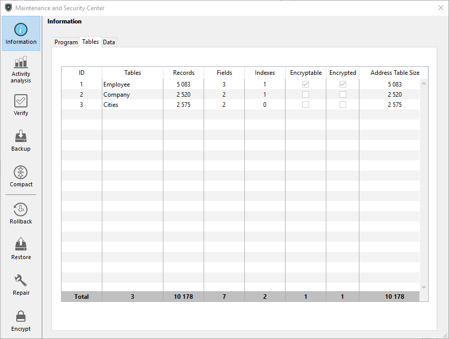

The Information page provides information about the 4D and system environments, as well as the database and application files. Each page can be displayed using tab controls at the top of the window.

## Program

This page indicates the name, version and location of the application as well as the active 4D folder (for more information about the active 4D folder, refer to the description of the `Get 4D folder` command in the *4D Language Reference* manual).

The central part of the window indicates the name and location of the project and data files as well as the log file (if any). The lower part of the window indicates the name of the 4D license holder, the type of license, and the name of the current 4D user.

- **Display and selection of pathnames**: On the **Program** tab, pathnames are displayed in pop-up menus containing the folder sequence as found on the disk:  

If you select a menu item (disk or folder), it is displayed in a new system window.
The **Copy the path** command copies the complete pathname as text to the clipboard, using the separators of the current platform.

- **"Licenses" Folder**
The **"Licenses" Folder** button displays the contents of the active Licenses folder in a new system window. All the license files installed in your 4D environment are grouped together in this folder, on your hard disk. When they are opened with a Web browser, these files display information concerning the licenses they contain and their characteristics.
The location of the "Licenses" folder can vary depending on the version of your operating system. For more information about the location of this folder, refer to the ```Get 4D folder``` command.
***Note:** You can also access this folder from the “Update License” dialog box (available in the Help menu).*

## Tables

This page provides an overview of the tables in your database:



>Information on this page is available in both standard and maintenance modes.

The page lists all the tables of the database (including invisible tables) as well as their characteristics:

- **ID**: Internal number of the table.
- **Tables**: Name of the table. Names of deleted tables are displayed with parenthesis (if they are still in the trash).
- **Records**: Total number of records in the table. If a record is damaged or cannot be read, *Error* is displayed instead of the number. In this case, you can consider using the verify and repair tools.
- **Fields**: Number of fields in the table. Invisible fields are counted, however, deleted fields are not counted.
- **Indexes**: Number of indexes of any kind in the table
- **Encryptable**: If checked, the **Encryptable** attribute is selected for the table at the structure level (see "Encryptable" paragraph in the Design Reference Manual).
- **Encrypted**: If checked, the records of the table are encrypted in the data file. ***Note**: Any inconstency between Encryptable and Encrypted options requires that you check the encryption status of the data file in the Encrypt page of the MSC.*
- **Address Table Size**: Size of the address table for each table. The address table is an internal table which stores one element per record created in the table. It actually links records to their physical address. For performance reasons, it is not resized when records are deleted, thus its size can be different from the current number of records in the table. If this difference is significant, a data compacting operation with the "Compact address table" option checked can be executed to optimize the address table size (see [Compact](compact.md) page).
***Note:** Differences between address table size and record number can also result from an incident during the cache flush.*


## Data

The **Data** page provides information about the available and used storage space in the data file.


>This page cannot be accessed in maintenance mode

The information is provided in graph form:


>This page does not take into account any data that may be stored outside of the data file (see "External storage").

Files that are too fragmented reduce disk, and thus, database performance. If the occupation rate is too low, 4D will indicate this by a warning icon (which is displayed on the Information button and on the tab of the corresponding file type) and specify that compacting is necessary:

A warning icon is also displayed on the button of the [Compact](compact.md) page:

