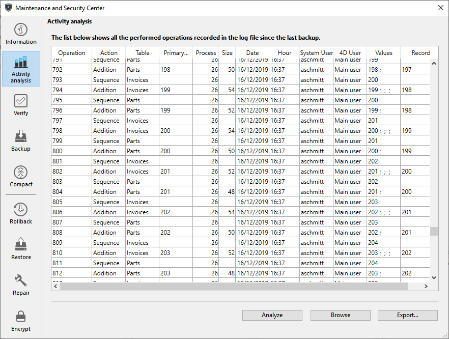

The Activity analysis page allows viewing the contents of the current log file. This function is useful for parsing the use of an application or detecting the operation(s) that caused errors or malfunctions. In the case of an application in client-server mode, it allows verifying operations performed by each client machine. 

>It is also possible to rollback the operations carried out on the data of the database. For more information, refer to [Rollback page](rollback.md).

Every operation recorded in the log file appears as a row. The columns provide various information on the operation. You can reorganize the columns as desired by clicking on their headers.

This information allows you to identify the source and context of each operation:

- **Operation**: Sequence number of operation in the log file.
- **Action**: Type of operation performed on the data. This column can contain one of the following operations:
	- Opening of Data File: Opening of a data file.
	- Closing of Data File: Closing of an open data file.
	- Creation of a Context: Creation of a process that specifies an execution context.
	- Closing of a Context: Closing of process.
	- Addition: Creation and storage of a record.
	- Adding a BLOB: Storage of a BLOB in a BLOB field.
	- Deletion: Deletion of a record.
	- Modification: Modification of a record.
	- Start of Transaction: Transaction started.
	- Validation of Transaction: Transaction validated.
	- Cancellation of Transaction: Transaction cancelled.
	- Update context: Change in extra data (e.g. a call to `CHANGE CURRENT USER` or `SET USER ALIAS`).

- **Table**: Table to which the added/deleted/modified record or BLOB belongs.
- **Primary Key/BLOB**: contents of the primary key for each record (when the primary key consists of several fields, the values are separated by semi-colons) or sequence number of the BLOB involved in the operation.
- **Process**: Internal number of process in which the operation was carried out. This internal number corresponds to the context of the operation.
- **Size**: Size (in bytes) of data processed by the operation.
- **Date and Hour**: Date and hour when the operation was performed.
- **System User**: System name of the user that performed the operation. In client-server mode, the name of the client-side machine is displayed; in single-user mode, the session name of the user is displayed.
- **4D User**: 4D user name of the user that performed the operation. If an alias is defined for the user, the alias is displayed instead of the 4D user name. 
- **Values**: Values of fields for the record in the case of addition or modification. The values are separated by “;”. Only values represented in alphanumeric form are displayed.  
***Note:** If the database is encrypted and no valid data key corresponding to the open log file has been provided, encrypted values are not displayed in this column.*
- **Records**: Record number.

Click on **Analyze** to update the contents of the current log file of the selected application (named by default dataname.journal). The Browse button can be used to select and open another log file for the application. The **Export...** button can be used to export the contents of the file as text.

