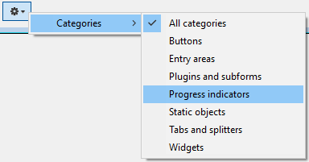
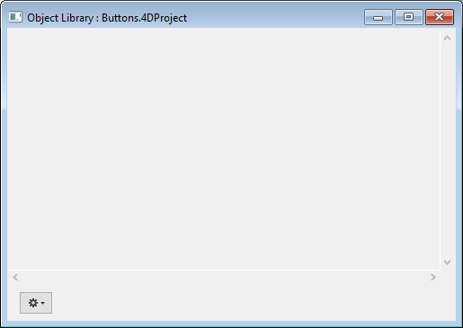

You can use object librairies in your forms. An object library offers a collection of preconfigured objects that can be used in your forms by simple or copy-paste or drag-and-drop.

4D proposes two kinds of object libraries:

- a standard, preconfigured object library, available in all your projects. 
- custom object librairies, that you can use to store your favorite form objects or full project forms.

## Using the standard object library

The standard object library is available from the Form editor: click on the last button of the toolbar:  

The library is displayed in a separate window:

The window has the following main features:

- Preview area with tips: The central area displays a preview of each object. You can hover on an object to obtain information about the object in a tip.
- You can filter the window contents by using the **Categories** menu:

- To use an object from the library to your form, you can either:
	- right-click on an object and select **Copy** in the contextual menu
	- or drag and drop the object from the library
The object is then added to the form. 

This library is read-only. If you want to edit default objects or create your own library of preconfigured objects or project forms, you need to create a custom object library (see below). 

All objects proposed in the standard object library are described on [this section on doc.4d.com](https://doc.4d.com/4Dv17R6/4D/17-R6/Library-objects.200-4354586.en.html).

## Creating and using custom object libraries

You can create and use custom object libraries in 4D. A custom object library is a 4D project where you can store your favorite objects (buttons, texts, pictures, etc.) You can then reuse these objects in different forms and different projects. 

Objects are stored with all their properties, including their object methods. Libraries are put together and used by simple drag-and-drop or copy-paste operations. 

Using libraries, you can build form object backgrounds grouped by graphic families, by behavior, etc. 

### Creating an object library
 
To create an object library, select **New>Object Library...** from the 4D **File** menu or tool bar. A standard save file dialog box appears, which allows you to choose the name and the location of the object library.

Once you validate the dialog box, 4D creates a new object library on your disk and displays its window (empty by default).

You can create as many libraries as desired per project. A library created and built under macOS can be used under Windows and vice-versa.

### Opening an object library  

A given object library can only be opened by one project at a time. However, several different libraries can be opened in the same project. 

To open a custom object library, select **Open>Object Library...** command in the 4D **File** menu or tool bar. A standard open file dialog box appears, which allows you to select the object library to open. You can select the following file types:
- **.4dproject**
- **.4dz**

In fact, custom object libraries are regular 4D projects. Only the following parts of a project are exposed when it is opened as library:

- project forms
- form pages 1

### Building an object library

Objects are placed in an object library using drag-and-drop or a cut-copy-paste operation. They can come from either a form or another object library (including the [standard library](#using-the-standard-object-library)). No link is kept with the original object: if the original is modified, the copied object is not affected.

> In order to be able to drag and drop objects from forms to object libraries, you must make sure the **Start drag and drop** option in the 4D Preferences is selected.

Basic operations are available in the context menu or the options menu of the window:

- **Cut** or **Copy** to the pasteboard
- **Paste** an object from the pasteboard
- **Clear** - deletes the object from the library
- **Rename** - a dialog box appears allowing you to rename the item. Note that object names must be unique in a library. 

You can place individual objects (including subforms) or sets of objects in an object library. Each object or set is grouped into a single item:

An object library can contain up to 32,000 items.

Objects are copied with all their properties, both graphic and functional, including their methods. These properties are kept in full when the item is copied into a form or another library.

#### Dependent objects  
Using copy-paste or drag-and-drop with certain library objects also causes their dependent objects to be copied. For example, copying a button will cause the object method that may be attached to be copied as well. These dependent objects cannot be copied or dragged and dropped directly.

The following is a list of dependent objects that will be pasted into the library at the same time as the main object that uses them (when applicable):

- Lists
- Formats/Filters
- Pictures
- Help Tips (linked to a field)
- Object methods

