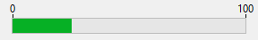

A progress indicator (also called "thermometer") is designed to display or set numeric or date/time values graphically. 



## Using indicators  

You can use indicators either to display or set values. For example, if a progress indicator is given a value by a method, it displays the value. If the user drags the indicator point, the value changes. The value can be used in another object such as a field or an enterable or non-enterable object.

The variable associated with the indicator controls the display. You place values into, or use values from, the indicator using methods. For example, a method for a field or enterable object could be used to control a progress indicator:

```4d
 vTherm:=[Employees]Salary
```
 
This method assigns the value of the Salary field to the vTherm variable. This method would be attached to the Salary field.

Conversely, you could use the indicator to control the value in a field. The user drags the indicator to set the value. In this case the method becomes:

```4d
 [Employees]Salary:=vTherm
``` 

The method assigns the value of the indicator to the Salary field. As the user drags the indicator, the value in the Salary field changes.


## Default thermometer


The thermometer is the basic progress indicator. 

You can display horizontal or vertical thermometers bars. This is determined by the shape of the object that you draw. 

Multiple graphical options are available: minimum/maximum values, graduations, steps.

### Supported Properties
[Barber shop](properties_Scale.md#barber-shop) - [Bold](properties_Text.md#bold) - [Border Line Style](properties_BackgroundAndBorder.md#border-line-style) -[Bottom](properties_CoordinatesAndSizing.md#bottom) - [Class](properties_Object.md#css-class) - [Display graduation](properties_Scale.md#display-graduation) - [Enterable](properties_Entry.md#enterable) - [Execute object method](properties_Action.md#execute-object-method) - [Expression Type](properties_Object.md#expression-type) (only "integer", "number", "date", or "time") - [Font](properties_Text.md#font) - [Font Color](properties_Text.md#font-color) - [Font Size](properties_Text.md#font-size) - [Height](properties_CoordinatesAndSizing.md#height) - [Italic](properties_Text.md#italic) - [Graduation step](properties_Scale.md#graduation-step) -[Help Tip](properties_Help.md#help-tip) - [Horizontal Sizing](properties_ResizingOptions.md#horizontal-sizing) - [Label Location](properties_Scale.md#label-location) - [Left](properties_CoordinatesAndSizing.md#left) - [Maximum](properties_Scale.md#maximum) - [Minimum](properties_Scale.md#minimum) - [Number Format](properties_Display.md#number-format) - [Object Name](properties_Object.md#object-name) - [Right](properties_CoordinatesAndSizing.md#right) - [Step](properties_Scale.md#step) - [Top](properties_CoordinatesAndSizing.md#top) - [Type](properties_Object.md#type) - [Underline](properties_Text.md#underline) - [Variable or Expression](properties_Object.md#variable-or-expression) - [Vertical Sizing](properties_ResizingOptions.md#vertical-sizing) - [Visibility](properties_Display.md#visibility) - [Width](properties_CoordinatesAndSizing.md#width)  


## Barber shop


**Barber shop** is a variant of the default thermometer. To enable this variant, you need to set the [Barber shop](properties_Scale.md#barber-shop) property.

>In JSON code, just remove "max" property from a default thermometer object to enable the Barber shop variant. 

Barber shop displays a continuous animation, like the [spinner](spinner.md). These thermometers are generally used to indicate to the user that the program is in the process of carrying out a long operation. When this thermometer variant is selected, [graphical Scale properties](properties_Scale.md) are not available.

When the form is executed, the object is not animated. You manage the animation by passing a value to its [associated variable or expression](properties_Object.md#variable-or-expression):

* 1 = Start animation,
* 0 = Stop animation.


### Supported Properties
[Barber shop](properties_Scale.md#barber-shop) - [Bold](properties_Text.md#bold) - [Border Line Style](properties_BackgroundAndBorder.md#border-line-style) -[Bottom](properties_CoordinatesAndSizing.md#bottom) - [Class](properties_Object.md#css-class) - [Enterable](properties_Entry.md#enterable) - [Execute object method](properties_Action.md#execute-object-method) - [Expression Type](properties_Object.md#expression-type) (only "integer", "number", "date", or "time") - [Font](properties_Text.md#font) - [Font Color](properties_Text.md#font-color) - [Font Size](properties_Text.md#font-size) - [Height](properties_CoordinatesAndSizing.md#height) - [Help Tip](properties_Help.md#help-tip) - [Horizontal Sizing](properties_ResizingOptions.md#horizontal-sizing) - [Italic](properties_Text.md#italic) - [Left](properties_CoordinatesAndSizing.md#left) - [Object Name](properties_Object.md#object-name) - [Right](properties_CoordinatesAndSizing.md#right) - [Top](properties_CoordinatesAndSizing.md#top) - [Type](properties_Object.md#type) - [Underline](properties_Text.md#underline) - [Variable or Expression](properties_Object.md#variable-or-expression) - [Vertical Sizing](properties_ResizingOptions.md#vertical-sizing) - [Visibility](properties_Display.md#visibility) - [Width](properties_CoordinatesAndSizing.md#width)  
 

## See also
- [rulers](ruler.md) 
- [steppers](stepper.md)