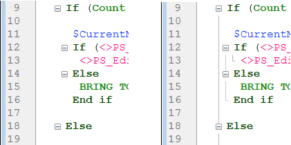
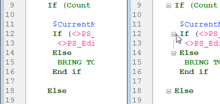

This page contains parameters defining the Code Editor interface and its default display as well as options concerning its operation. It is divided into two sections accessed using the Theme and Options tabs.

## Themes

This page allows selecting, creating, or configuring Code Editor themes. A theme defines the font, font size, colors and styles of items displayed in the code editor. 

### Theme list

In this list, you select the theme to apply to the code editor. All available themes are displayed, including custom themes (if any). 4D provides two themes by default:

*	**Default Light Theme**
*	**Default Dark Theme**

> Default themes cannot be modified or deleted.

A **myTheme** theme is automatically added if you already customized Code Editor styles in previous 4D releases. 

### Creating custom themes

You can create themes that you can fully customize. To create a theme, select an existing theme and click on the **+** at the bottom of the theme list. You can also add customized themes by copying theme files in the `4D Editor Themes` folder (see below). 

### Custom theme files 

Each custom theme is stored in a single JSON file named *themeName.json* The JSON files for custom themes are stored in the `4D Editor Themes` folder located at the same level as the 4D [preferences file](overview.md#storage).

If key values are not defined in a custom theme, they default to the values from the *Default Light Theme*. If a JSON theme file is invalid, the *Default Light Theme* is loaded and an error is generated. 

> When a theme file is modified by an external editor, 4D must be restarted to take the modification(s) into account. 

## Theme definition

Defining a theme means:

- setting a global font and font size for the whole code editor,
- assigning specific styles and colors to each 4D language element (fields, tables, variables, parameters, SQL, etc.), SQL language element (keywords, functions, etc.), and color backgrounds. 

Combining different colors and styles is particularly useful for code maintenance purposes. 

### Font and Font size

The **font** and **font size** menus allows you to select the font name and size used in the Code Editor entry area for all categories. 

### 4D Language and SQL Language

You can set different font styles and colors (font color or background color) for each type of language element. You can select the element(s) to customize in the Category list.

### Other Styles  

These options configure the various colors used in the Code Editor and debugger interfaces.

| |Description|
|---|---|
|**Background color**|Background color of Code Editor window.|
|**Border of the running line in the debugger**| Color of the border surrounding the line currently running in the debugger when the "Highlight line running" option is enabled in the [Options](#options) page.|
|**Cursor line background color**|Background color of line containing the cursor.|
|**Execution line background color**|Background color of line being executed in the debugger.|
|**Highlight of the found words**| Highlight color of words found in a search.|
|**Highlight of the parentheses**| Highlight color of corresponding parentheses (used when pairs of parentheses are signaled by highlighting, see [Options](#options)).
|**Highlight of the blocks**|Highlight color for selected logical blocks when the "Highlight logical blocks" option is enabled in the [Options](#options).|
|**Highlight of the same variable or field**|Highlight color for other occurrences of the same variable or field text when one of the "Highlighting variables and text" option is enabled in the [Options](#options).|
|**Highlight of the running line in the debugger**| Highlight color of the line currently running in the debugger when the "Highlight line running" option is enabled in the [Options](#options).|
|**Selection back color**|Background color of selection.|
|**Suggested text**|Color of autocomplete text suggested by the Code Editor.|

## Options  

This page configures Code Editor display options.

### Options  

#### 4D Programming Language (Use regional system settings)

Allows you to disable/enable the "international" code settings for the local 4D application.
- **unchecked** (default): English-US settings and the English programming language are used in 4D methods.
- **checked**: Regional settings are used in 4D methods.

> If you modify this option, you need to restart the 4D application so that the change is taken into account.

#### Indentation

Changes the indentation value for the 4D code in the Code Editor. The width must be specified in points (10 by default).

4D code is automatically indented in order to reveal its structure:

Modifying this default value can be useful if your methods contain complex algorithms with many levels of embedding. Narrower indentation can be used in order to limit horizontal scrolling.

#### Show Line Numbers

Lets you display the line numbers by default in each window of the Code Editor. You can also show/hide line numbers for the current window directly from the Code Editor.

#### Show Lists

Lets you choose whether or not to show the lists of objects (Commands, Tables and fields, etc.) by default when the Code Editor window is opened. You can also show or hide each list directly from the Code Editor.

#### Show clipboards

Lets you choose whether or not to show the multiple clipboards in the code editor.

The corresponding [clipboard shorcuts](https://doc.4d.com/4Dv19R3/4D/19-R3/Writing-a-method.300-5612559.en.html#3977166) are still active when these clipboards are hidden. 

#### Highlight the logical blocks

When checked, the whole code belonging to a logical block (If/End if for example) is highlighted when the mouse is placed over the expanded node:

The highlight color can be set in the [Theme](#theme-definition) page.

#### Always show block lines

Allows to hide vertical block lines permanently. The block lines are designed to visually connect nodes. By default, they are always displayed (except when collapse/expand icons are hidden, see below).

#### Hide collapse/expand icons

Allows you to hide all expand/collapse icons by default when displaying code. When the option is checked, node icons (as well as local block lines, see above), are displayed temporarily when the mouse is placed over a node:

#### Insert () and closing } ) ] "

Enables automatic insertion of () and closing braces while typing code. This option controls two automatic features:

- **parentheses pair ()**: Added after a 4D command, keyword or project method inserted from a suggestion or completion list, if the inserted element requires one or more mandatory arguments. For example, if you type "C_OB" and press Tab, 4D writes "C_OBJECT()" and sets the insertion point inside the ().

- **closing }, ), ], or "**: Character added when you type respectively an opening {, (, ], or ". This feature allows inserting matching pairs of symbols at the insertion point or surrounding a selected text. For example, if you highlight a string and type a single ", the whole selected string will be enclosed in "":

  

#### Matching \[]\(){}

Sets the graphic signaling of matching braces in the code. This signaling appears whenever a square bracket, parenthesis, or curly bracket is selected. 
The following options are available:

- **None**: No signaling
- **Rectangle** (default): Braces surrounded by a black line  
	
- **Background Color**: Braces highlighted (the color is set in the [Theme](#theme-definition) page).
- **Bold**: Braces displayed in bold.

#### Highlighted variables and fields

Allows to highlight all occurrences of the same variable or field in an open method window.

- **No**(default): No highlight
- **On cursor**: All occurrences are highlighted when the text is clicked
- **On selection**: All occurrences are highlighted when the text is selected

The highlight color can be set in the [Theme](#theme-definition) page.

#### Debug (Highlight the line running)

Highlights the line that is currenty running in the debugger in addition to the regular yellow arrow indicator.

If you deselect this option, only the yellow arrow is shown.

### Suggestions  

This area lets you configure autocomplete mechanisms in the Code Editor to adapt it to your own work habits.

| |Description|
|---|---|
|Automatic opening of window for|Triggers the automatic display of the suggestion window for:<ul><li>Constants</li><li>Variables (local and interprocess) and object attributes</li><li>Tables</li><li>Prototypes (*i.e.*, class functions)</li></ul>
For example, when the "Variables (local or interprocess) and object attributes" option is checked, a list of suggestions appears when you type the $ character:

 You can disable this functioning for certain elements of the language by deselecting their corresponding option.|
|Validation of a suggestion for| Sets the entry context that allows the Code Editor to validate automatically the current suggestion displayed in the autocomplete window.<ul><li>**Tab and delimiters** When this option is selected, you can validate the current selection with the Tab key or any delimiter that is relevant to the context. For example, if you enter "ALE" and then "(", 4D automatically writes "ALERT(" in the editor. Here is the list of delimiters that are taken into account:  ( ; : = < [ {</li><li>**Tab only** When this option is selected, you can only use the Tab key to insert the current suggestion. This can be used more particularly to facilitate the entry of delimiter characters in element names, such as ${1}.**Note**: You can also double-click in the window or press the Carriage return key to validate a suggestion.</li></ul>|
	

