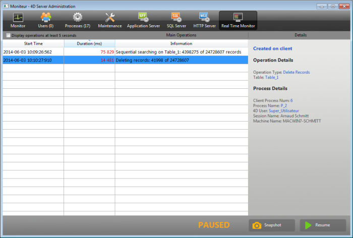

The Real Time Monitor page monitors the progress of "long" operations performed by the application in real time. These operations are, for example, sequential queries, execution of formulas, etc.

>This page is available in the administration window of the server machine and also from a remote 4D machine. In the case of a remote machine, this page displays data from operations performed on the server machine.

A line is added for each long operation performed on the data. This line automatically disappears when the operation is complete (you can check the **Display operations at least 5 seconds** option to keep quick operations on screen for 5 seconds, see below).

The following information is provided for each line:

- **Start Time**: starting time of operation in the format: "dd/mm/yyyy - hh:mm:ss"
- **Duration** (ms): duration in milliseconds of operation in progress
- **Information**: title of operation.
- **Details**: this area displays detailed information which will vary according to the type of operation selected. More specifically:
	+ **Created on**: indidates whether the operation results from a client action (Created on client) or if it was started explicitly on the server by means of a stored procedure or the "Execute on server" option (Created on server).
	+ **Operation Details**: Operation type and (for query operations) query plan.
	+ **Sub-operations** (if any): Dependent operations of the selected operation (e.g. deleting related records before a parent record).
	+ **Process Details**: Additional information concerning the table, field, process or client, depending on the type of operation

> Real-time monitoring page uses the [`ACTIVITY SNAPSHOT`](https://doc.4d.com/4dv19/help/command/en/page1277.html) command internally. More information can be found in this command description.

The page is active and updated permanently as soon as it is displayed. It should be noted that its operation can significantly slow the execution of the application. It is possible to suspend the updating of this page in one of the following ways:

- clicking on the **Pause** button,
- clicking in the list,
- pressing the space bar.

When you pause the page, a "PAUSED" message appears and the button label changes to **Resume**.
You can resume monitoring of the operations by performing the same action as for pausing.

## Advanced mode

The RTM page can display additional information, if necessary, for each listed operation.

To access the advanced mode for an operation, press **Shift** and select the desired operation. All available information is then displayed in the "Process Details" area without any filtering (as returned by the `ACTIVITY SNAPSHOT` command). Available information depends on the operation selected.

Here is an example of information displayed in standard mode:

In advanced mode (**Shift+Click** on the operation), additional information is displayed:

## Snapshot button

The **Snapshot** button allows you to copy to the clipboard all the operations displayed in the RTM panel, as well as their related details (process and sub-operation info):

## Display operations at least 5 seconds

If you check the **Display operations at least 5 seconds** option, any listed operation will be displayed on the page for at least five seconds, even after its execution is finished. Retained operations appear dimmed in the operation list. This feature is useful for getting information about operations that execute very quickly.
