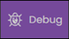
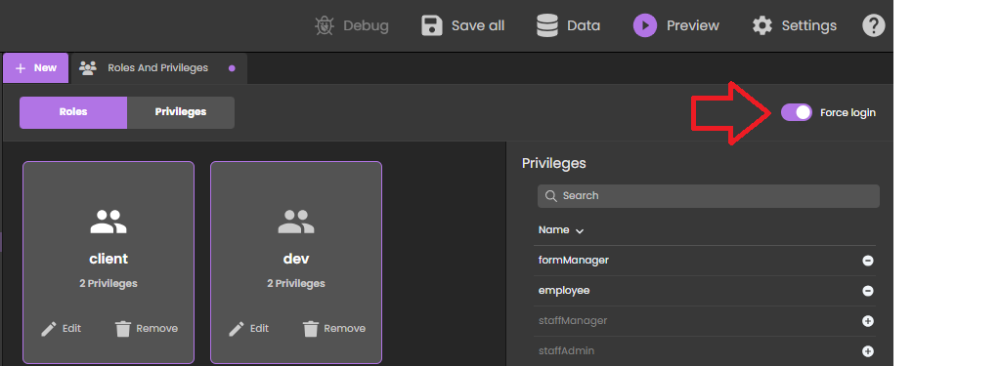
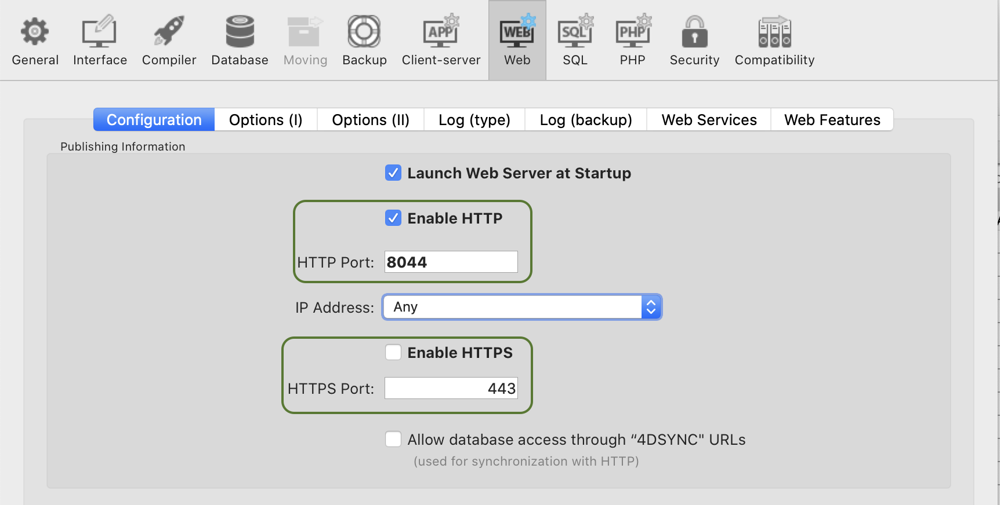

**Qodly Studio** is an interface builder for web applications. It provides developers with a graphical page editor to design applications running in web browsers or smartphones. It supports natively the [ORDA objects](../ORDA/overview.md).

You can use Qodly Studio directly from your **4D environment** to build modern and sophisticated interfaces that you can easily integrate to your existing 4D projects and deploy **on premise**.

Qodly Studio can also be used in the [**Qodly Cloud platform**](https://qodly.com), dedicated to the development of web business applications.

Qodly Studio proposes a full-featured web UI, allowing you to:

- create Qodly pages by placing components on a canvas
- map components to Qodly Sources
- trigger 4D code by configuring events
- and much more.


## Configuration

### Requirements

#### Browser

Qodly Studio supports the following web browsers:

- Chrome
- Edge
- FireFox

The recommended resolution is 1920x1080.

#### 4D application

- Development: 4D v20 R2 or higher
- Deployment: 4D Server v20 R2 or higher
- Qodly Studio only works with 4D projects (binary databases are not supported).
- Web sessions (*aka* Scalable sessions) must [be enabled](sessions.md#enabling-web-sessions).
- The 4D code called by Qodly forms must be [thread-safe](preemptiveWeb.md).


### Enabling access to Qodly Studio

By default, access to Qodly Studio is not granted.

Qodly Studio is served by the [WebAdmin web server](../Admin/webAdmin.md) and displays data from 4D projects handled by the [4D web server](webServer.md).

To enable access to Qodly Studio, you must explicitly allow it at two levels:

* at 4D application level
* at project level


If one of the two levels (or both) are not enabled, access to Qodly Studio is denied (a 403 page is returned).

#### At 4D level

As a first security level, you need to [allow access to Qodly Studio on the WebAdmin web server](../Admin/webAdmin.md#enable-access-to-qodly-studio). This setting applies to the 4D application (4D or 4D Server) on the host machine. All projects opened with that 4D application take this setting into account.

Keep this option unchecked if you want to make sure no access to Qodly Studio is allowed on the application. Check this option to make it possible to access Qodly Studio. However, you still need to enable it at every project level.

Additionally, you can [configure the WebAdmin web server's HTTP/HTTPS port used](../Admin/webAdmin.md#accept-http-connections-on-localhost).

:::note

After any change to these settings, you must [restart the WebAdmin web server](../Admin/webAdmin.md#start-and-stop) for the new configuration to be effective.

:::

#### At project level

After you have enabled access to Qodly Studio at the 4D level, you need to explicitly designate every project that can be accessed. The **Enable access to Qodly Studio** option must be enabled on the [Web Features page of the 4D application's Settings](../settings/web.md#enable-access-to-qodly-studio).

Keep in mind that [user settings](../settings/overview.md) can be defined at several levels, and that priorities apply.


### Activating authentication

Authentication on the WebAdmin web server is granted using an access key. For more details, see [Access key](../Admin/webAdmin.md#access-key).


### Development and deployment

In accordance with the management of 4D projects, only the following usages are supported:

- development with Qodly Studio must be done using **4D** (single-user).
- deployment of 4D applications powered with Qodly pages must be done using **4D Server**.

:::warning

You can open Qodly Studio, [debug](#using-qodly-debugger-on-4d-server) and edit Qodly pages directly on a 4D Server machine when a project is running in interpreted mode. This feature is only provided for testing and debugging purposes, for example to evaluate the application flow with actual data, or in multi-user environment. It must NOT be considered as a regular way to develop applications since it does not provide any control over concurrent accesses.

:::


## Opening Qodly Studio

The Qodly Studio page is available when the [WebAdmin web server is running](../Admin/webAdmin.md#start-and-stop) and authentication is activated (see above).

There are two ways to access Qodly Studio:

* by selecting the **Qodly Studio...** menu command from the **Design** menu (4D single-user) or the **Window** menu (4D Server).
If the WebAdmin web server is already running, depending on its configuration, your default browser opens at `IPaddress:HTTPPort/studio` or `IPaddress:HTTPSPort/studio`. Otherwise, you will be prompted if you want to start the WebAdmin web server first.

* on a browser, with the WebAdmin web server running (launched from 4D or 4D Server), enter the following address:<br/>
	`IPaddress:HTTPPort/studio`

	or:

	`IPaddress:HTTPSPort/studio`

	For example, after launching a local web server on port 7080, type this address in your browser:

	`localhost:7080/studio`

	You will then be prompted to enter the [access key](../Admin/webAdmin.md#access-key) to access Qodly Studio.


## Developing with Qodly Studio

### Documentation

The Qodly Studio documentation is available on the [Qodly documentation website](https://developer.qodly.com/docs/studio/overview).

You can rely on this documentation and its associated resources for developing web applications powered by Qodly pages. However, depending on implementation stage, 4D developers will either use Qodly Studio or 4D IDE (see [Feature comparison](#feature-comparison)).

Code examples are provided in [QodlyScript](https://developer.qodly.com/docs/category/qodlyscript), but since QodlyScript inherits from the 4D Language, you won't be lost. For more information, see the [From QodlyScript to 4D Language](from-qodlyscript-to-4d.md) page.

:::info

There is no direct compatibility between apps implemented with 4D and apps implemented with Qodly.

:::

### Feature comparison

||Qodly Studio in 4D|Qodly Studio in Qodly Cloud platform|
|---|---|---|
|View and edit tables (dataclasses), attributes and relations|4D Structure Editor(1)|Qodly Studio Model Editor|
|Qodly pages|Qodly Studio Page Editor|Qodly Studio Page Editor|
|Desktop forms|4D IDE|*not supported*|
|Programming language|4D Language featuring ORDA|[QodlyScript](https://developer.qodly.com/docs/category/qodlyscript) featuring ORDA|
|Coding IDE|4D IDE code editor *or* VS Code with [4D-Analyzer extension](https://github.com/4d/4D-Analyzer-VSCode)<br/>*4D Server only*: Qodly Studio code editor (see (2))|Qodly Studio code editor|
|Debugger|4D IDE debugger<br/>*4D Server only*: Qodly Studio debugger (see [this paragraph](#using-qodly-debugger-on-4d-server))|Qodly Studio debugger|
|REST/Web roles and privileges|roles.json direct edit/Qodly Studio roles and privileges editor|Qodly Studio role and privileges editor|

(1) If you click on the **Model** button in Qodly Studio, nothing happens.<br/>
(2) In 4D Server, opening 4D code with the Qodly Studio code editor is supported **for testing and debugging purposes** (see [this paragraph](#development-and-deployment)). Note that in 4D single-user, if you open some 4D code with the Qodly Studio code editor, syntax coloring is not available and a "Lsp not loaded" warning is displayed.


### Language

The following commands and classes are dedicated to the server-side management of Qodly pages:

- [`Web Form`](../API/WebFormClass.md#web-form) command: returns the Qodly page as an object.
- [`Web Event`](../API/WebFormClass.md#web-event) command: returns events triggered within Qodly page components.
- [`WebForm`](../API/WebFormClass.md) class: functions and properties to manage the rendered Qodly page.
- [`WebFormItem`](../API/WebFormItemClass.md) class: functions and properties to manage Qodly page components.


### Using project methods

We recommend using class functions over project methods. Only class functions can be called from components. However, you can still use your project methods in Qodly Studio in two ways:

- You can call your methods from class functions.
- You can directly [execute your methods](https://developer.qodly.com/docs/studio/coding#methods-and-classes) from the Qodly Explorer.


### Offline use

You can develop with Qodly Studio while your computer is not connected to the internet. In this case however, the following features are not available:

- [Templates](https://developer.qodly.com/docs/studio/pageLoaders/templates): the Template library is empty
- UI tips: they are not displayed when you click on  icons.


## Deployment

### Enabling rendering

Qodly Studio encapsulates Qodly pages, including layout, data connections, and event-driven logic, in a structured JSON file. This JSON file is processed on-the-fly by the **Qodly renderer** to serve a fully functional web page.

:::info

See [this page](https://developer.qodly.com/docs/studio/rendering) for detailed information on how to render Qodly pages in Qodly.

:::

To enable the rendering of Qodly pages, the following options must be set.

* The 4D project's **Settings** > **Web** > **Web Features** > [**Expose as REST server**](../settings/web.md#exposed-as-rest-server) option must be activated.
* The [4D web server](webServer.md) must be running.

:::note

[Renderer buttons](https://developer.qodly.com/docs/studio/rendering#how-to-render-a-webform) are not available if the configuration options are not activated.

:::

### Scope of Qodly forms

When rendering Qodly forms in the Qodly Studio, the renderer will connect to the 4D web server through HTTP or HTTPS, depending on the settings, following the same HTTP/HTTPS connection pattern as for the [4D WebAdmin web server](../Admin/webAdmin.md#accept-http-connections-on-localhost). See also [this paragraph](#about-license_usage) about URL schemes and license usage.


Keep in mind that Qodly Studio runs through the 4D WebAdmin web server. When you use Qodly Studio as a developer, even when you preview a Qodly Page in the studio, you're using the 4D WebAdmin web server. This allows you to see dataclasses, functions and attributes that are not exposed as REST resources for example (they are greyed out).

However, page rendering happens outside Qodly Studio, and is served by the standard 4D web server. In this situation, your web application cannot access assets that are not exposed as REST resources. See [Exposed vs non-exposed functions](../ORDA/ordaClasses.md#exposed-vs-non-exposed-functions) and [Exposing tables](../REST/configuration.md#exposing-tables) for more information on how to expose assets.


### Accessing Qodly pages

For deployment, the WebAdmin server is not necessary. End-user access to your web application made with Qodly Studio is based on the 4D REST protocol, and as such, it works as through a conventional 4D remote application.

Your Qodly pages are available through the following url:

```
IP:port/$lib/renderer/?w=QodlyPageName
```

...where *IP:port* represents the address of the web server and *QodlyPageName* is the name of the Qodly page.  

For example:

```
https://www.myWebSite.com/$lib/renderer/?w=welcome
```

### Preview Qodly Application

You can preview your Qodly application at any moment by selecting the **Preview Qodly Application...** command in the **Windows** menu (4D Server) or in the **Design** menu (4D single-user). 

This command launches the Qodly renderer on a local address in your default browser and displays the **start page** [defined in the Application settings](https://developer.qodly.com/docs/studio/settings#start-page) of Qodly Studio.


### Using Qodly debugger on 4D Server

When using Qodly pages in a deployed 4D Server application (interpreted mode), you might encounter some cases where you need to debug your pages on the server, for example when a specific user configuration is required. In this case, you can attach the [Qodly Studio debugger](https://developer.qodly.com/docs/studio/debugging) to the 4D Server and then, benefit from its features when executing your Qodly pages.

Note that in this case, the Qodly Studio debugger will display all the code executed on the server, in accordance with the [attached debugger rule on 4D Server](../Debugging/debugging-remote.md#attached-debugger).  

To attach the Qodly Studio debugger to your running 4D Server application:

1. [Open Qodly Studio](#opening-qodly-studio) from 4D Server.

:::note

The project must be running in interpreted mode so that **Qodly Studio** menu item is available.

:::

2. In the Qodly Studio toolbar, click on the **Debug** button.<br/>


If the debug session starts successfully, a green bullet appears on the button label  and you can use the Qodly Studio debugger.

If the debugger is already attached to a another machine or another Qodly Studio page, an error is displayed. You have to detach it beforehand from the other location.

To detach the Qodly Studio debugger from your running 4D Server application:

1. Click the **Debug** button in the Qodly Studio toolbar while a debug session is active.
A warning dialog box will prompt you to confirm whether you want to detach the debugger.
2. Select **Keep in progress** to continue evaluating the code until the end of the current method or function before detaching the debugger, or **Stop** to detach the debugger immediately.


## Force login

With Qodly Studio for 4D, the ["force login" mode](../REST/authUsers.md#force-login-mode) allows you to control the number of opened web sessions that require 4D Client licenses. You can also [logout](#logout) the user at any moment to decrement the number of retained licenses.

### Configuration

Make sure the ["force login" mode](../REST/authUsers.md#force-login-mode) is enabled for your 4D application in the [Roles and Privileges page](https://developer.qodly.com/docs/studio/roles/rolesPrivilegesOverview), using the **Force login** option:



You can also set this option directly in the [**roles.json** file](../ORDA/privileges.md#rolesjson-file).

You just need then to implemented the [`authentify()`](../REST/authUsers.md#function-authentify) function in the datastore class and call it from the Qodly page. A licence will be consumed only when the user is actually logged.


:::note Compatibility

When the legacy login mode ([deprecated as of 4D 20 R6](https://blog.4d.com/force-login-becomes-default-for-all-rest-auth)) is enabled, any REST request, including the rendering of an authentication Qodly page, creates a web session on the server and gets a 4D Client license, whatever the actual result of the authentication. For more information, refer to [this blog post](https://blog.4d.com/improved-4d-client-licenses-usage-with-qodly-studio-for-4d) that tells the full story.  

:::

#### Example

In a simple Qodly page with login/password inputs, a "Submit" button calls the following `authentify()` function we have implemented in the DataStore class:

```4d

exposed Function authentify($credentials : Object) : Text

var $salesPersons : cs.SalesPersonsSelection
var $sp : cs.SalesPersonsEntity

$salesPersons:=ds.SalesPersons.query("identifier = :1"; $credentials.identifier)
$sp:=$salesPersons.first()

If ($sp#Null)
	If (Verify password hash($credentials.password; $sp.password))

		Session.clearPrivileges()
		Session.setPrivileges("") //guest session

		return "Authentication successful"
	Else
		return "Wrong password"
	End if
Else
	return "Wrong user"
End if
```

This call is accepted and as long as the authentication is not successful, `Session.setPrivileges()` is not called, thus no license is consumed. Once `Session.setPrivileges()` is called, a 4D client licence is used and any REST request is then accepted.


### Logout

When the ["force login" mode is enabled](#setting-the-force-login-mode), Qodly Studio for 4D allows you to implement a logout feature in your application.

To logout the user, you just need to execute the **Logout** standard action from the Qodly page. In Qodly Studio, you can associate this standard action to a button for example:


Triggering the logout action from a web user session has the following effects:

- the current web user session loses its privileges, only [descriptive REST requests](../REST/authUsers.md#descriptive-rest-requests) are allowed,
- the associated 4D license is released,
- the `Session.storage` is kept until the web session inactivity timeout is reached (at least one hour). During this period after a logout, if the user logs in again, the same session is used and the `Session.storage` shared object is available with its current contents.


## About license usage for rendering

In default mode when any page is rendered, or in "force login" mode when a page handling data or calling a function is rendered, you must have an available license, as rendering Qodly forms targets the project database's main web server.

### URL Schemes

Qodly Studio's URL scheme configuration (HTTP and HTTPS) determines how many licenses are retained when rendering Qodly forms. With the appropriate configuration, you can avoid unnecessary license retaining.

As explained in the [configuration](#configuration) section, the WebAdmin web server provides a secured web access to Qodly Studio. On the other hand, the [renderer](#rendering-webforms) communicates with the 4D web server of the database using REST requests. As such, it behaves like a conventional 4D Client.

If you run the renderer from the Qodly Studio and these two web servers are not reached through the same URL scheme (HTTP or HTTPS), it might lead to wrong licence counting.

:::info

Using different schemes might also lead to [session](sessions.md) issues, such as losing [privileges](../ORDA/privileges.md) after a page refresh.

:::

#### Example

1. You run the Qodly Studio on an HTTPS URL scheme (e.g. `https://127.0.0.1:7443/studio/`)

2. The web server of your database is started only on an HTTP port.



3. In Qodly Studio, you click on the **Preview** icon. You are warned that the two web servers are started on different schemes, but despite this you click on the **Confirm** button.


As a result, two licenses are retained.

:::note

You can enable/disable the display of the renderer pop over using a Qodly Studio user setting.

:::

### SameSite attribute

The behavior previously described is due to the session cookie of the 4D web server. This session cookie has a `SameSite` attribute that determines if the session cookie is sent to the web server.

If the `SameSite` attribute's value is `Strict` (default), the session cookie is not sent to the web server, so a new session is opened each time a page is rendered or refreshed.

For more information on the `SameSite` attribute, check out [this blog post](https://blog.4d.com/get-ready-for-the-new-SameSite-and-secure-attributes-for-cookies/).

### Recommendations

To avoid using more licenses than necessary, we recommend doing one of the following:

- Run the renderer on another browser tab (by entering the rendered URL of your Qodly page: `IP:port/$lib/renderer/?w=QodlyPageName`).
- Ensure the Qodly Studio and your database are reached on the same URL scheme.
- Use the `Lax` value for the [session cookie](webServerConfig.md#session-cookie-samesite) of your project database's web server.

