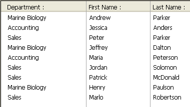

<!--REF #_command_.APPEND TO LIST.Syntax-->**APPEND TO LIST** ( *list* ; *itemText* ; *itemRef* {; *sublist* ; *expanded*} )<!-- END REF-->
<!--REF #_command_.APPEND TO LIST.Params-->
| Parameter | Type |  | Description |
| --- | --- | --- | --- |
| list | Integer | &#8594;  | List reference number |
| itemText | Text | &#8594;  | Text of the new list item |
| itemRef | Integer | &#8594;  | Unique reference number for the new list item |
| sublist | Integer | &#8594;  | Optional sublist to attach to the new list item |
| expanded | Boolean | &#8594;  | Indicates if the optional sublist will be expanded or collapsed |

<!-- END REF-->

*This command is not thread-safe, it cannot be used in preemptive code.*


#### Description 

<!--REF #_command_.APPEND TO LIST.Summary-->The **APPEND TO LIST** command appends a new item to the hierarchical list whose list reference number you pass in *list*.<!-- END REF-->

You pass the text of the item in *itemText*. You can pass a string or text expression of up to 2 billion characters. Starting with 4D v16 R4, if the item is associated with a standard action, you can pass the ak standard action title constant in *itemText* to automatically use the localized action name. For more information, please refer to the *Standard actions* section.

You pass the unique reference number of the item (of the Longint type) in *itemRef*. Although we qualify this item reference number as unique, you can actually pass the value you want. Refer to the *Managing Hierarchical Lists* section for more information about the *itemRef* parameter.

If you also want an item to have child items, pass a valid list reference to the child hierarchical list in *sublist*. In this case, you must also pass the *expanded* parameter. Pass **True** or **False** in this parameter so that the sublist is displayed expanded or collapsed respectively.

The list reference you pass in *sublist* must refer to an existing list. The existing list may be a one-level list or a list with sublists. If you do not want to attach a child list to the new item, omit the parameter or pass 0\. Even though they are both optional, the *sublist* and *expanded* parameters must be passed jointly.

**Tips**

* To insert a new item in a list, use [INSERT IN LIST](insert-in-list.md). To change the text of an existing item or modify its child list as well as its expanded state, use [SET LIST ITEM](set-list-item.md).
* To change the appearance of the new appended item use [SET LIST ITEM PROPERTIES](set-list-item-properties.md).

#### Example 

Here is a partial view of a database structure:


The \[Departments\] and \[Employees\] tables contain the following records:




You want to display a hierarchical list, named *hlList*, that shows the Departments, and for each Department, a child list that shows the Employees working in that Department. The object method of *hlList* is:

```4d
  // hlList Hierarchical List Object Method
 
 Case of
 
    :(FORM Event=On Load)
       var hlList;$hSubList;$vlDepartment;$vlEmployee;$vlDepartmentID : Integer
  // Create a new empty hierarchical list
       hlList:=New list
  // Select all the records from the [Departments] table
       ALL RECORDS([Departments])
  // For each Department
       For($vlDepartment;1;Records in selection([Departments]))
  // Select the Employees from this Department
          RELATE MANY([Departments]Name)
  // How many are they?
          $vlNbEmployees:=Records in selection([Employees])
  // Is there at least one Employee in this Department?
          If($vlNbEmployees>0)
  // Create a child list for the Department item
             $hSubList:=New list
  // For each Employee
             For($vlEmployee;1;Records in selection([Employees]))
  // Add the Employee item to the sublist
  // Note that ID field of the [Employees] record
  // is passed as item reference number
                APPEND TO LIST($hSubList;[Employees]Last Name+", "+[Employees]First Name;[Employees]ID)
  // Go the next [Employees] record
                NEXT RECORD([Employees])
             End for
          Else
  // No Employees, no child list for the Department item
             $hSubList:=0
          End if
  // Add the Department item to the main list
  // Note that ID field of the [Departments] record
  // is passed as item reference number. The bit #31
  // of this item is forced to one so we'll be able
  // to distinguish Department and Employee items. See note further
  // below on why we can use this bit as supplementary information about
  // the item.
          APPEND TO LIST(hlList;[Departments]Name;[Departments]ID?+31;$hSublist;$hSubList#0)
  // Set the Department item in Bold to emphasize the hierarchy of the list
          SET LIST ITEM PROPERTIES(hlList;0;False;Bold;0)
  // Go to the next Department
          NEXT RECORD([Departments])
       End for
  // Sort the whole list in ascending order
       SORT LIST(hlList;>)
  // Set the list style to windows
  // and force the minimal line height to 14 Pts
       SET LIST PROPERTIES(hlList;Ala Windows;Windows node;14)
 
    :(FORM Event=On Unload)
  // The list is no longer needed; do not forget to get rid of it!
       CLEAR LIST(hlList;*)
 
    :(FORM Event=On Double Clicked)
  // A double-click occurred
  // Get the position of the selected item
       $vlItemPos:=Selected list items(hlList)
  // Just in case, check the position
       If($vlItemPos #0)
  // Get the list item information
          GET LIST ITEM(hlList;$vlItemPos;$vlItemRef;$vsItemText;$vlItemSubList;$vbItemSubExpanded)
  // Is the item a Department item?
          If($vlItemRef ?? 31)
  // If so, it is a double-click on a Department Item
             ALERT("You double-clicked on the Department item "+Char(34)+$vsItemText+Char(34)+".")
          Else
  // If not, it is a double-click on an Employee item
  // Using the parent item ID to find the [Departments] record
             $vlDepartmentID:=List item parent(hlList;$vlItemRef)?-31
             QUERY([Departments];[Departments]ID=$vlDepartmentID)
  // Tell where the Employee is working and to whom he or she is reporting
             ALERT("You double-clicked on the Employee item "+Char(34)+$vsItemText+Char(34)+
             " who is working in the Department "+Char(34)+[Departments]Name+Char(34)+
             " whose manager is "+Char(34)+[Departments]Manager+Char(34)+".")
          End if
       End if
 
 End case
 
  // Note: 4D can store up to 1 billion records per table
  // In our example, we use bit #31 of the unused high byte for
  // distinguishing Employees and Departments items.
```

In this example, there is only one reason to distinguish \[Departments\] items and \[Employees\] items:

1\. We store record IDs in the item reference numbers; therefore, we will probably end up with \[Departments\] items whose item reference numbers are the same as \[Employees\] items.

2\. We use the [List item parent](list-item-parent.md) command to retrieve the parent of the selected item. If we click on an \[Employees\] item whose associated record ID is #10, and if there is also a \[Departments\] item #10, the \[Departments\] item will be found first by [List item parent](list-item-parent.md) when it browses the lists to locate the item with the item reference number we pass. The command will return the parent of the \[Departments\] item and not the parent of the \[Employees\] item.

Therefore, we made the item reference numbers unique, not because we wanted unique numbers, but because we needed to distinguish \[Departments\] and \[Employees\] records.

When the form is executed, the list will look like this:


**Note:** This example is useful for user interface purposes if you deal with a reasonably small number of records. Remember that lists are held in memory—do not build user interfaces with hierarchical lists containing millions of items.

#### See also 

[INSERT IN LIST](insert-in-list.md)  
[SET LIST ITEM](set-list-item.md)  
[SET LIST ITEM PARAMETER](set-list-item-parameter.md)  
[SET LIST ITEM PROPERTIES](set-list-item-properties.md)  