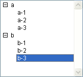
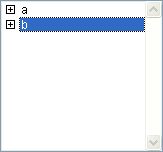
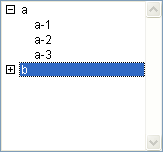

<!--REF #_command_.Count list items.Syntax-->**Count list items** ( {* ;} *list* {; *} ) : Integer<!-- END REF-->
<!--REF #_command_.Count list items.Params-->
| Parameter | Type |  | Description |
| --- | --- | --- | --- |
| * | Operator | &#8594;  | If specified, list is an object name (string) If omitted, list is a list reference number |
| list | Integer, Text | &#8594;  | List reference number (if * omitted), or Name of list type object (if * passed) |
| * | Operator | &#8594;  | If omitted (default): Return visible list items (expanded) If specified: Return all list items |
| Function result | Integer | &#8592; | Number of visible (expanded) list items (if 2nd * omitted) or Total number of list items (if 2nd * present) |

<!-- END REF-->

#### Description 

<!--REF #_command_.Count list items.Summary-->The Count list items command returns either the number of items currently “visible” or the total number of items in the list whose reference number or object name you pass in *list*.<!-- END REF-->

If you pass the first optional *\** parameter, you indicate that the *list* parameter is an object name (string) corresponding to a representation of the list in the form. If you do not pass this parameter, you indicate that the *list* parameter is a hierarchical list reference ([ListRef](# "A Longint reference to a hierachical list")). If you only use a single representation of the list or work with all the items (the second *\** is passed), you can use either syntax. Conversely, if you use several representations of the same list and work with the visible items (the second *\** is omitted), the syntax based on the object name is required since each representation can have its own expanded/collapsed configuration.

**Note:** If you use the @ character in the name of the list object and the form contains several lists that match with this name, the Count list items command will only apply to the first object whose name corresponds. 

Use the second \* parameter to determine which type of information will be returned. When this parameter is passed, the command returns the total number of items present in the list, regardless of whether it is expanded or collapsed. 

When this parameter is omitted, the command returns the number of items that are visible, depending on the current expanded/collapsed state of the list and its sublists.

You apply this command to a list displayed in a form.

#### Examples 

Here a list named *hList* shown in the Application environment:



```4d
 $vlNbItems:=Count list items(hList) // at this point $vlNbItems gets 8
 $vlNbTItems:=Count list items(hList;*) //$vlNbTItems also gets 8
```



```4d
 $vlNbItems:=Count list items(hList) // at this point $vlNbItems gets 2
 $vlNbTItems:=Count list items(hList;*) //$vlNbTItems still gets 8
```



```4d
 $vlNbItems:=Count list items(hList) // at this point $vlNbItems gets 5
 $vlNbTItems:=Count list items(hList;*) //$vlNbTItems still gets 8
```

#### See also 

[List item position](list-item-position.md)  
[Selected list items](selected-list-items.md)  

#### Properties
|  |  |
| --- | --- |
| Command number | 380 |
| Thread safe | &check; |
| Forbidden on the server ||


