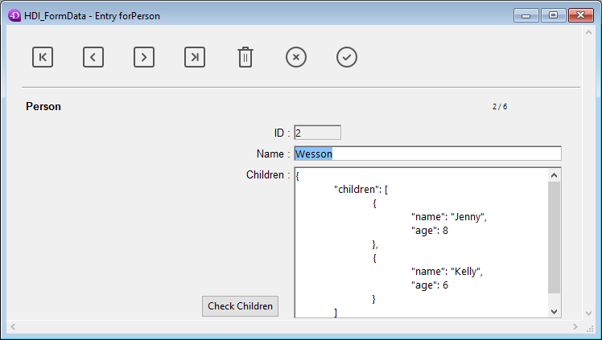

<!--REF #_command_.DIALOG.Syntax-->**DIALOG** ( {*aTable* ;} *form* {; *formData*}{; *} )<!-- END REF-->
<!--REF #_command_.DIALOG.Params-->
| Parameter | Type |  | Description |
| --- | --- | --- | --- |
| aTable | Table | &#8594;  | Table owning the form or If omitted: default table or use of project form |
| form | Text, Object | &#8594;  | Name (string) of table or project form, or a POSIX path (string) to a .json file describing the form, oran object describing the form |
| formData | Object | &#8594;  | Data to associate to the form |
| * | Operator | &#8594;  | Use the same process |

<!-- END REF-->

*This command is not thread-safe, it cannot be used in preemptive code.*


#### Description 

<!--REF #_command_.DIALOG.Summary-->The **DIALOG** command presents the *form* to the user, along with *formData* parameter(s) (optional).<!-- END REF--> 

This command is designed to work with customized and advanced user interfaces based on forms. You can use it to display information coming from the database or other locations, or to provide data entry features. Unlike [ADD RECORD](add-record.md) or [MODIFY RECORD](modify-record.md), **DIALOG** gives you full control over the form, its contents and the navigation and validation buttons. 

This command is typically called along with the [Open form window](open-form-window.md) to display sophisticated forms, as shown in the following example: 


The **DIALOG** command can also be used instead of [ALERT](alert.md), [CONFIRM](confirm.md) or [Request](request.md) when the information to be presented or gathered is more complex than those commands can manage.

**Note:** In converted databases, it's possible to prohibit data entry in dialog boxes (thus limiting data entry to variables only) using an option in the 4D Database Settings (Compatibility page). This restriction corresponds to the operation of former versions of 4D. 

In the *form* parameter, you can pass:

* the name of a form (project form or table form) to use;
* the path (in POSIX syntax) to a valid .json file containing a description of the form to use. See *Form file path*;
* an object containing a description of the form to use.

Optionally, you can pass parameter(s) to the *form* using the *formData* object. Any properties of the *formData* object will then be available from within the form context through the [Form](form.md) command. For example, if you pass an object containing {"version","12"} in *formData*, you will be able to get the value of the "version" property in the form by calling:

```4d
 $v:=Form.version //"12"
```

Using a local variable for *formData*, this feature allows you to safely pass parameters to your forms, whatever the calling context. In particular, if the same form is called from different places in the same process, you will always be able to access its specific values by simply calling [Form](form.md).myProperty. Moreover, since objects are passed by reference, if the user modifies a property value in the form, it will automatically be saved in the object itself.   
By combining the *formData* object and the [Form](form.md) command, you can send parameters to the form or read parameters from the form at any moment with clean and safe code.

**Note:** If you do not pass the *formData* parameter or if you pass an undefined object, **DIALOG** automatically creates a new empty object bound to the *form*, available through the [Form](form.md) command. 

The dialog is closed by the user either with an "accept" action (triggered by the ak accept standard action, the Enter key, or the [ACCEPT](accept.md) command), or with a "cancel" action (triggered by the ak cancel standard action, the Escape key, or the [CANCEL](cancel.md) command). An accept action will set the OK system variable to 1, while a cancel action will set OK to 0\. 

Keep in mind that validation does not equal saving: if the dialog includes fields, you must explicitly call the [SAVE RECORD](save-record.md) command to save any data that has been modified. 

If you pass the optional *\** parameter, the form is loaded and displayed in the last open window of the current process and the command finishes its execution while leaving the active form on the screen.   
This form then reacts “normally” to user actions and is closed using a standard action or when 4D code related to the form (object method or form method) calls the [CANCEL](cancel.md) or [ACCEPT](accept.md) command. If the current process terminates, the forms created in this way are automatically closed in the same way as if a [CANCEL](cancel.md) command had been called. This opening mode is particularly useful for displaying a floating palette with a document, without necessarily requiring another process. 

**Notes:** 

* You can combine the use of the **DIALOG**(form;\*) syntax with the [CALL FORM](call-form.md) command to establish communication between the forms.
* You must create a window before calling the **DIALOG**(form;\*) statement. It is not possible to use the current dialog window in the process nor the window created by default for each process. Otherwise, error -9909 is generated.
* When the *\** parameter is used, the window is closed automatically following a standard action or a call to the [CANCEL](cancel.md) or [ACCEPT](accept.md) command. You do not have to manage the closing of the window itself.

#### Example 1 

The following example can be used to create a tool palette:

```4d
  //Display tool palette
 $palette_window:=Open form window("tools";Palette form window)
 DIALOG("tools";*) //Give back the control immediately
  //Display main document windowl
 $document_window:=Open form window("doc";Plain form window)
 DIALOG("doc")
```

#### Example 2 

In a form displaying the record of a person, a "Check children" button opens a dialog to verify/modify the names and ages of their children:



**Note:** The "Children" object field is represented only to show its structure for this example.

In the verification form, you have assigned some [Form](form.md) object properties to variables:


Here is the code for the "Check children" button:

```4d
 var $win;$n;$i : Integer
 var $save : Boolean
 ARRAY OBJECT($children;0)
 OB GET ARRAY([Person]Children;"children";$children) //get the children collection
 $save:=False //initialize the save variable
 
 $n:=Size of array($children)
 If($n>0)
    $win:=Open form window("Edit_Children";Movable form dialog box)
    SET WINDOW TITLE("Check children for "+[Person]Name)
    For($i;1;$n) //for each child
       DIALOG("Edit_Children";$children{$i}) //displays dialog filled with values
       If(OK=1) //the user clicked OK
          $save:=True
       End if
    End for
    If($save=True)
       [Person]Children:=[Person]Children //forces object field update
    End if
    CLOSE WINDOW($win)
 Else
    ALERT("No child to check.")
 End if
```

**Note:** This example requires that object notation be enabled in the database (see *Compatibility page*).

The form displays information for each child:


If values are edited and the OK button is clicked, the field is updated (the parent record must be saved afterwards). 

#### Example 3 

The following example uses the path to a .json form to display the records in an employee list: 

```4d
 Open form window("/RESOURCES/OutputPersonnel.json";Plain form window)
 ALL RECORDS([Personnel])
 DIALOG("/RESOURCES/OutputPersonnel.json";*)
```

which displays:


#### Example 4 

The following example uses a .json file as an object and modifies a few properties: 

```4d
 var $form : Object
 $form:=JSON Parse(Document to text(Get 4D folder(Current resources folder)+"OutputPersonnel.json"))
 $form.windowTitle:="The Avengers"
 $form.pages[1].objects.logo.picture:="/RESOURCES/Images/Avengers.png"
 $form.pages[1].objects.myListBox.borderStyle:="double"
 Open form window($form;Plain form window)
 DIALOG($form;*)
```

The altered form is displayed with the title, logo and border modified:


#### System variables and sets 

After a call to **DIALOG**, if the dialog is accepted, OK is set to 1; if it is canceled, OK is set to 0.

#### See also 

[ACCEPT](accept.md)  
[ADD RECORD](add-record.md)  
[CALL FORM](call-form.md)  
[CANCEL](cancel.md)  
[Form](form.md)  
[Open window](open-window.md)  