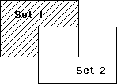

<!--REF #_command_.DIFFERENCE.Syntax-->**DIFFERENCE** ( *set1* ; *set2* ; *resultSet* )<!-- END REF-->
<!--REF #_command_.DIFFERENCE.Params-->
| Parameter | Type |  | Description |
| --- | --- | --- | --- |
| set1 | Text | &#8594;  | Set |
| set2 | Text | &#8594;  | Set to subtract |
| resultSet | Text | &#8594;  | Resulting set |

<!-- END REF-->

#### Description 

<!--REF #_command_.DIFFERENCE.Summary-->**DIFFERENCE** compares *set1* and *set2* and excludes all records that are in *set2* from the *resultSet*.<!-- END REF--> In other words, a record is included in the *resultSet* only if it is in *set1*, but not in *set2*. The following table shows all possible results of a set Difference operation.

| **Set1** | **Set2** | **Result Set** |
| -------- | -------- | -------------- |
| Yes      | No       | Yes            |
| Yes      | Yes      | No             |
| No       | Yes      | No             |
| No       | No       | No             |

The result of a Difference operation is depicted here. The shaded area is the result set.



The *resultSet* is created by **DIFFERENCE**. The *resultSet* replaces any existing set having the same name, including *set1* and *set2*. Both *set1* and *set2* must be from the same table. The *resultSet* belongs to the same table as *set1* and *set2*.

**4D Server:** In Client/Server mode, sets are "visible" depending on their type (interprocess, process and local) and where they were created (server or client). **DIFFERENCE** requires all three sets to be visible on the same machine. See the paragraph *4D Server, Sets and Named Selections* in the 4D Server Reference manual for more information.

#### Example 

This example excludes the records that a user selects from a displayed selection. The records are displayed on screen with the following line:

```4d
 DISPLAY SELECTION([Customers]) //Display the customers in a list
```

At the bottom of the list of records is a button with an object method. The object method excludes the records that the user has selected (the set named “UserSet”), and displays the reduced selection:

```4d
 CREATE SET([Customers];"$Current") //Create a set of current selection
 DIFFERENCE("$Current";"UserSet";"$Current") //Exclude selected records
 USE SET("$Current") //Use the new set
 CLEAR SET("$Current") //Clear the set
```

#### See also 

[INTERSECTION](intersection.md)  
[UNION](union.md)  