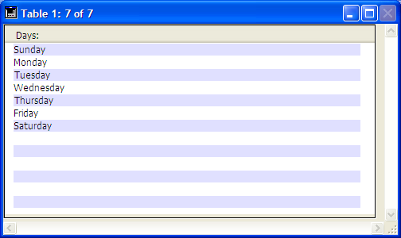

<!--REF #_command_.Displayed line number.Syntax-->**Displayed line number**  : Integer<!-- END REF-->
<!--REF #_command_.Displayed line number.Params-->
| Parameter | Type |  | Description |
| --- | --- | --- | --- |
| Function result | Integer | &#8592; | Number of row being displayed |

<!-- END REF-->

*This command is not thread-safe, it cannot be used in preemptive code.*


#### Description 

<!--REF #_command_.Displayed line number.Summary-->The **Displayed line number** command only works with the On Display Detail form event.<!-- END REF--> It returns the number of the row being processed while a list of records or list box rows is displayed on screen. If **Displayed line number** is called other than when displaying a list or a list box, it returns 0.

In the case of a list of records, when the displayed row is not empty (when it is linked to a record), the value returned by **Displayed line number** is identical to the value returned by [Selected record number](selected-record-number.md).

Like [Selected record number](selected-record-number.md), **Displayed line number** starts at 1\. This command is useful if you want to process each row of a list form or list box displayed on screen, including empty rows. 

#### Example 

This example lets you apply an alternating color to a list form displayed on screen, even for rows without records:

```4d
  //List form method
 If(Form event code=On Display Detail)
    If(Displayed line number% 2=0)
  //Black on white for even row text
       OBJECT SET RGB COLORS([Table 1]Field1;-1;0x00FFFFFF)
    Else
  //Black on light blue for odd row text
       OBJECT SET RGB COLORS([Table 1]Field1;-1;0x00E0E0FF)
    End if
 End if
```



#### See also 

[Form event code](../commands/form-event-code.md)  
[Selected record number](selected-record-number.md)  