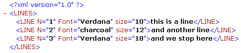

<!--REF #_command_.DOM Count XML attributes.Syntax-->**DOM Count XML attributes** ( *elementRef* ) : Integer<!-- END REF-->
<!--REF #_command_.DOM Count XML attributes.Params-->
| Parameter | Type |  | Description |
| --- | --- | --- | --- |
| elementRef | Text | &#8594;  | XML element reference |
| Function result | Integer | &#8592; | Number of attributes |

<!-- END REF-->

#### Description 

<!--REF #_command_.DOM Count XML attributes.Summary-->The **DOM Count XML attributes** command returns the number of XML attributes present in the XML element designated by *elementRef*.<!-- END REF--> For more information about XML attributes, refer to the *Overview of XML DOM Commands* section. 

#### Example 

Before retrieving the values of elements in an array, you want to know the number of attributes in the following XML element:



```4d
 var myBlobVar : Blob
 var $xml_Parent_Ref;$xml_Child_Ref : Text
 var myResult : Text
 var $numAttributes : Integer
 
 $xml_Parent_Ref:=DOM Parse XML variable(myBlobVar)
 $xml_Child_Ref:=DOM Get first child XML element($xml_Parent_Ref)
 
 $numAttributes:=DOM Count XML attributes($xml_Child_Ref)
 ARRAY TEXT(tAttrib;$numAttributes)
 ARRAY TEXT(tValAttrib;$numAttributes)
 For($i;1;$numAttributes)
    DOM GET XML ATTRIBUTE BY INDEX($xml_Child_Ref;$i;tAttrib{$i};tValAttrib{$i})
 End for
```

In the above example, $numAttributes equals 3, tAttrib{1} contains “Font”, tAttrib{2} contains “N”, tAttrib{3} contains “size” and tValAttrib contains “Verdana”, “1” and “10”.

**Note:** The index number does not correspond to the location of the attribute in the XML file displayed in text form. In XML, the index of an attribute indicates its position among the attributes arranged in alphabetical order (according to their name).

#### System variables and sets 

If the command has been correctly executed, the system variable OK is set to 1\. If an error occurs, it is set to 0.

#### See also 

[DOM Count XML elements](dom-count-xml-elements.md)  

#### Properties

|  |  |
| --- | --- |
| Command number | 727 |
| Thread safe | &check; |
| Modifies variables | OK |


