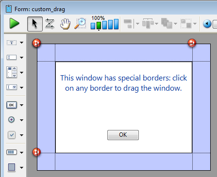

<!--REF #_command_.DRAG WINDOW.Syntax-->**DRAG WINDOW**<!-- END REF-->
<!--REF #_command_.DRAG WINDOW.Params-->
| Does not require any parameters |  |
| --- | --- |

<!-- END REF-->

*This command is not thread-safe, it cannot be used in preemptive code.*


#### Description 

<!--REF #_command_.DRAG WINDOW.Summary-->The DRAG WINDOW command lets users drag the window on which they clicked following the movements of the mouse.<!-- END REF--> Usually you call this command from within an object method of an object that can respond instantaneously to mouse clicks (i.e., invisible buttons).

#### Example 

The following form, shown here in the Form editor, contains a colored frame, above which are four invisible buttons for each side:



Each button has the following method:

```4d
 DRAG WINDOW //Start dragging window when clicked
```

After executing the following project method:

```4d
 $winRef:=Open form window("custom_drag";Modal form dialog box)
 DIALOG("custom_drag")
 CLOSE WINDOW
```

You obtain a window similar to this:


Then you can drag the window by clicking anywhere on the borders.

#### See also 

[GET WINDOW RECT](get-window-rect.md)  
[SET WINDOW RECT](set-window-rect.md)  