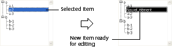
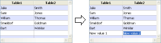

<!--REF #_command_.EDIT ITEM.Syntax-->**EDIT ITEM** ( {* ;} *object* {; *item*} )<!-- END REF-->
<!--REF #_command_.EDIT ITEM.Params-->
| Parameter | Type |  | Description |
| --- | --- | --- | --- |
| * | Operator | &#8594;  | If set, object is an object name (string) If omitted, object is a table or variable |
| object | any | &#8594;  | Object name (if * set) or Table or variable (if * omitted) |
| item | Integer | &#8594;  | Item number |

<!-- END REF-->

#### Description 

<!--REF #_command_.EDIT ITEM.Summary-->The **EDIT ITEM** command allows you to edit the current item or the item number *item* in the array or the list set in the *object* parameter.<!-- END REF-->   
This means that the selected item can be modified; entering a character entirely replaces the item content.

If you pass the optional *\** parameter, you indicate that the *object* parameter is an object name (in this case, pass a string in *object*). If you do not pass the parameter, you indicate that the *object* parameter is a table or a variable. In this case, you do not pass a string but a table or a variable reference.

This command applies to the following enterable objects:

* Hierarchical lists
* List box columns
* Subforms (in this case, only an object name — the subform — can be passed in *object*),
* List forms displayed using the [DISPLAY SELECTION](display-selection.md) or [MODIFY SELECTION](modify-selection.md) commands.

If the command is used with an enterable object that is not a list, it then acts the same as the [GOTO OBJECT](goto-object.md) command.   
The command does nothing if the list or the array is empty or invisible. Also, if the list or the array is not enterable, the command only selects the specified item without changing to editing mode. Regarding list boxes, if the column does not allow text entry (entry by check boxes or drop-down lists only), the specified element gets the focus.

The optional *item* parameter allows you to set the position of the item (hierarchical list) or the row number (list box column, list form and subform in “multiple selection” mode) to change to editing mode. If you do not pass this parameter, the command is applied to the current item for *object*. If there is no current item, the first item of *object* changes to editing mode.

**Notes:**

* In subforms and list forms, the command changes the first field of a specified row to edit mode, in the order of entry.
* In listboxes displayed in hierarchical mode, if the targeted item belongs to a hierarchical level that is collapsed, this level (as well as any parent levels) will be expanded automatically so that the item is visible.

#### Example 1 

This command can be particularly useful when creating a new item in a hierarchical list. When the command is called, the last item added or inserted in the list automatically becomes editable without the user having to do anything.   
The following code may be the method of a button that allows you to insert a new item in an existing list. The default text “New\_item” is automatically ready to be changed:

```4d
 vlUniqueRef:=vlUniqueRef+1
 INSERT IN LIST(hList;*;"New_item";vlUniqueRef)
 EDIT ITEM(*;"MyList")
```



#### Example 2 

Given two columns in a list box whose variable names are “Array1” and “Array2” respectively. The following example inserts a new item in the two arrays and passes the new item of Array2 into editing mode: 

```4d
 $vlRowNum:=Size of array(Array1)+1
 LISTBOX INSERT ROWS(*;"MyListBox";$vlRowNum)
 Array1{$vlRowNum}:="New value 1"
 Array2{$vlRowNum}:="New value 2"
 EDIT ITEM(Array2;$vlRowNum)
```



#### See also 

[GOTO OBJECT](goto-object.md)  
[INSERT IN LIST](insert-in-list.md)  
[SET LIST ITEM](set-list-item.md)  

#### Properties
|  |  |
| --- | --- |
| Command number | 870 |
| Thread safe | &check; |
| Forbidden on the server ||


