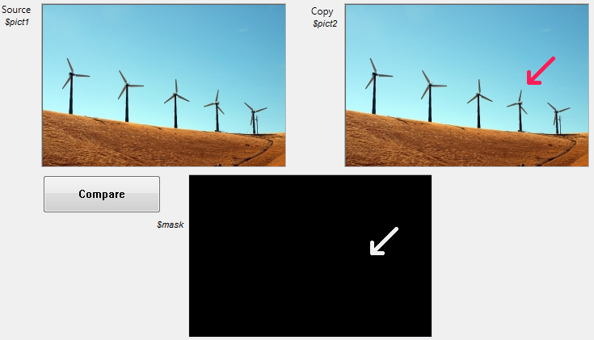

<!--REF #_command_.Equal pictures.Syntax-->**Equal pictures** ( *picture1* ; *picture2* ; *mask* ) : Boolean<!-- END REF-->
<!--REF #_command_.Equal pictures.Params-->
| Parameter | Type |  | Description |
| --- | --- | --- | --- |
| picture1 | Picture, Picture | &#8594;  | Original source picture |
| picture2 | Picture, Picture | &#8594;  | Picture to compare |
| mask | Picture, Picture | &#8592; | Resulting mask |
| Function result | Boolean | &#8592; | True if both pictures are identical; otherwise, False |

<!-- END REF-->

#### Description 

<!--REF #_command_.Equal pictures.Summary-->The **Equal pictures** command precisely compares both the dimensions and the contents of two pictures.<!-- END REF-->

Pass the source picture in *picture1* and the picture you want to compare with it in *picture2*. 

* If the pictures are not the same dimension, the command returns **False** and the *mask* parameter contains a blank picture.
* If the pictures are of the same dimension but with different contents, the command returns **False** and the *mask* parameter contains the resulting picture mask based on a comparison of the two pictures. This comparison is performed pixel by pixel, and each pixel that does not match appears white on a black background.
* If both pictures are exactly the same, the command returns **True** and the *mask* parameter contains a picture that is completely black.

#### System variables and sets 

If the command is executed successfully (the two pictures are compared), the system variable OK is set to 1\. In the case of an anomaly, particularly if one of the pictures is not initialized (blank picture), the OK variable is set to 0.

#### Example 

In the following example, we compare two pictures (pict1 and pict2) and display the resulting mask:



Here is the code for the **Compare** button:

```4d
 $equal :=Equal pictures($pict1;$pict2;$mask)
```


#### Properties
|  |  |
| --- | --- |
| Command number | 1196 |
| Thread safe | &check; |
| Modifies variables | OK |
| Forbidden on the server ||


