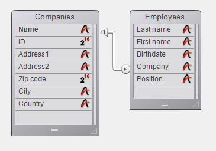

<!--REF #_command_.GET FIELD RELATION.Syntax-->**GET FIELD RELATION** ( *manyField* ; *one* ; *many* {; *} )<!-- END REF-->
<!--REF #_command_.GET FIELD RELATION.Params-->
| Parameter | Type |  | Description |
| --- | --- | --- | --- |
| manyField | Field | &#8594;  | Starting field of a relation |
| one | Integer | &#8592; | Status of the Many-to-One relation |
| many | Integer | &#8592; | Status of the One-to-Many relation |
| * | Operator | &#8594;  | • If passed: one and many return the current status of the relation (values 2 or 3 only) • If omitted (default): one and many can return the value 1 if the relation has not been modified through programming |

<!-- END REF-->

#### Description 

<!--REF #_command_.GET FIELD RELATION.Summary-->The **GET FIELD RELATION** command lets you find out the automatic/manual status of the relation starting from *manyField* for the current process.<!-- END REF--> You can view any relation, including automatic relations set in the Structure window.

* In *manyField*, pass the name of theMany table field from which the relation whose status you want to find out originates. If no relation originates from the *manyField* field, the *one* et *many* parameters return 0, an error is returned and the system variable OK is set to 0 (see below).
* After the command is executed, the *one* parameter contains a value indicating whether the Many-to-One relation specified is set as automatic:  
0 = There is no relation originating from *manyField*. Syntax error No. 16 (“The field has no relation”) is generated and the system variable OK is set to 0\.  
1 = The automatic/manual status of the Many-to-One relation specified is that set by the **Auto Relate One** option in the Relation properties of the Design environment (it has not been modified by programming).  
2 = The Many-to-One relation is manual for the process.  
3 = The Many-to-One relation is automatic for the process.
* After the command is executed, the *many* parameter contains a value indicating whether the One-to-Many relation specified is set as automatic:  
0 = There is no relation originating from *manyField*. Syntax error No. 16 (“The field has no relation”) is generated and the system variable OK is set to 0\.  
1 = The automatic/manual status of the One-to-Many relation specified is that set by the **Auto One to Many** option in the Relation properties of the Design environment (it has not been modified by programming).  
2 = The One-to-Many relation is manual for the process.  
3 = The One-to-Many relation is automatic for the process.

You can compare the values returned in the *one* and *many* parameters with the constants of the “*Relations*” theme: 

| Constant                | Type    | Value |
| ----------------------- | ------- | ----- |
| Automatic               | Integer | 3     |
| Manual                  | Integer | 2     |
| No relation             | Integer | 0     |
| Structure configuration | Integer | 1     |

* The optional *\** parameter lets you “force” the reading of the current status of the relation, even if it has not been modified by programming. In other words, when you pass the \* parameter, only the values 2 or 3 can be returned in the *one* and *many* parameters.

#### Example 

Given the following structure:



The properties of the relation linking the \[Employees\]Company field to the \[Companies\]Name field are the following:


The following code illustrates the various possibilities offered by the **GET FIELD RELATION**, [GET AUTOMATIC RELATIONS](get-automatic-relations.md) and [SET FIELD RELATION](set-field-relation.md), [SET AUTOMATIC RELATIONS](set-automatic-relations.md) commands along with their effects:

```4d
 GET AUTOMATIC RELATIONS(one;many) //returns False, False
 GET FIELD RELATION([Employees]Company;one;many) //returns 1,1
 GET FIELD RELATION([Employees]Company;one;many;*) //returns 3,2
 
 SET FIELD RELATION([Employees]Company;2;0) //changes Many-to-One relation to manual
 
 GET FIELD RELATION([Employees]Company;one;many) //returns 2,1
 GET FIELD RELATION([Employees]Company;one;many;*) //returns 2, 2
 
 SET FIELD RELATION([Employees]Company;1;0) //re-establishes the parameters set in Design environment for Many-to-One relation
 
 GET FIELD RELATION([Employees]Company;one;many) //returns 1,1
 GET FIELD RELATION([Employees]Company;one;many;*) //returns 3,2
 
 SET AUTOMATIC RELATIONS(True;True) //changes all relations of all tables to automatic
 
 GET AUTOMATIC RELATIONS(one;many) //returns True, True
 GET FIELD RELATION([Employees]Company;one;many) //returns 1,1
 GET FIELD RELATION([Employees]Company;one;many;*) //returns 3,3
```

#### See also 

[GET AUTOMATIC RELATIONS](get-automatic-relations.md)  
[GET RELATION PROPERTIES](get-relation-properties.md)  
[SET AUTOMATIC RELATIONS](set-automatic-relations.md)  
[SET FIELD RELATION](set-field-relation.md)  

#### Properties
|  |  |
| --- | --- |
| Command number | 920 |
| Thread safe | &check; |
| Forbidden on the server ||


