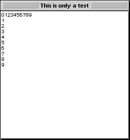

<!--REF #_command_.GOTO XY.Syntax-->**GOTO XY** ( *x* ; *y* )<!-- END REF-->
<!--REF #_command_.GOTO XY.Params-->
| Parameter | Type |  | Description |
| --- | --- | --- | --- |
| x | Integer | &#8594;  | x (horizontal) position of cursor |
| y | Integer | &#8594;  | y (vertical) position of cursor |

<!-- END REF-->

*This command is not thread-safe, it cannot be used in preemptive code.*


#### Description 

<!--REF #_command_.GOTO XY.Summary-->The **GOTO XY** command is used in conjunction with the [MESSAGE](message.md) command when you display messages in a window opened using [Open window](open-window.md).<!-- END REF-->  
  
**GOTO XY** positions the character cursor (an invisible cursor) to set the location of the next message in the window.

The upper-left corner is position 0,0\. The cursor is automatically placed at 0,0 when a window is opened and after [ERASE WINDOW](erase-window.md) is executed.

After **GOTO XY** positions the cursor, you can use [MESSAGE](message.md) to display characters in the window.

#### Example 1 

See example for the [MESSAGE](message.md) command.

#### Example 2 

See example for the [Milliseconds](milliseconds.md) command.

#### Example 3 

The following example: 

```4d
 Open window(50;50;300;300;5;"This is only a test")
 For($vlRow;0;9)
    GOTO XY($vlRow;0)
    MESSAGE(String($vlRow))
 End for
 For($vlLine;0;9)
    GOTO XY(0;$vlLine)
    MESSAGE(String($vlLine))
 End for
 $vhStartTime:=Current time
 Repeat
 Until((Current time-$vhStartTime)>†00:00:30†)
```

displays the following window (on Macintosh) for 30 seconds:



#### See also 

[MESSAGE](message.md)  