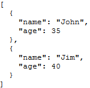

<!--REF #_command_.JSON Stringify array.Syntax-->**JSON Stringify array** ( *array* {; *} ) : Text<!-- END REF-->
<!--REF #_command_.JSON Stringify array.Params-->
| Parameter | Type |  | Description |
| --- | --- | --- | --- |
| array | Text array, Real array, Boolean array, Pointer array, Object array | &#8594;  | Array whose contents must be serialized |
| * | Operator | &#8594;  | Pretty formatting |
| Function result | Text | &#8592; | String containing the serialized JSON array |

<!-- END REF-->

#### Description 

<!--REF #_command_.JSON Stringify array.Summary-->The **JSON Stringify array** command converts the 4D array *array* into a serialized JSON array.<!-- END REF--> This command performs the opposite action of the [JSON PARSE ARRAY](json-parse-array.md) command.

In *array*, pass a 4D array containing the data to be serialized. This array may be of the text, real, Boolean, pointer or object type.

**Note:** If you pass a scalar variable or field in *array*, the command will return a string with the parameter value between "\[ \]". 

You can pass the optional *\** parameter to use pretty formatting in the resulting string. This improves the presentation of JSON data by including formatting characters when it is displayed in a Web page.

#### Example 1 

Conversion of a text array:

```4d
 var $jsonString : Text
 ARRAY TEXT($ArrayFirstname;2)
 $ArrayFirstname{1}:="John"
 $ArrayFirstname{2}:="Jim"
 $jsonString :=JSON Stringify array($ArrayFirstname)
 
  // $jsonString = "["John","Jim"]"
```

#### Example 2 

Conversion of a text array containing numbers:

```4d
 ARRAY TEXT($phoneNumbers;0)
 APPEND TO ARRAY($phoneNumbers ;"555-0100")
 APPEND TO ARRAY($phoneNumbers ;"555-0120")
 $string :=JSON Stringify array($phoneNumbers)
  // $string = "["555-0100","555-0120"]"
```

#### Example 3 

Conversion of an object array:

```4d
 var $ref_john : Object
 var $ref_jim : Object
 ARRAY OBJECT($myArray;0)
 OB SET($ref_john;"name";"John";"age";35)
 OB SET($ref_jim;"name";"Jim";"age";40)
 APPEND TO ARRAY($myArray ;$ref_john)
 APPEND TO ARRAY($myArray ;$ref_jim)
 $JsonString :=JSON Stringify array($myArray)
  // $JsonString = "[{"name":"John","age":35},{"name":"Jim","age":40}]"
 
  // If you want to view the result in a Web page,
  // pass the optional * parameter:
 $JsonStringPretty :=JSON Stringify array($myArray;*)
```



#### Example 4 

Conversion of a 4D selection in an object array:

```4d
 var $jsonObject : Object
 var $jsonString : Text
 
 QUERY([Company];[Company]Company Name="a@")
 OB SET($jsonObject;"company name";->[Company]Company Name)
 OB SET($jsonObject;"city";->[Company]City)
 OB SET($jsonObject;"date";[Company]Date_input)
 OB SET($jsonObject;"time";[Company]Time_input)
 ARRAY OBJECT($arraySel;0)
 
 While(Not(End selection([Company])))
    $ref_value:=OB Copy($jsonObject;True)
  // If you do not copy them, the values will be empty strings
    APPEND TO ARRAY($arraySel;$ref_value)
  // Each element contains the selected values, for example:
  // $arraySel{1} = // {"company name":"APPLE","time":43200000,"city":
  // "Paris","date":"2012-08-02T00:00:00Z"}
    NEXT RECORD([Company])
 End while
 
 $jsonString:=JSON Stringify array($arraySel)
  // $jsonString = "[{"company name":"APPLE","time":43200000,"city":
  //"Paris","date":"2012-08-02T00:00:00Z"},{"company name":
  //"ALMANZA",...}]"
```

#### See also 

[JSON PARSE ARRAY](json-parse-array.md)  
[JSON Stringify](json-stringify.md)  

#### Properties
|  |  |
| --- | --- |
| Command number | 1228 |
| Thread safe | &check; |
| Forbidden on the server ||


