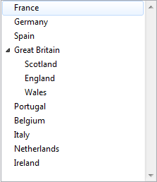

<!--REF #_command_.LIST TO ARRAY.Syntax-->**LIST TO ARRAY** ( *list* ; *array* {; *itemRefs*} )<!-- END REF-->
<!--REF #_command_.LIST TO ARRAY.Params-->
| Parameter | Type |  | Description |
| --- | --- | --- | --- |
| list | Text, Integer | &#8594;  | Name or Reference of list from which to copy the first level items |
| array | Array | &#8592; | Array to which to copy the list items |
| itemRefs | Array | &#8592; | List item reference numbers |

<!-- END REF-->

#### Description 

<!--REF #_command_.LIST TO ARRAY.Summary-->The LIST TO ARRAY command creates or overrides the array *array* with the first level items of the list or choice list designated by *list*.<!-- END REF--> 

In the list parameter, you can pass either the name of a choice list (string), or a reference to a hierarchical list ([ListRef](# "A Longint reference to a hierachical list")).

If you do not set the array as an Alpha or Text type beforehand, LIST TO ARRAY creates a new Text array by default. 

**Note:** In compiled mode, the *array* must have been defined previously and cannot be retyped.

The optional *itemRefs* parameter (a numeric array) returns the list item reference numbers. 

You can use LIST TO ARRAY to build an array based on the first level items of a list. However, this command does not allow you to work with any of the list's child items. When working with hierarchical lists, we recommend that you use the hierarchical lists commands, in particular [Load list](load-list.md).

#### Example 1 

The following example copies the items of a list called Regions into an array called *atRegions*:

```4d
 LIST TO ARRAY("Regions";atRegions)
```

#### Example 2 

Given a hierarchical list created as follows:

```4d
 myList2:=New list
 APPEND TO LIST(myList2;"Scotland";1)
 APPEND TO LIST(myList2;"England";2)
 APPEND TO LIST(myList2;"Wales";3)
 myList1:=New list
 APPEND TO LIST(myList1;"France";1)
 APPEND TO LIST(myList1;"Germany";2)
 APPEND TO LIST(myList1;"Spain";3)
 APPEND TO LIST(myList1;"Great Britain";4;myList2;True)
 APPEND TO LIST(myList1;"Portugal";5)
 APPEND TO LIST(myList1;"Belgium";6)
 APPEND TO LIST(myList1;"Italy";7)
 APPEND TO LIST(myList1;"Netherlands";8)
 APPEND TO LIST(myList1;"Ireland";9)
```

This list can be represented as:



If you execute the following statement:

```4d
 LIST TO ARRAY(myList1;$MyArray)
```

...you get

```4d
 $MyArray{1}="France"
 $MyArray{2}="Germany"
 $MyArray{3}="Spain"
 $MyArray{4}="Great Britain"
 $MyArray{5}="Portugal"
 ...
```

#### See also 

[ARRAY TO LIST](array-to-list.md)  
[Load list](load-list.md)  
[SAVE LIST](save-list.md)  

#### Properties
|  |  |
| --- | --- |
| Command number | 288 |
| Thread safe | &check; |
| Forbidden on the server ||


