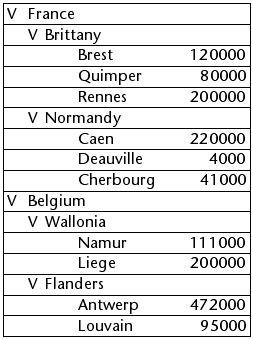
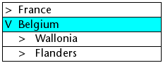

<!--REF #_command_.LISTBOX EXPAND.Syntax-->**LISTBOX EXPAND** ( {* ;} *object* {; *recursive* {; *selector* {; *line* {; *column*}}}} )<!-- END REF-->
<!--REF #_command_.LISTBOX EXPAND.Params-->
| Parameter | Type |  | Description |
| --- | --- | --- | --- |
| * | Operator | &#8594;  | If specified, object is an object name (string)<br/>If omitted, object is a variable |
| object | any | &#8594;  | Object name (if * is specified) or <br/>Variable (if * is omitted) |
| recursive | Boolean | &#8594;  | True = expand sublevels<br/>False = do not expand sublevels |
| selector | Integer | &#8594;  | Part of list box to expand |
| line | Integer | &#8594;  | Number of break row to expand or <br/>Number of list box level to expand |
| column | Integer | &#8594;  | Number of break column to expand |

<!-- END REF-->

#### Description 

<!--REF #_command_.LISTBOX EXPAND.Summary-->The LISTBOX EXPAND command is used to expand the break rows of the list box object designated by the *object* and *\** parameters.<!-- END REF-->

If you pass the optional *\** parameter, you indicate that the *object* parameter is an object name (string). If you do not pass this parameter, you indicate that the *object* parameter is a variable. In this case, you pass a variable reference instead of a string. 

If the list box is not configured in hierarchical mode, the command does nothing. For more information about hierarchical list boxes, please refer to the *Hierarchical list boxes* section.

 The optional *recursive* parameter is used to configure the expanding of the hierarchical sublevels of the list box. Pass True or omit this parameter for the command to expand all the levels and all the sublevels. If you pass False, only the first level specified will be expanded. 

The optional *selector* parameter is used to specify the scope of the command. You can pass one of the following constants, found in the *List Box* theme, in this parameter:

| Constant     | Type    | Value | Comment                                                                                                                                                                                                                                                                                                                                 |
| ------------ | ------- | ----- | --------------------------------------------------------------------------------------------------------------------------------------------------------------------------------------------------------------------------------------------------------------------------------------------------------------------------------------- |
| lk all       | Integer | 0     | The command affects all sub-levels (default value, used when parameter is omitted).                                                                                                                                                                                                                                                     |
| lk selection | Integer | 1     | The command affects selected sub-levels.                                                                                                                                                                                                                                                                                                |
| lk break row | Integer | 2     | The command affects the sub-level to which the "cell" designated by the *row* and *column* parameters belongs. Note that these parameters represent the row and column numbers in the list box in standard mode and not in its hierarchical representation. If the *row* and *column* parameters are omitted, the command does nothing. |
| lk level     | Integer | 3     | The command affects all the break rows corresponding to the *level* column. This parameter designates a column number in the list box in standard mode and not in its hierarchical representation. If the *level* parameter is omitted, the command does nothing.                                                                       |

The command does not select break rows. 

If the selection or list box does not contain a break row or if all the break rows are already expanded, the command does nothing.

#### Example 

This example illustrates different ways of using the command. Given the following arrays shown in a list box:


```4d
  //Expand all the break rows and subrows of the list box
 LISTBOX EXPAND(*;"MyListbox")
```



```4d
  //Expand the first level of break rows of the selection
 LISTBOX EXPAND(*;"MyListbox";False;lk selection)
  //If the "Belgium" row was selected
```



```4d
  //Expand the Brittany break row with recursion
 LISTBOX EXPAND(*;"MyListbox";False;lk break row;1;2)
```


```4d
  //Expand all the first columns (countries) without recursion
 LISTBOX EXPAND(*;"MyListbox";False;lk level;1)
```


#### See also 

[LISTBOX COLLAPSE](listbox-collapse.md)  

#### Properties
|  |  |
| --- | --- |
| Command number | 1100 |
| Thread safe | &check; |
| Forbidden on the server ||


