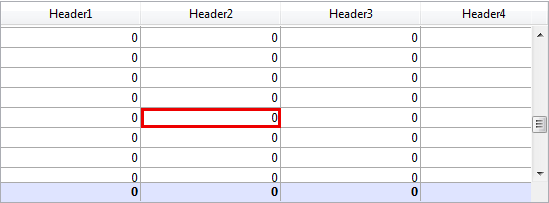

<!--REF #_command_.LISTBOX GET CELL COORDINATES.Syntax-->**LISTBOX GET CELL COORDINATES** ( {* ;} *object* ; *column* ; *row* ; *left* ; *top* ; *right* ; *bottom* )<!-- END REF-->
<!--REF #_command_.LISTBOX GET CELL COORDINATES.Params-->
| Parameter | Type |  | Description |
| --- | --- | --- | --- |
| * | Operator | &#8594;  | If specified = object is the name of the object (string) If omitted = object is a variable |
| object | any | &#8594;  | Object name (if * is specified) or variable (if * is omitted) |
| column | Integer | &#8594;  | Column number |
| row | Integer | &#8594;  | Row number |
| left | Integer | &#8592; | Left coordinate of the object |
| top | Integer | &#8592; | Top coordinate of the object |
| right | Integer | &#8592; | Right coordinate of the object |
| bottom | Integer | &#8592; | Bottom coordinate of the object |

<!-- END REF-->

#### Description 

<!--REF #_command_.LISTBOX GET CELL COORDINATES.Summary-->The **LISTBOX GET CELL COORDINATES** command returns in variables or fields the *left*, *top*, *right* and *bottom* coordinates (in points) of the cell designated by the *column* and *row* parameters, in the list box defined by *\** and *object*.<!-- END REF-->

If you pass the optional *\** parameter, it indicates that the *object* parameter is an object name (a string). If you don’t pass the optional *\** parameter, this indicates that the object is a field or a variable. In this case, you pass a field or variable reference (only a field or variable of the object type) instead of a string

For consistency with the *OBJECT GET COORDINATES* command, the origin is the upper-left corner of the form which contains the cell. Also, the coordinates returned are theoretical; they take into account the scrolling state of the list box before any clipping occurs. As a result, the cell may be not visible (or only partially so) at its coordinates, and these coordinates may be outside the form limits (or even negative). To find out if the cell is displayed (and which part of it is visible) you need to compare the coordinates returned with the list box coordinates, while considering the following rules:

* All cells are clipped to the coordinates of their parent list box (as returned by the [OBJECT GET COORDINATES](object-get-coordinates.md) command for the list box).
* Header and footer sub-objects are displayed on top column content: when the coordinates of a cell intersect the coordinates of the header or footer rows, then the cell is not displayed at this intersection.
* Elements of locked columns are displayed on top of elements of scrollable columns: when the coordinates of an element in a scrollable column intersect the coordinates of an element in a locked column, then it is not displayed at this intersection.

For more information, please refer to the [OBJECT GET COORDINATES](object-get-coordinates.md) command description.

#### Example 

You want to draw a red rectangle around the selected cell of a list box:

```4d
 OBJECT SET VISIBLE(*;"RedRect";False) //initialize a red rectangle
  //the rectangle is already defined somewhere in the form
 LISTBOX GET CELL POSITION(*;"LB1";$col;$row)
 LISTBOX GET CELL COORDINATES(*;"LB1";$col;$row;$x1;$y1;$x2;$y2)
 OBJECT SET VISIBLE(*;"RedRect";True)
 OBJECT SET COORDINATES(*;"RedRect";$x1;$y1;$x2;$y2)
```



#### See also 

[LISTBOX GET CELL POSITION](listbox-get-cell-position.md)  
[OBJECT GET COORDINATES](object-get-coordinates.md)  

#### Properties
|  |  |
| --- | --- |
| Command number | 1330 |
| Thread safe | &check; |
| Forbidden on the server ||


