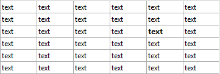

<!--REF #_command_.LISTBOX SET ROW FONT STYLE.Syntax-->**LISTBOX SET ROW FONT STYLE** ( {* ;} *object* ; *row* ; *style* )<!-- END REF-->
<!--REF #_command_.LISTBOX SET ROW FONT STYLE.Params-->
| Parameter | Type |  | Description |
| --- | --- | --- | --- |
| * | Operator | &#8594;  | If specified, object is an object name (string) If omitted, object is a variable |
| object | any | &#8594;  | Object name (if * is specified) or<br/>Variable (if * is omitted) |
| row | Integer | &#8594;  | Row number |
| style | Integer | &#8594;  | Font style |

<!-- END REF-->

*This command is not thread-safe, it cannot be used in preemptive code.*


#### Description 

<!--REF #_command_.LISTBOX SET ROW FONT STYLE.Summary-->**Note:** This command only works with array type list boxes.<!-- END REF-->

The **LISTBOX SET ROW FONT STYLE** command sets a font style for a row or a cell in the array type list box designated by the *object* and *\** parameters. 

Passing the optional *\** parameter indicates that the *object* parameter is an object name (string). If you do not pass this parameter, it indicates that the *object* parameter is a is a variable. In this case, you pass a variable reference instead of a string.

You can designate a list box or a list box column in the *object* parameter:

* When *object* designates a list box, the command applies to the row.
* When *object* designates a list box column, the command applies to the cell located at the column/row intersection.

In *row*, pass the number of the row where you want to apply the new style. 

**Note:** The command does not take any hidden/shown states of the list box rows into account.

In *style*, you pass a style value. You must use one (or a combination) of the constants found in the *Font Styles* theme: 

| Constant  | Type    | Value |
| --------- | ------- | ----- |
| Bold      | Integer | 1     |
| Italic    | Integer | 2     |
| Plain     | Integer | 0     |
| Underline | Integer | 4     |

If an array of font styles has been associated with the list box or column, only the element matching the row is modified. In other words, executing the command has the same effect, in this case, as modifying an element of the font style array.   
If there is no font style array associated with the list box or column, one will be created dynamically when this command is called. You can access them using the [LISTBOX Get array](listbox-get-array.md) command.

If conflicting style properties are set for the column or the list box, an order of priority is applied. For more information, refer to the *Design Reference* manual. 

**Note:** Since style arrays for columns take priority over the ones for list boxes, when this command is applied to a list box, it will only have an effect if no style array has been assigned to the columns.

#### Example 

Given an array type list box with the following characteristics:

* a font style array associated with the list box (*ArrGlobalStyle*)
* a font style array associated with column 5 (*ArrCol5Style*)
* the other columns do not have any style arrays.

```4d
 LISTBOX SET ROW FONT STYLE(*;"Col5";3;Bold)
  // equivalent to ArrCol5Style{3}:=Bold
```



```4d
 LISTBOX SET ROW FONT STYLE(*;"List Box";3;Italic+Underline)
  // equivalent toArrGlobalStyle{3}:=Italic+Underline
```


After the second statement, all the cells of the third row change to underlined italic, except for the one in the 5th column which stays in bold only (column style arrays take priority over list box arrays). 

#### See also 

[LISTBOX Get row font style](listbox-get-row-font-style.md)  
[LISTBOX SET ROW COLOR](listbox-set-row-color.md)  