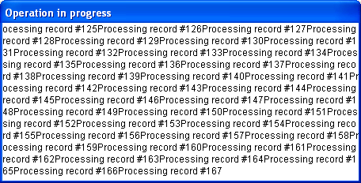

<!--REF #_command_.MESSAGE.Syntax-->**MESSAGE** ( *message* )<!-- END REF-->
<!--REF #_command_.MESSAGE.Params-->
| Parameter | Type |  | Description |
| --- | --- | --- | --- |
| message | Text | &#8594;  | Message to display |

<!-- END REF-->

#### Description 

<!--REF #_command_.MESSAGE.Summary-->The **MESSAGE** command is usually used to inform the user of some activity.<!-- END REF--> It displays *message* on the screen in a special message window that opens and closes each time you call **MESSAGE**, unless you work with a window you previously opened using [Open window](open-window.md) (see the following details). The message is temporary and is erased as soon as a form is displayed or the method stops executing. If another **MESSAGE** is executed, the old message is erased.

If a window is opened with [Open window](open-window.md), all subsequent calls to **MESSAGE** display the messages in that window. The window behaves like a terminal:

* Successive messages do not erase previous messages when displayed in the window. Instead, they are concatenated onto existing messages.
* If a message is wider than the window, 4D automatically performs text wrap.
* If a message has more lines than the window, 4D automatically scrolls the message window.
* To control line breaks, include carriage returns — **Char(13)** — into your message.
* To display the text at a particular place in the window, call [GOTO XY](goto-xy.md).
* To erase the contents of the window, call [ERASE WINDOW](erase-window.md).
* The window is only an output window and does not redraw when other windows overlap it.
* You can modify the font and size of characters displayed in the window by means of the "Interface" page in the Database Settings.

**Note:** **MESSAGE** is compatible with the [Open form window](open-form-window.md) command; however, in this context the second *\** parameter of [Open form window](open-form-window.md), which saves the window's size and position, is not supported. 

#### Example 1 

The following example processes a selection of records and calls MESSAGE to inform the user about the progress of the operation:

```4d
 For($vlRecord;1;Records in selection([anyTable]))
    MESSAGE("Processing record #"+String($vlRecord))
  // Do Something with the record
    NEXT RECORD([anyTable])
 End for
```

The following window appears and disappears at each MESSAGE call:


#### Example 2 

In order to avoid this "blinking" window, you can display the messages in a window opened using [Open window](open-window.md), as in this example:

```4d
 Open window(50;50;500;250;5;"Operation in Progress")
 For($vlRecord;1;Records in selection([anyTable]))
    MESSAGE("Processing record #"+String($vlRecord))
  // Do Something with the record
    NEXT RECORD([anyTable])
 End for
 CLOSE WINDOW
```

This provides the following result (shown here on Windows):



#### Example 3 

Adding a carriage return makes a better presentation:

```4d
 Open window(50;50;500;250;5;"Operation in Progress")
 For($vlRecord;1;Records in selection([anyTable]))
    MESSAGE("Processing record #"+String($vlRecord)+Char(Carriage return))
  // Do Something with the record
    NEXT RECORD([anyTable])
 End for
 CLOSE WINDOW
```

This provides the following result (shown here on Windows):


#### Example 4 

Using [GOTO XY](goto-xy.md) and writing some additional lines:

```4d
 Open window(50;50;500;250;5;"Operation in Progress")
 $vlNbRecords:=Records in selection([anyTable])
 $vhStartTime:=Current time
 For($vlRecord;1;$vlNbRecords)
    GOTO XY(5;2)
    MESSAGE("Processing record #"+String($vlRecord)+Char(Carriage return))
  // Do Something with the record
    NEXT RECORD([anyTable])
    GOTO XY(5;5)
    $vlRemaining:=(($vlNbRecords/$vlRecord)-1)*(Current time-$vhStartTime)
    MESSAGE("Estimated remaining time: "+Time string($vlRemaining))
 End for
 CLOSE WINDOW
```

This provides the following result (shown here on Windows):


#### See also 

[CLOSE WINDOW](close-window.md)  
[ERASE WINDOW](erase-window.md)  
[GOTO XY](goto-xy.md)  
[Open window](open-window.md)  

#### Properties
|  |  |
| --- | --- |
| Command number | 88 |
| Thread safe | &check; |
| Forbidden on the server ||


