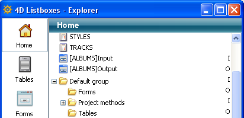

<!--REF #_command_.METHOD GET FOLDERS.Syntax-->**METHOD GET FOLDERS** ( *arrNames* {; *filter*}{; *} )<!-- END REF-->
<!--REF #_command_.METHOD GET FOLDERS.Params-->
| Parameter | Type |  | Description |
| --- | --- | --- | --- |
| arrNames | Text array | &#8592; | Array of Home page folder names |
| filter | Text | &#8594;  | Name filter |
| * | Operator | &#8594;  | If passed = command applies to host database when executed from a component (parameter ignored outside of this context) |

<!-- END REF-->

*This command is not thread-safe, it cannot be used in preemptive code.*

#### Description 

<!--REF #_command_.METHOD GET FOLDERS.Summary-->The **METHOD GET FOLDERS** command returns, in the *arrNames* array, the names of folders created on the Home page of the 4D Explorer:

Since folder names must be unique, the hierarchy is not returned in this array.<!-- END REF--> 

You can limit this list of folders by passing a comparison string in the *filter* parameter: in this case, only folders whose names match the filter are returned. You can use the @ character in order to specify "starts with", "ends with" or "contains" type filters. If you pass an empty string, the *filter* parameter is ignored. 

If the command is executed from a component, it returns by default the paths of the component methods. If you pass the *\** parameter, the array contains the paths of the methods of the host database.

#### See also 

[METHOD GET PATHS](method-get-paths.md)  