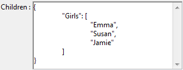

<!--REF #_command_.OB SET ARRAY.Syntax-->**OB SET ARRAY** ( *object* ; *property* ; *array* )<!-- END REF-->
<!--REF #_command_.OB SET ARRAY.Params-->
| Parameter | Type |  | Description |
| --- | --- | --- | --- |
| object | Object, Object | &#8594;  | Structured object |
| property | Text | &#8594;  | Name of property to set |
| array | Array, Variable | &#8594;  | Array to store in property |

<!-- END REF-->

#### Description 

<!--REF #_command_.OB SET ARRAY.Summary-->The **OB SET ARRAY** command defines the *array* to be associated with the *property* in the language object designated by the *object* parameter.<!-- END REF-->

*object* can be an object varialble or a 4D object field.

In the *property* parameter, pass the label of the property to be created or modified. If the property already exists in *object*, its value is updated. If it does not exist, it is created.   
Note that the *property* parameter is case sensitive. 

In the *array* parameter, pass the array that must be passed as the property value. Several array types are supported: real, longint, text, boolean, object, pointer, or picture. 

**Notes:** 

* Simple variables are supported in the *array* parameter, in which case a single-value array is created and associated to the *property*.
* It is not possible to use two-dimensional arrays.

#### Example 1 

Using a text array:

```4d
 var $Children : Object
 ARRAY TEXT($arrChildren;3)
 $arrChildren{1}:="Richard"
 $arrChildren{2}:="Susan"
 $arrChildren{3}:="James"
 
 OB SET ARRAY($Children;"Children";$arrChildren)
  // Value of $Children = {"Children":["Richard","Susan","James"]}
```

#### Example 2 

Adding an element to an array:

```4d
 ARRAY TEXT($arrText;2)
 $arrText{1}:="Smith"
 $arrText{2}:="White"
 var $Employees : Object
 OB SET ARRAY($Employees;"Employees";$arrText)
 APPEND TO ARRAY($arrText;"Brown") // Add to the 4D array
  // $Employees = {"Employees":["Smith","White"]}
 
 OB SET ARRAY($Employees;"Employees";$arrText)
  // $Employees = {"Employees":["Smith","White","Brown"]}
```

#### Example 3 

Using a text array with selection of an element:

```4d
  // $Employees = {"Employees":["Smith","White","Brown"]}
 OB SET ARRAY($Employees ;"Manager";$arrText{1})
  // $Employees = {"Employees":["Smith","White","Brown"],"Manager":["Smith"]}
```

#### Example 4 

Using an object array:

```4d
 var $Children;$ref_richard;$ref_susan;$ref_james : Object
 ARRAY OBJECT($arrChildren;0)
 OB SET($ref_richard;"nom";"Richard";"age";7)
 APPEND TO ARRAY($arrChildren;$ref_richard)
 OB SET($ref_susan;"name";"Susan";"age";4)
 APPEND TO ARRAY($arrChildren;$ref_susan)
 OB SET($ref_james;"name";"James";"age";3)
 
 APPEND TO ARRAY($arrChildren;$ref_james)
 
  // $arrChildren {1} = {"name":"Richard","age":7}
  // $arrChildren {2} = {"name":"Susan","age":4}
  // $arrChildren {3} = {"name":"James","age":3}
 
 OB SET ARRAY($Children;"Children";$arrChildren)
 
  // $Children = {"Children":[{"name":"Richard","age":7},{"name":"Susan",
  // "age":4},{"name":"James","age":3}]}
```

Here is how the object appears in the debugger:


#### Example 5 

Using an Object field:

```4d
 ARRAY TEXT($arrGirls;3)
 $arrGirls{1}:="Emma"
 $arrGirls{2}:="Susan"
 $arrGirls{3}:="Jamie"
 OB SET ARRAY([People]Children;"Girls";$arrGirls)
```



#### Example 6 

Using a picture array:

```4d
 ARRAY PICTURE($arrPhotos;3)
 READ PICTURE FILE("pict1.jpg";$arrPhotos{1})
 READ PICTURE FILE("pict2.jpg";$arrPhotos{2})
 READ PICTURE FILE("pict3.jpg";$arrPhotos{3})
 
 OB SET ARRAY([Cities]Places;"Photoset";$arrPhotos)
```

#### See also 

[OB GET ARRAY](ob-get-array.md)  
[OB SET](ob-set.md)  
*Type conversions between collections and 4D arrays*  