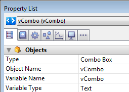

<!--REF #_command_.OBJECT Get data source.Syntax-->**OBJECT Get data source** ( {* ;} *object* ) : Pointer<!-- END REF-->
<!--REF #_command_.OBJECT Get data source.Params-->
| Parameter | Type |  | Description |
| --- | --- | --- | --- |
| * | Operator | &#8594;  | If specified, object is an object name (string)<br/>If omitted, object is a field or variable |
| object | any | &#8594;  | Object name (if * is specified) or <br/>Field or variable (if * is omitted) |
| Function result | Pointer | &#8592; | Pointer to current data source of object |

<!-- END REF-->

*This command is not thread-safe, it cannot be used in preemptive code.*


#### Description 

<!--REF #_command_.OBJECT Get data source.Summary-->The **OBJECT Get data source** command returns the current data source of the object(s) designated by the *object* and *\** parameters.<!-- END REF--> 

You can define the data source for an object in Design mode using the Property List, or using the [OBJECT SET DATA SOURCE](object-set-data-source.md) command.

Passing the optional *\** parameter indicates that the *object* parameter is an object name (string). If you do not pass this parameter, it indicates that the *object* parameter is a field or variable. In this case, you pass a field or variable reference instead of a string (field or variable object only).

#### Example 

Given a combo box object defined in a form:



You execute the following code:

```4d
 $vPtr :=OBJECT Get data source(*;"vCombo")
  // $vPtr contains -> vCombo
```

#### See also 

[OBJECT SET DATA SOURCE](object-set-data-source.md)  