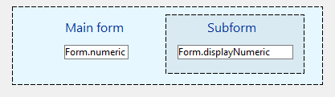

<!--REF #_command_.OBJECT Get subform container value.Syntax-->**OBJECT Get subform container value**  : Mixed<!-- END REF-->
<!--REF #_command_.OBJECT Get subform container value.Params-->
| Parameter | Type |  | Description |
| --- | --- | --- | --- |
| Function result | Mixed | &#8592; | Current value of the subform container data source |

<!-- END REF-->

*This command is not thread-safe, it cannot be used in preemptive code.*


#### Description 

<!--REF #_command_.OBJECT Get subform container value.Summary-->The **OBJECT Get subform container value** command returns the current value of the data source bound with the subform container displayed in the parent form.<!-- END REF-->

This command can only be used in the context of a form used as a subform. In any other context, it returns **Undefined**.

* If the data source is an expression, the command returns the current value of the expression, evaluated since the last form event cycle.
* If the data source is an array, the command returns the array index (integer).

For more information on bound variables and form/subform interaction, see *Managing the bound variable* on developer.4d.com.

#### Example 

Given a main form and a subform that both have an Input form object: 



Inside the main form, the Input object and the Subform object are bound to the *Form.numeric* expression of type Numeric.

The main form's Input object and the subform's Input object both have the *On Data Change* property set via the Property list.

The subform's Form Method contains the following code: 

```4d
 If(Form event code=On bound variable change)
    Form.displayNumeric:=OBJECT Get subform container value
 End if
```

And inside the subform, the Input text's object method contains the following code: 

```4d
 OBJECT SET SUBFORM CONTAINER VALUE(Form.displayNumeric)
```

As a result, at runtime, updating the value of the main form's Input object also updates the value of the subform's Input object, and vice versa.

#### See also 

[Form](form.md)  
[OBJECT Get pointer](object-get-pointer.md)  
[OBJECT SET SUBFORM CONTAINER VALUE](object-set-subform-container-value.md)  