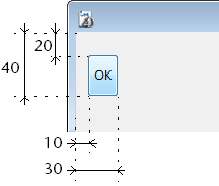

<!--REF #_command_.OBJECT SET COORDINATES.Syntax-->**OBJECT SET COORDINATES** ( {* ;} *object* ; *left* ; *top* {; *right* ; *bottom*} )<!-- END REF-->
<!--REF #_command_.OBJECT SET COORDINATES.Params-->
| Parameter | Type |  | Description |
| --- | --- | --- | --- |
| * | Operator | &#8594;  | If specified, object is an object name (string)<br/>If omitted, object is a field or variable |
| object | Integer | &#8594;  | Object name (if * is specified) or<br/>Field or variable (if * is omitted) |
| left | Integer | &#8594;  | Left coordinate of object in pixels |
| top | Integer | &#8594;  | Top coordinate of object in pixels |
| right | Integer | &#8594;  | Right coordinate of object in pixels |
| bottom | Integer | &#8594;  | Bottom coordinate of object in pixels |

<!-- END REF-->

#### Description 

<!--REF #_command_.OBJECT SET COORDINATES.Summary-->The **OBJECT SET COORDINATES** command modifies the location and, optionally, the size of the object(s) designated by the *object* and *\** parameters for the current process.<!-- END REF-->

**Note:** This command is the equivalent of using the [OBJECT MOVE](object-move.md) command and passing its 2nd *\** parameter. 

Passing the optional *\** parameter indicates that the *object* parameter is an object name (string). If you do not pass this parameter, it indicates that the *object* parameter is a field or variable. In this case, you pass a field or variable reference instead of a string (field or variable object only).

In the *left* and *top* parameters, pass the new absolute coordinates of the object in the form. These coordinates must be expressed in pixels with respect to the top left corner of the form. 

You can also pass absolute coordinate values in the *right* and *bottom* parameters, indicating the bottom right corner of the object. If this corner does not correspond to the corner of the object after application of the *left* and *top* parameters, the object is resized accordingly. 

**Note:** If you want to move an object relative to its initial position, we recommend using the existing [OBJECT MOVE](object-move.md) command.

This command only functions in the following contexts:

* Input forms in entry mode,
* Forms displayed using the [DIALOG](dialog.md) command,
* Headers and footers of output forms displayed by the [MODIFY SELECTION](modify-selection.md) or [DISPLAY SELECTION](display-selection.md) command,
* Forms being printed.

#### Example 

The following statement places the "button\_1" object at the (10,20) (30,40) coordinates:

```4d
 OBJECT SET COORDINATES(*;"button_1";10;20;30;40)
```



#### See also 

[CONVERT COORDINATES](convert-coordinates.md)  
[OBJECT GET COORDINATES](object-get-coordinates.md)  
[OBJECT MOVE](object-move.md)  

#### Properties

|  |  |
| --- | --- |
| Command number | 1248 |
| Thread safe | &cross; |


