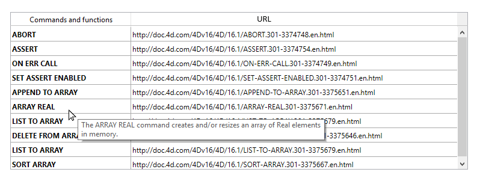

<!--REF #_command_.OBJECT SET HELP TIP.Syntax-->**OBJECT SET HELP TIP** ( {* ;} *object* ; *helpTip* )<!-- END REF-->
<!--REF #_command_.OBJECT SET HELP TIP.Params-->
| Parameter | Type |  | Description |
| --- | --- | --- | --- |
| * | Operator | &#8594;  | If specified, object is an object name (string)If omitted, object is a variable |
| object | any | &#8594;  | Object Name (if * is specified) or Variable (if * is omitted) |
| helpTip | Text | &#8594;  | Contents of help message |

<!-- END REF-->

*This command is not thread-safe, it cannot be used in preemptive code.*


#### Description 

<!--REF #_command_.OBJECT SET HELP TIP.Summary-->The **OBJECT SET HELP TIP** command sets or dynamically modifies the help tip associated with the object(s) designated by the *object* and *\** parameters for the current process.<!-- END REF-->

If you pass the optional *\** parameter, this indicates that the *object* parameter is a form object's name (a string). If you do not pass this parameter, this indicates that the *object* is a variable. In this case, you pass a variable reference instead of a string. 

In the *helpTip* parameter, pass a character string for the contents of the message. If you pass an empty string "" , the help tip will be removed.

When the form is executed, messages appear as help tips when the cursor moves over the field or object. The display delay and maximum duration of help tips can be controlled using the Tips delay and Tips duration selectors of the [SET DATABASE PARAMETER](set-database-parameter.md) command.

You can use this command with a list box object to add help tips to list box rows and cells. For example, a list box object can have a different help tip per row. In this case, you would first need to determine the position of the cursor with the [LISTBOX GET CELL POSITION](listbox-get-cell-position.md) command. This is shown in an example below.

When a help tip is already displayed, calling the **OBJECT SET HELP TIP** command closes it, opens a new tip at the mouse location and restarts the Tips duration counter, allowing dynamic handling of tips. 

**Notes:** 

* Help tip contents can also be set using the Form editor (see *Data entry controls and assistance*) and the Structure editor (see *Field properties*) in Design mode.
* Help tips can be globally disabled for the application using the Tips enabled selector of the [SET DATABASE PARAMETER](set-database-parameter.md) command.

#### Example 1 

In this form, a help tip is displayed and changes dynamically when the mouse hovers over different parts of a picture button:


```4d
  //"myFlag" object method
 
 var $x;$y;oldX;oldY : Real
 var $left;$right;$top;$bottom : Real
 var $b : Integer
 var $tip : Text
 var oldTip : Text
 var $doRefresh : Boolean
 
 Case of
    :(FORM Event=On Load)
       oldTip:=""
       SET DATABASE PARAMETER(Tips enabled;1) //To make sure tips are enabled
       SET DATABASE PARAMETER(Tips delay;0) // Tip displayed immediately at mouse stop
       SET DATABASE PARAMETER(Tips duration;60*10) // 10 seconds max display
    :(FORM Event=On Mouse Move)
       MOUSE POSITION($x;$y;$b)
       OBJECT GET COORDINATES(*;"myFlag";$left;$top;$right;$bottom)
       $x:=$x-$left
       $y:=$y-$top
       Case of //each part of the flag is 76 pixels
          :($x<76)
             $tip:="Green color"
          :($x<152)
             $tip:="White color"
          Else
             $tip:="Orange color"
       End case
 
       $doRefresh:=($tip#oldtip) //true if different tip
       If(Not($doRefresh)) //Same contents
          $doRefresh:=((Abs($x-oldX)>30)|(Abs($y-oldY)>30)) //true if cursor moved
       End if
 
       If($doRefresh) //display another tip
          OBJECT SET HELP TIP(*;"myFlag";$tip)
          oldX:=$x
          oldY:=$y
          oldTip:=$tip
       End if
 
 End case
```

#### Example 2 

You have a list box, "Commands List", containing a list and you want to set a help tip displaying the description for each list item. The description is in the \[Documentation\] table. 

```4d
 var $mouseX;$mouseY;$mouseZ : Real
 var $col;$row : Integer
 
 Case of
 
    :(FORM Event=On Mouse Enter)
 
       SET DATABASE PARAMETER(Tips delay;1) // make the tip appear quickly
 
    :(FORM Event=On Mouse Move)
 
  //#1 : find which row is hovered
 
       MOUSE POSITION($mouseX;$mouseY;$mouseZ)
       LISTBOX GET CELL POSITION(*;"Commands List";$mouseX;$mouseY;$col;$row)
 
  //#2 : setup the matching help tip
 
       If($row#0)
          GOTO SELECTED RECORD([Documentation];$row)
          OBJECT SET HELP TIP(*;"Commands List";[Documentation]Description) // the full description will be used as "help tip" when (if) the mouse stops moving.
       End if
 
    :(FORM Event=On Mouse Leave)
 
       SET DATABASE PARAMETER(Tips delay;3) // make the tip appear normaly
 
 End case
```

The result is...



#### See also 

[OBJECT Get help tip](object-get-help-tip.md)  
[SET DATABASE PARAMETER](set-database-parameter.md)  