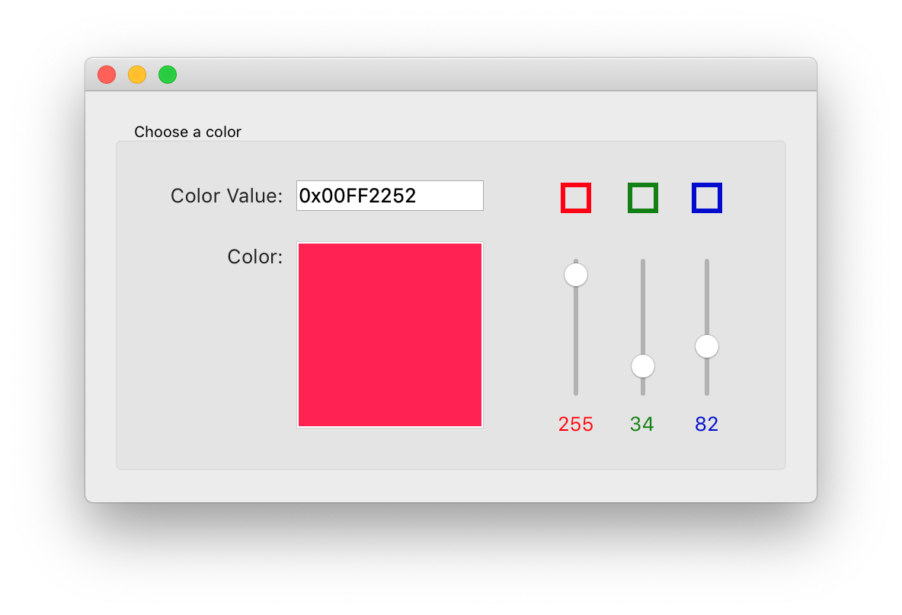
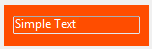

<!--REF #_command_.OBJECT SET RGB COLORS.Syntax-->**OBJECT SET RGB COLORS** ( {* ;} *object* ; *foregroundColor* {; *backgroundColor* {; *altBackgrndColor*}} )<!-- END REF-->
<!--REF #_command_.OBJECT SET RGB COLORS.Params-->
| Parameter | Type |  | Description |
| --- | --- | --- | --- |
| * | Operator | &#8594;  | If specified, Object is an Object Name (String) If omitted, Object is a Field or a Variable |
| object | any | &#8594;  | Object Name (if * is specified), or <br/>Variable or field (if * is omitted) |
| foregroundColor | Text, Integer | &#8594;  | RGB color value for foreground |
| backgroundColor | Text, Integer | &#8594;  | RGB color value for background |
| altBackgrndColor | Text, Integer | &#8594;  | RGB color value for alternating background |

<!-- END REF-->

#### Description 

<!--REF #_command_.OBJECT SET RGB COLORS.Summary-->The **OBJECT SET RGB COLORS** command changes the foreground and background colors of the objects specified by the *object* parameter and the optional *\** parameter.<!-- END REF--> When the command is applied to a list box object, an additional parameter lets you modify the alternating color of the rows.

If you specify the optional *\** parameter, you indicate an object name (a string) in *object*. If you omit the optional \* parameter, you indicate a field or a variable in *object*. In this case, you specify a field or variable reference (field or variable objects only) instead of a string. For more information about object names, see the *Object Properties* section.

The optional *altBackgrndColor* parameter lets you set an alternate background color for even-numbered rows. This parameter is only used when the object specified is a list box or a column of the list box. When this parameter is used, the *backgroundColor* parameter is only used for odd-numbered rows. Using alternating colors makes lists easier to read.

If *object* specifies a list box object, alternating colors are used for the entire list box. If *object* specifies a column of the list box, only that column will use the colors set.

**Definition of colors**

You indicate RGB color values in *foregroundColor* and, optionally, *backgroundColor*, and *altBackgrndColor* parameters. The following formats are supported:

| **Format name**               | **Type** | **Description**                                                                                                                                                                                                                                                                                                                                                                                                                                       | **Examples**                                                                                              |
| ----------------------------- | -------- | ----------------------------------------------------------------------------------------------------------------------------------------------------------------------------------------------------------------------------------------------------------------------------------------------------------------------------------------------------------------------------------------------------------------------------------------------------- | --------------------------------------------------------------------------------------------------------- |
| CSS color name                | Text     | Standard CSS2 color name. <br/> List of available names can be found in various locations on the web, for example on the [htmlcolorcodes.com](https://htmlcolorcodes.com/color-names/) web site. Use "transparent" to set transparency to background (can only be used with the *backgroundColor* and *altBackgrndColor* parameters). Use "" (empty string) in *foregroundColor* and/or *backgroundColor* to let it unchanged.                | "red", "cyan", "lightblue"                                                                                |
| CSS color "#rrggbb" syntax    | Text     | Standard CSS2 hex color code: rr = red component of the color gg = green component of the color bb = blue component of the color                                                                                                                                                                                                                                                                                                                      | "#ff0000", "#00FFFF", "#ADD8E6"                                                                           |
| CSS color "rgb(r,g,b)" syntax | Text     | Standard CSS2 rgb color code: r = red component of the color (0...255) g = green component of the color (0...255) b = blue component of the color (0...255)                                                                                                                                                                                                                                                                                           | "rgb(255,255,0)", "rgb(255,0,0)"                                                                          |
| 4-byte RGB value              | Integer  | 4-byte Long Integer (format 0x00rrggbb). Hex values:<br/> rr = red component of the color gg = green component of the color bb = blue component of the color                                                                                                                                                                                                                                                                                  | 0x00000000, 0x00FF7F7F                                                                                    |
| 4D "system" color constant    | Integer  | Colors used by 4D for drawing objects with automatic colors. Available constants (from *SET RGB COLORS* theme):<br/> Background color Background color none (can only be used with the *backgroundColor* and *altBackgrndColor* parameters) Dark shadow color Disable highlight item color Foreground color Highlight menu background color Highlight menu text color Highlight text background color Highlight text color Light shadow color | **Note:* Automatic colors depend on the system as well as the type of object to which they are assigned.* |

#### Example 1 

This form contains the two non-enterable variables *vsColorValue* and *vsColor* as well as the three thermometers: *thRed*, *thGreen*, and *thBlue*.


Here are the methods for these objects:

```4d
  //vsColorValue non-enterable Object Method
 Case of
    :(FORM Event=On Load)
       vsColorValue:="0x00000000"
 End case
  // vsColor non-enterable variable Object Method
 Case of
    :(FORM Event=On Load)
       vsColor:=""
       OBJECT SET RGB COLORS(vsColor;0x00FFFFFF;0x0000)
 End case
 
  // thRed Thermometer Object Method
 CLICK IN COLOR THERMOMETER
 
  // thGreen Thermometer Object Method
 CLICK IN COLOR THERMOMETER
 
  // thBlue Thermometer Object Method
 CLICK IN COLOR THERMOMETER
```

The project method called by the three thermometers is:

```4d
  // CLICK IN COLOR THERMOMETER Project Method
 OBJECT SET RGB COLORS(vsColor;0x00FFFFFF;(thRed<<16)+(thGreen<<8)+thBlue)
 vsColorValue:=String((thRed<<16)+(thGreen<<8)+thBlue;"&x")
 If(thRed=0)
    vsColorValue:=Substring(vsColorValue;1;2)+"0000"+Substring(vsColorValue;3)
 End if
```

Note the use of the [SET AUTOMATIC RELATIONS](set-automatic-relations.md) for calculating the color value from the thermometer values.

When executed, the form looks like this:



#### Example 2 

Changing to transparent background with a light font color:


```4d
 OBJECT SET RGB COLORS(*;"myVar";Light shadow color;Background color none)
```



#### See also 

[OBJECT GET RGB COLORS](object-get-rgb-colors.md)  
[Select RGB Color](select-rgb-color.md)  

#### Properties
|  |  |
| --- | --- |
| Command number | 628 |
| Thread safe | &check; |
| Forbidden on the server ||


