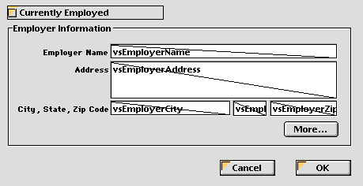

<!--REF #_command_.OBJECT SET VISIBLE.Syntax-->**OBJECT SET VISIBLE** ( {* ;} *object* ; *visible* )<!-- END REF-->
<!--REF #_command_.OBJECT SET VISIBLE.Params-->
| Parameter | Type |  | Description |
| --- | --- | --- | --- |
| * | Operator | &#8594;  | If specified, Object is an Object Name (String) If omitted, Object parameter is a Field or a Variable |
| object | any | &#8594;  | Object Name (if * is specified), or Field or Variable (if * is omitted) |
| visible | Boolean | &#8594;  | True for visible, False for invisible |

<!-- END REF-->

*This command is not thread-safe, it cannot be used in preemptive code.*


#### Description 

<!--REF #_command_.OBJECT SET VISIBLE.Summary-->The **OBJECT SET VISIBLE** command shows or hides the objects specified by *object*.<!-- END REF-->

If you specify the optional *\** parameter, you indicate an object name (a string) in *object*. If you omit the optional \* parameter, you indicate a field or a variable in *object*. In this case, you specify a field or variable reference (field or variable objects only) instead of a string. For more information about object names, see the section *Object Properties*.

If you pass *visible* equal to **TRUE**, the objects are shown. If you pass *visible* equal to **FALSE**, the objects are hidden.

#### Example 

Here is a typical form in the Design environment:



The objects in the **Employer Information** group box each have an object name that contains the expression “employer” (including the group box). When the **Currently Employed** check box is checked, the objects must be visible; when the check box is unchecked, the objects must be invisible.   
Here is the object method of the check box:

```4d
  // cbCurrentlyEmployed Check Box Object Method
 Case of
    :(FORM Event=On Load)
       cbCurrentlyEmployed:=1
 
    :(FORM Event=On Clicked)
  // Hide or Show all the objects whose name contains "emp"
       OBJECT SET VISIBLE(*;"@emp@";cbCurrentlyEmployed#0)
  // But always keep the check box itself visible
       OBJECT SET VISIBLE(cbCurrentlyEmployed;True)
 End case
```

Therefore, when executed, the form looks like:


or:


#### See also 

[OBJECT Get visible](object-get-visible.md)  
[OBJECT SET ENTERABLE](object-set-enterable.md)  