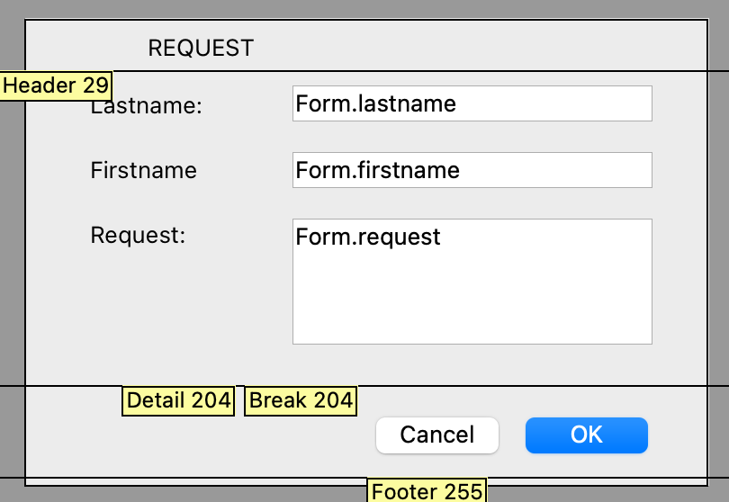

<!--REF #_command_.Print form.Syntax-->**Print form** ( {*aTable* ;} *form* {; *formData*} {; *areaStart*{; *areaEnd*}} ) : Integer<!-- END REF-->
<!--REF #_command_.Print form.Params-->
| Parameter | Type |  | Description |
| --- | --- | --- | --- |
| aTable | Table | &#8594;  | Table owning the form, or Default table, if omitted |
| form | Text, Object | &#8594;  | Name (string) of the form, or a POSIX path (string) to a .json file describing the form, or an object describing the form to print |
| formData | Object | &#8594;  | Data to associate to the form |
| areaStart | Integer | &#8594;  | Print marker, or Beginning area (if areaEnd is specified) |
| areaEnd | Integer | &#8594;  | Ending area (if areaStart specified) |
| Function result | Integer | &#8592; | Height of printed section |

<!-- END REF-->

#### Description 

<!--REF #_command_.Print form.Summary-->**Print form** simply prints *form* with the current values of fields and variables of *aTable*.<!-- END REF--> It is usually used to print very complex reports that require complete control over the printing process. **Print form** does not do any record processing, break processing or page breaks. These operations are your responsibility. **Print form** prints fields and variables in a fixed size frame only.

In the *form* parameter, you can pass:

* the name of a form, or
* the path (in POSIX syntax) to a valid .json file containing a description of the form to use (see *Form file path*), or
* an object containing a description of the form.

Since **Print form** does not issue a page break after printing the form, it is easy to combine different forms on the same page. Thus, **Print form** is perfect for complex printing tasks that involve different tables and different forms. To force a page break between forms, use the [PAGE BREAK](page-break.md) command. In order to carry printing over to the next page for a form whose height is greater than the available space, call the [CANCEL](cancel.md) command before the [PAGE BREAK](page-break.md) command.

Three different syntaxes may be used:

* **Detail area printing**

Syntax:

```4d
 height:=Print form(myTable;myForm)
```

In this case, **Print form** only prints the Detail area (the area between the Header line and the Detail line) of the form.

* **Form area printing**

Syntax:

```4d
 height:=Print form(myTable;myForm;marker)
```

In this case, the command will print the section designated by the *marker*. Pass one of the constants of the *Form Area* theme in the marker parameter:

| Constant      | Type    | Value |
| ------------- | ------- | ----- |
| Form break0   | Integer | 300   |
| Form break1   | Integer | 301   |
| Form break2   | Integer | 302   |
| Form break3   | Integer | 303   |
| Form break4   | Integer | 304   |
| Form break5   | Integer | 305   |
| Form break6   | Integer | 306   |
| Form break7   | Integer | 307   |
| Form break8   | Integer | 308   |
| Form break9   | Integer | 309   |
| Form detail   | Integer | 0     |
| Form footer   | Integer | 100   |
| Form header   | Integer | 200   |
| Form header1  | Integer | 201   |
| Form header10 | Integer | 210   |
| Form header2  | Integer | 202   |
| Form header3  | Integer | 203   |
| Form header4  | Integer | 204   |
| Form header5  | Integer | 205   |
| Form header6  | Integer | 206   |
| Form header7  | Integer | 207   |
| Form header8  | Integer | 208   |
| Form header9  | Integer | 209   |

* **Section printing**

Syntax:

```4d
 height:=Print form(myTable;myForm;areaStart;areaEnd)
```

In this case, the command will print the section included between the *areaStart* and *areaEnd* parameters. The values entered must be expressed in pixels.

**formData**

Optionally, you can pass parameters to the *form* using the *formData* object. Any properties of the *formData* object will then be available from within the form context through the [Form](form.md) command. For example, if you pass an object containing {"version","12"} in *formData*, you will be able to get or set the value of the "version" property in the form by calling:

```4d
 $v:=Form.version //"12"
 Form.version:=13
```

The *formData* object is available in the On Printing Detail form event. *formData* allows you to safely pass parameters to your forms, whatever the calling context. In particular, if the same form is called from different places in the same process, you will always be able to access its specific values by simply calling [Form](form.md).myProperty. 

**Note:** If you do not pass the *formData* parameter or if you pass an undefined object, **Print form** automatically creates a new empty object bound to the *form*, available through the [Form](form.md) command.

**Return value**

The value returned by **Print form** indicates the height of the printable area. This value will be automatically taken into account by the [Get printed height](get-printed-height.md) command.

The printer dialog boxes do not appear when you use **Print form**. The report does not use the print settings that were assigned to the form in the Design environment. There are two ways to specify the print settings before issuing a series of calls to **Print form**:

* Call [PRINT SETTINGS](print-settings.md). In this case, you let the user choose the settings.
* Call [SET PRINT OPTION](set-print-option.md) and [GET PRINT OPTION](get-print-option.md). In this case, print settings are specified programmatically.

**Print form** builds each printed page in memory. Each page is printed when the page in memory is full or when you call [PAGE BREAK](page-break.md). To ensure the printing of the last page after any use of **Print form**, you must conclude with the [PAGE BREAK](page-break.md) command (except in the context of an [OPEN PRINTING JOB](open-printing-job.md), see note). Otherwise, if the last page is not full, it stays in memory and is not printed.

**Warning:** If the command is called in the context of a printing job opened with [OPEN PRINTING JOB](open-printing-job.md), you must NOT call [PAGE BREAK](page-break.md) for the last page because it is automatically printed by the [CLOSE PRINTING JOB](close-printing-job.md) command. If you call [PAGE BREAK](page-break.md) in this case, a blank page is printed.

This command prints external areas and objects (for example, 4D Write or 4D View areas). The area is reset for each execution of the command.

**Warning:** Subforms are not printed with **Print form**. To print only one form with such objects, use [PRINT RECORD](print-record.md) instead.

**Print form** generates only one On Printing Detail event for the form method.

**4D Server:** This command can be executed on 4D Server within the framework of a stored procedure. In this context:

* Make sure that no dialog box appears on the server machine (except for a specific requirement).
* In the case of a problem concerning the printer (out of paper, printer disconnected, etc.), no error message is generated.

#### Example 1 

The following example performs as a [PRINT SELECTION](print-selection.md) command would. However, the report uses one of two different forms, depending on whether the record is for a check or a deposit:

```4d
 QUERY([Register]) // Select the records
 If(OK=1)
    ORDER BY([Register]) // Sort the records
    If(OK=1)
       PRINT SETTINGS // Display Printing dialog boxes
       If(OK=1)
          For($vlRecord;1;Records in selection([Register]))
             If([Register]Type ="Check")
                Print form([Register];"Check Out") // Use one form for checks
             Else
                Print form([Register];"Deposit Out") // Use another form for deposits
             End if
             NEXT RECORD([Register])
          End for
          PAGE BREAK // Make sure the last page is printed
       End if
    End if
 End if
```

#### Example 2 

Refer to the example of the [SET PRINT MARKER](set-print-marker.md) command. 

#### Example 3 

This form is used as dialog, then printed with modifications:



The form method:

```4d
 If(Form event code=On Printing Detail)
    Form.lastname:=Uppercase(Form.lastname)
    Form.firstname:=Uppercase(Substring(Form.firstname;1;1))+Lowercase(Substring(Form.firstname;2))
    Form.request:=Lowercase(Form.request)
 End if
```

The code that calls the dialog then prints its body:

```4d
 $formData:=New object
 $formData.lastname:="Smith"
 $formData.firstname:="john"
 $formData.request:="I need more COFFEE"
 $win:=Open form window("Request_obj";Plain form window;Horizontally centered;Vertically centered)
 DIALOG("Request_obj";$formData)
 $h:=Print form("Request_var";$formData;Form detail)
```

#### See also 

[CANCEL](cancel.md)  
[PAGE BREAK](page-break.md)  
[PRINT SETTINGS](print-settings.md)  
[SET PRINT OPTION](set-print-option.md)  

#### Properties

|  |  |
| --- | --- |
| Command number | 5 |
| Thread safe | &cross; |


