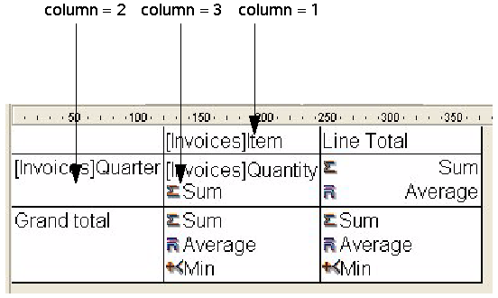

<!--REF #_command_.QR GET INFO COLUMN.Syntax-->**QR GET INFO COLUMN** ( *area* ; *colNum* ; *title* ; *object* ; *hide* ; *size* ; *repeatedValue* ; *displayFormat* {; *resultVar*} )<!-- END REF-->
<!--REF #_command_.QR GET INFO COLUMN.Params-->
| Parameter | Type |  | Description |
| --- | --- | --- | --- |
| area | Integer | &#8594;  | Reference of the area |
| colNum | Integer | &#8594;  | Column number |
| title | Text | &#8592; | Column title |
| object | Text | &#8592; | Object assigned for that column |
| hide | Integer | &#8592; | 0 = displayed, 1 = hidden |
| size | Integer | &#8592; | Column size |
| repeatedValue | Integer | &#8592; | 0 = not repeated, 1 = repeated |
| displayFormat | Text | &#8592; | Display format for the data |
| resultVar | Text | &#8592; | Name of the formula variable |

<!-- END REF-->

*This command is not thread-safe, it cannot be used in preemptive code.*


#### Description 

<!--REF #_command_.QR GET INFO COLUMN.Summary-->##### List mode 

The **QR GET INFO COLUMN** command retrieves the parameters of an existing column.<!-- END REF-->

*area* is the reference of the Quick Report area.

*colNum* is the number of the column to modify.

*title* returns the title that will be displayed in the header of the column.

*object* returns the field name or the formula assigned to the column.

**Note:** The command does not take into account any virtual structure defined by means of the [SET TABLE TITLES](set-table-titles.md) and [SET FIELD TITLES](set-field-titles.md) commands. The actual name of the field is returned in the *object* parameter. 

*hide* returns whether the column is displayed or hidden:

* if *hide* equals 1, the column is hidden;
* if *hide* equals 0, the column is displayed.

*size* returns the size of the column in pixels. If the value returned is negative, the size of the column is automatic.

*repeatedValue* returns the status for data repetition. For example, if the value for a field or variable does not change from one record to the other, it may or may not be repeated when they do not change: 

* if *repeatedValue* equals 0, values are not repeated,
* if *repeatedValue* equals 1, values are repeated.

*format* returns the display format. Display formats are the 4D formats compatible with the data displayed.

When passed, the optional *resultVar* parameter returns the name of the variable automatically assigned by the Quick Report editor to the formula column (if any): "C1" for the first formula column, "C2" for the second, and so on. 4D uses this variable to store the results from the last execution of the column's formula when generating the report. 

##### Cross-table mode 

The QR GET INFO COLUMN command retrieves the same parameters but the reference of the areas to which it applies is different and varies depending on the parameter you want to set. First of all, the *title*, *hide*, and *repeatedValue* parameters are meaningless when this command is used in cross-table mode. The value to use for *colNum* varies depending on whether you want to retrieve the column size or the data source and display format.

* Column size  
This is a “visual” attribute, therefore columns are numbered from left to right, as depicted below:


The following statement sets the size to automatic for all the columns in a cross-table report and leaves other elements unchanged:

```4d
 For($i;1;3)
    QR GET INFO COLUMN(qr_area;$i;$title;$obj;$hide;$size;$rep;$format)
    QR SET INFO COLUMN(qr_area;$i;$title;$obj;$hide;0;$rep;$format)
 End for
```

You will notice that since you want to alter only the column size, you have to use QR GET INFO COLUMN to retrieve the column properties and pass them to [QR SET INFO COLUMN](qr-set-info-column.md) to leave it unchanged, except for the column size.

* Data source (object) and display format  
In this case, the numbering of columns operates as depicted below:



If you pass an invalid area number, the error -9850 will be generated.  
If you pass an invalid ColNum value, the error -9852 will be generated.

#### Example 

You have designed the following report:


You can write:

```4d
 var $vTitle;$vObject;$vDisplayFormat;$vResultVar : Text
 var $area;$vHide;$vSize;$vRepeatedValue : Integer
 QR GET INFO COLUMN($area;3;$vTitle;$vObject;$vHide;$vSize;$vRepeatedValue;$vDisplayFormat;$vResultVar)
  //$vTitle = "Age"
  //$vObject = "[People]Birthdate-Current date"
  //$vHide = 0
  //$vSize = 57
  //$vRepeatedValue = 1
  //$vDisplayFormat = ""
  //$vResultVar = "C1"
```

#### See also 

[QR Get info row](qr-get-info-row.md)  
[QR SET INFO COLUMN](qr-set-info-column.md)  
[QR SET INFO ROW](qr-set-info-row.md)  