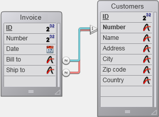

<!--REF #_command_.RELATE ONE.Syntax-->**RELATE ONE** ( manyTable | Field {; *choiceField*} )<!-- END REF-->
<!--REF #_command_.RELATE ONE.Params-->
| Parameter | Type |  | Description |
| --- | --- | --- | --- |
| manyTable &#124; Field | Table, Field | &#8594;  | Table for which to establish all automatic relations, or Field with manual relation to one table |
| choiceField | Field | &#8594;  | Choice field from the one table |

<!-- END REF-->

*This command is not thread-safe, it cannot be used in preemptive code.*


#### Description 

<!--REF #_command_.RELATE ONE.Summary-->**RELATE ONE** has two forms.<!-- END REF-->

The first form, **RELATE ONE**(manyTable), establishes all automatic Many-to-One relations for *manyTable* in the current process. This means that for each field in *manyTable* that has an automatic Many-to-One relation, the command will select the related record in each related table. This changes the current record in the related tables for the process.

The second form, **RELATE ONE**(manyField{;choiceField}), looks for the record related to *manyField*. The relation does not need to be automatic. If it exists, **RELATE ONE** loads the related record into memory, making it the current record and current selection for its table.

The optional *choiceField* parameter must be a field in the related table. It can only be an Alpha, Text, Numeric, Date, Time, or Boolean field. More specifically, it cannot be a Picture or BLOB type field. 

If *choiceField* is specified and more than one record is found in the related table, **RELATE ONE** displays a list of records that match the value in *manyField* so that the user can select a record. In this list, the left column displays related field values, and the right column displays *choiceField* values.

More than one record may be found if *manyField* ends with the wildcard character (@). If there is only one match, the list does not appear. 

In the screen below, a record is being entered and a selection list is displayed in the foreground.


The following command is used to make the selection list appear: 

```4d
 RELATE ONE([Personnel]Company;[Companies]Region)
```

A user entered LLC@ to see a list of companies whose names begin with LLC, as well as their region.

Specifying *choiceField* is the same as specifying a wildcard choice when establishing the table relation. For information about specifying a wildcard choice, refer to the *4D Design Reference* manual.

##### 

**Note:** This command does not support Object type fields.

#### Example 

Let’s say you have an *\[Invoice\]* table related to a *\[Customers\]* table with two non-automatic relations. One relation is from *\[Invoice\]Bill to* to *\[Customers\]Number*, and the other relation is from *\[Invoice\]Ship to* to *\[Customers\]Number*.



Here is the form for the \[Invoice\] table displaying the "Bill to" and "Send to" information:


Since both relations are to the same table, *\[Customers\]*, you cannot obtain the billing and shipment information at the same time. Therefore, displaying both addresses in a form should be performed using variables and calls to **RELATE ONE**. If the *\[Customers\]* fields were displayed instead, data from only one of the relations would be displayed.

The following two methods are the object methods for the *\[Invoice\]Bill to* and *\[Invoice\]Ship to* fields. They are executed when the fields are entered. 

Here is the object method for the *\[Invoice\]Bill to* field:

```4d
 RELATE ONE([Invoice]Bill to)
 vAddress1:=[Customers]Address
 vCity1:=[Customers]City
 vState1:=[Customers]State
 vZIP1:=[Customers]ZIP
```

Here is the object method for the *\[Invoice\]Ship to* field:

```4d
 RELATE ONE([Invoice]Ship to)
 vAddress2:=[Customers]Address
 vCity2:=[Customers]City
 vState2:=[Customers]State
 vZIP2:=[Customers]ZIP
```

#### System variables and sets 

If the command has been executed correctly and if the related records have been loaded, the OK system variable is set to 1\. If the user clicked on **Cancel** in the record selection dialog box (that appears when the related record has been modified), the OK variable is set to 0\. 

#### See also 

[OLD RELATED ONE](old-related-one.md)  
[RELATE MANY](relate-many.md)  