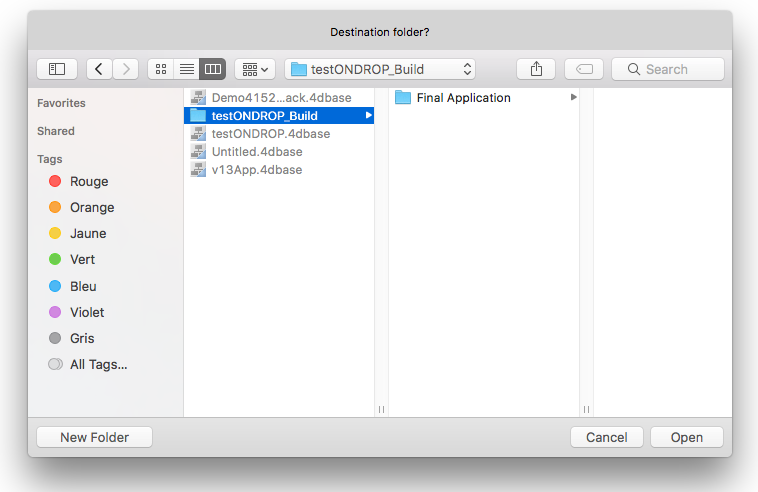

<!--REF #_command_.Select folder.Syntax-->**Select folder** ( {*message* }{;}{ *defaultPath* {; *options*}} ) : Text<!-- END REF-->
<!--REF #_command_.Select folder.Params-->
| Parameter | Type |  | Description |
| --- | --- | --- | --- |
| message | Text | &#8594;  | Title of the window |
| defaultPath | Text, Integer | &#8594;  | • Default pathname or • Empty string to display the default user folder (“My documents” under Windows, “Documents” under Mac OS), or • Number of memorized pathname |
| options | Integer | &#8594;  | Selection option(s)under Mac OS |
| Function result | Text | &#8592; | Access path to the selected folder |

<!-- END REF-->

#### Description 

<!--REF #_command_.Select folder.Summary-->The **Select folder** command displays a dialog box that allows you to manually select a folder and then retrieve the complete access path to that folder.<!-- END REF--> The optional *defaultPath* parameter can be used to designate the location of a folder that will be initially displayed in the folder selection dialog box.

**Note:** This command does not modify 4D’s current folder.

The **Select folder** command displays a standard dialog box to browse through the workstation’s volumes and folders.   
The optional parameter *message* allows you to display a message in the dialog box. In the following examples, the message is "Destination folder?":

**Windows**  


**macOS**



 You can use the *defaultPath* parameter to provide a default folder location in the folder selection dialog box. You can pass three types of values in this parameter: 
* The pathname of a valid folder using the syntax of the current platform.
* An empty string (“”) to display the default user folder of the system (“My documents” under Windows, “Documents” under macOS).
* The number of a memorized pathname (from 1 to 32,000) to display the associated folder. This means that you can store in memory the pathname of the folder that is open when the user clicks on the selection button; in other words, the folder chosen by the user. When calling a random number (for instance, 5) the command displays the default user folder of the system (equivalent to passing an empty string). The user may then browse among the folders on their harddisk. When the user clicks on the selection button, the pathname is memorized and associated with the number 5\. When the number 5 is called subsequently, the memorized pathnname will be used by default. If a new location is selected, the path number 5 will be updated, and so on.  
This mechanism can be used to memorize up to 32,000 pathnames. Under Windows, each path is only kept during the session. Under macOS, the paths remain memorized from one session to the next. If the pathname is incorrect, the *defaultPath* parameter is ignored.

**Note:** This mechanism is identical to the one used by the [Select document](select-document.md) command. The numbers of memorized pathnames are shared between both these commands.

The *options* parameter lets you benefit from additional functions under macOS. In this parameter, you can pass one of the following constants, found in the *System Documents* theme: 

| Constant         | Type    | Value | Comment                                                                                                                                                                                                                                                                                                                                                                                                 |
| ---------------- | ------- | ----- | ------------------------------------------------------------------------------------------------------------------------------------------------------------------------------------------------------------------------------------------------------------------------------------------------------------------------------------------------------------------------------------------------------- |
| Package open     | Integer | 2     | (Mac OS only): Authorizes the opening of packages as folders and thus the viewing /selection of their contents. By default, if this constant is not used, the command will not allow the opening of packages.                                                                                                                                                                                           |
| Use sheet window | Integer | 16    | (Mac OS only): Displays the selection dialog box in the form of a sheet window (this option is ignored under Windows). <br/>Sheet windows are specific to the Mac OS X interface which have graphic animation (for more information, refer to the [DISPLAY SELECTION](display-selection.md) section). By default, if this constant is not used, the command will display a standard dialog box. |

You can pass a single constant or a combination of both. These options are only taken into account under macOS. Under Windows, the *options* parameter is ignored if it is passed. 

The user selects a folder and then clicks the **Select Folder** button (on Windows) or the **Open** button (on macOS). The access path to the folder is then returned by the function. 

* On Windows, the access path is returned in the following format:  
“C:\\Folder1\\Folder2\\SelectedFolder\\”
* On macOS, the access path is returned in the following format:  
“Hard Disk:Folder1:Folder2:SelectedFolder:”

**Note:** On macOS, depending on whether or not the name of the folder is selected in the dialog box, the access path that is returned to you may be different.


**4D Server:** This function allows you to view the volumes connected to the client workstations. It is not possible to call this function from a stored procedure.

If the user validates the dialog box, the **OK** system variable is set to 1\. If the user clicks the **Cancel** button, the **OK** system variable is set to 0 and the function returns an empty string.

**Note:** On Windows, if the user selected some incorrect elements, such as “Workstation”, “Trash can”, and so on, the **OK** system variable is set to 0, even if the user validates the dialog box.

#### Example 

The following example allows you to select the folder in which the pictures in the picture library will be stored:

```4d
 $PictFolder:=Select folder("Select a folder for your pictures.")
 PICTURE LIBRARY LIST(pictRefs;pictNames)
 For($n;1;Size of array(pictNames))
    GET PICTURE FROM LIBRARY(pictRefs{$n};$vStoredPict)
    WRITE PICTURE FILE($PictFolder+pictNames{$n};$vStoredPict)
 End for
```

#### See also 

[CREATE FOLDER](create-folder.md)  
[FOLDER LIST](folder-list.md)  
[Select document](select-document.md)  

#### Properties
|  |  |
| --- | --- |
| Command number | 670 |
| Thread safe | &check; |
| Modifies variables | OK, error |


