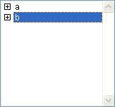
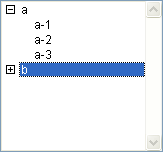
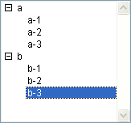
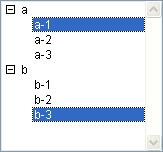

<!--REF #_command_.Selected list items.Syntax-->**Selected list items** ( {* ;} *list* {; *itemsArray* {; *}} )  : Integer<!-- END REF-->
<!--REF #_command_.Selected list items.Params-->
| Parameter | Type |  | Description |
| --- | --- | --- | --- |
| * | Operator | &#8594;  | If specified, list is an object name (string) If omitted, list is a list reference number |
| list | Integer, Text | &#8594;  | List reference number (if * omitted), or Name of list type object (if * passed) |
| itemsArray | Array integer | &#8592; | If 2nd * omitted: Array contains the positions of selected items in the list(s) If 2nd * passed: Array contains the selected item references |
| * | Operator | &#8594;  | If omitted: Item position(s) If passed: Item reference(s) |
| Function result | Integer | &#8592; | If 2nd * omitted: Position of current selected list item in expanded/collapsed list(s) If 2nd * passed: Reference of the selected item |

<!-- END REF-->

*This command is not thread-safe, it cannot be used in preemptive code.*


#### Description 

<!--REF #_command_.Selected list items.Summary-->The **Selected list items** command returns the position or reference of the selected item in the list whose reference number or object name you pass in *list*.<!-- END REF--> 

If you pass the first optional *\** parameter, you indicate that the *list* parameter is an object name (string) corresponding to a representation of the list in the form. If you do not pass this parameter, you indicate that the *list* parameter is a hierarchical list reference ([ListRef](# "A Longint reference to a hierachical list")). If you only use a single representation of the list or work with item references (the second *\** is passed), you can use either syntax. Conversely, if you use several representations of the same list and work with the item positions (the second *\** is omitted), the syntax based on the object name is required since each representation can have its own expanded/collapsed item configuration.

**Note:** If you use the @ character in the name of the list object and the form contains several lists that match with this name, the [Selected list items](selected-list-items.md) command will only apply to the first object whose name corresponds. 

In the case of multiple selection, the command can also return in the *itemsArray* array, the position or reference of each item selected. You apply this command to a list displayed in a form to detect which item(s) the user has selected. 

The second \* parameter lets you indicate whether you want to work with current item positions (in this case, the \* parameter should be omitted) or with fixed item references (in this case, the \* parameter must be used). 

You can pass a longint array in the *itemsArray* parameter. If necessary, the array will be created and resized by the command. Once the command has been executed, *itemsArray* will contain:

* the position of each item selected relative to the expanded/collapsed state of the list(s) if the \* parameter is omitted.
* the fixed reference of each item selected if the \* parameter is passed.  
If no items have been selected, the array is returned empty.

**Note:** In the event of multiple selections, the command returns the position or reference of the first item that was selected in *list*, either by the user (manual selections) or by the [SELECT LIST ITEMS BY POSITION](select-list-items-by-position.md) or [SELECT LIST ITEMS BY REFERENCE](select-list-items-by-reference.md) commands (programmed selection). 

If the list has sublists, you apply the command to the main list (the one actually defined in the form), not one of its sublists. The positions are expressed relative to the top item of the main list, using the current expanded/collapsed state of the list and its sublist.

In any case, if no items are selected, the function returns 0.

#### Example 

Here a list named *hList,* shown in the Application environment:



```4d
 $vlItemPos:=Selected list items(hList) // at this point $vlItemPos gets 2
```



```4d
 $vlItemPos:=Selected list items(hList) // at this point $vlItemPos gets 5
 $vlItemRef:=Selected list items(hList;*) // $vlItemRef gets 200 (for instance)
```



```4d
 $vlItemPos:=Selected list items(hList) // at this point $vlItemPos gets 8
 $vlItemRef:=Selected list items(hList;*) // $vlItemRef gets 203 (for instance)
```


```4d
 $vlItemPos:=Selected list items(hList;$arrPos) // at this point, $vlItemPos gets 3
  // $arrPos{1} gets 3, $arrPos{2} gets 4 and $arrPos{3} gets 5
```



```4d
 $vlItemRef:=Selected list items(hList;$arrRefs;*) // $vlItemRef gets 101 (for instance)
  // $arrRefs{1} gets 101, $arrRefs{2} gets 203 (for instance)
```

#### See also 

[SELECT LIST ITEMS BY POSITION](select-list-items-by-position.md)  
[SELECT LIST ITEMS BY REFERENCE](select-list-items-by-reference.md)  