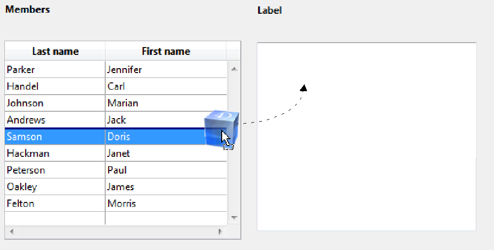

<!--REF #_command_.SET DRAG ICON.Syntax-->**SET DRAG ICON** ( *icon* {; *horOffset* {; *vertOffset*}} )<!-- END REF-->
<!--REF #_command_.SET DRAG ICON.Params-->
| Parameter | Type |  | Description |
| --- | --- | --- | --- |
| icon | Picture | &#8594;  | Icon to use during drag |
| horOffset | Integer | &#8594;  | Horizontal offset from left edge of picture with respect to cursor position (>0 = to the left, <0 = to the right) |
| vertOffset | Integer | &#8594;  | Vertical offset from top edge of picture with respect to cursor position (>0 = upwards, <0 = downwards) |

<!-- END REF-->

#### Description 

<!--REF #_command_.SET DRAG ICON.Summary-->The **SET DRAG ICON** command associates the icon picture with the cursor during drag and drop operations that are managed by programming.<!-- END REF-->

This command can only be called in the context of the On Begin Drag Over form event (see the [Form event code](../commands/form-event-code.md) command).

In the *icon* parameter, pass the picture to use. Its maximum size is 256x256 pixels. If one of its dimensions exceeds 256 pixels, it is automatically resized. 

In *horOffset* and *vertOffset*, you can pass offset values in pixels:

* for *horOffset*, you pass the horizontal offset from the left edge of the icon with respect to the cursor position. Pass a positive value to apply this offset towards the left or a negative value to apply it towards the right.
* for *vertOffset*, you pass the vertical offset from the top edge of the icon with respect to the cursor position. Pass a positive value to apply this offset upwards or a negative value to apply it downwards.

If you omit this parameter, the cursor is placed at the center of the icon.

#### Example 

In a form, a user can generate a label by dragging and dropping a row. In the object method of the list box, you can write:

```4d
 If(Form event code=On Begin Drag Over)
    READ PICTURE FILE(Get 4D folder(Current resources folder)+"splash.png";vpict)
    CREATE THUMBNAIL(vpict;vpict;48;48)
    SET DRAG ICON(vpict)
 End if
```

When you drag a row, the picture appears as shown here:



Note that you can modify the position of the cursor with respect to the picture:

```4d
 SET DRAG ICON(vpict;0;0)
```


#### See also 

[Form event code](../commands/form-event-code.md)  

#### Properties

|  |  |
| --- | --- |
| Command number | 1272 |
| Thread safe | &cross; |


