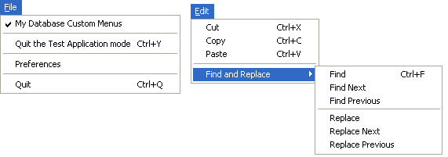

<!--REF #_command_.SET MENU BAR.Syntax-->**SET MENU BAR** ( *menuBar* {; *process*}{; *} )<!-- END REF-->
<!--REF #_command_.SET MENU BAR.Params-->
| Parameter | Type |  | Description |
| --- | --- | --- | --- |
| menuBar | Integer, Text, Text | &#8594;  | Number or name of the menu bar or Menu reference |
| process | Integer | &#8594;  | Process reference number |
| * | Operator | &#8594;  | Save menu bar state |

<!-- END REF-->

#### Description 

<!--REF #_command_.SET MENU BAR.Summary-->**SET MENU BAR** replaces the current menu bar with the one specified by *menuBar* for the current process only.<!-- END REF--> In the *menuBar* parameter, you can pass either the number or name of the new menu bar. You can also pass a menu ID ([MenuRef](# "Unique ID (16-character alphanumeric) of a menu") type, 16-character string). When you work with references, the menus can be used as menu bars and vice versa (see the *Managing Menus* section).

**Note:** The name of a menu bar may contain up to 31 characters and must be unique.

The optional *process* parameter changes the menu bar of the specified process to *menuBar*.

**Note:** If you pass a [MenuRef](# "Unique ID (16-character alphanumeric) of a menu") in *menuBar*, the *process* parameter serves no purpose and will be ignored.

The optional *\** parameter allows you to save the state of the menu bar. If this parameter is omitted, **SET MENU BAR** reinitializes the menu bar when the command is executed.

For example, suppose that **SET MENU BAR**(1) is executed. Next, several menu commands are disabled using the [DISABLE MENU ITEM](disable-menu-item.md) command.

If **SET MENU BAR** **(1)** is executed a second time, either from the same process or from a different process, all menu commands will revert to their initial enabled state.

If **SET MENU BAR** **(1;\*)** is executed, the menu bar will retain the same state as before, and the menu commands that were disabled will remain disabled.

**Note:** If you pass a [MenuRef](# "Unique ID (16-character alphanumeric) of a menu") in *menuBar*, the *\** parameter serves no purpose and will be ignored.

When a user enters the Application environment, the first menu bar is displayed (Menu Bar #1). You can change this menu bar when opening a database by specifying the desired menu bar in the or in the startup method for an individual user.

#### Example 1 

The following example changes the current menu bar to menu bar #3 and resets the states of the menu commands to their original states:

```4d
 SET MENU BAR(3)
```

#### Example 2 

The following example changes the current menu bar to the menu bar named “FormMenuBar1” and saves the states of the menu commands. Menu commands that were previously disabled will appear disabled.

```4d
 SET MENU BAR("FormMenuBar1";*)
```

#### Example 3 

The following example sets the current menu bar to menu bar #3 while records are being modified. After the records have been modified, the menu bar is reset to menu bar #2, with the menu state saved:

```4d
 SET MENU BAR(3)
 ALL RECORDS([Customers])
 MODIFY SELECTION([Customers])
 SET MENU BAR(2;*)
```

#### Example 4 

In this comprehensive example, we will create, by programming, a menu bar including the following File and Edit menus: 



```4d
  //Method for creating File menu
 var FileMenu : Text // FileMenu will contain the File menu reference
 FileMenu:=Create menu
 INSERT MENU ITEM(FileMenu;-1;"My Database "+Get indexed string(131;29))
 SET MENU ITEM MARK(FileMenu;1;Char(18))
 INSERT MENU ITEM(FileMenu;-1;"(-")
 INSERT MENU ITEM(FileMenu;-1;"Quit the Test Application mode/Y")
 SET MENU ITEM PROPERTY(FileMenu;3;Associated standard action;ak return to design mode)
 INSERT MENU ITEM(FileMenu;-1;"(-")
 INSERT MENU ITEM(FileMenu;-1;"Preferences")
 SET MENU ITEM PROPERTY(FileMenu;5;Associated standard action;ak database settings) //Settings
 INSERT MENU ITEM(FileMenu;-1;"(-")
 INSERT MENU ITEM(FileMenu;-1;Get indexed string(131;30))
 SET MENU ITEM PROPERTY(FileMenu;7;Associated standard action;ak quit) //Quit
 SET MENU ITEM SHORTCUT(FileMenu;7;Character code("Q"))
 
  //Method for creating Find and Replace menu
 var FindAndReplaceMenu : Text //FindAndReplaceMenu will contain the Find and Replace menu reference
 FindAndReplaceMenu:=Create menu
 APPEND MENU ITEM(FindAndReplaceMenu;"Find;Find Next;Find Previous;(-;Replace;Replace Next;Replace Previous")
 SET MENU ITEM SHORTCUT(FindAndReplaceMenu;1;Character code("F"))
 SET MENU ITEM SHORTCUT(FindAndReplaceMenu;5;Character code("R"))
 SET MENU ITEM METHOD(FindAndReplaceMenu;1;"MyFindMethod")
 
  //Method for creating Edit menu
 var EditMenu : Text //EditMenu will contain the Edit menu reference
 EditMenu:=Create menu
 APPEND MENU ITEM(EditMenu;"Cut;Copy;Paste")
 SET MENU ITEM SHORTCUT(EditMenu;1;Character code("X"))
 SET MENU ITEM PROPERTY(EditMenu;1;Associated standard action;ak cut)
 SET MENU ITEM SHORTCUT(EditMenu;2;Character code("C"))
 SET MENU ITEM PROPERTY(EditMenu;2;Associated standard action;ak copy)
 SET MENU ITEM SHORTCUT(EditMenu;3;Character code("V"))
 SET MENU ITEM PROPERTY(EditMenu;3;Associated standard action;ak paste)
 INSERT MENU ITEM(EditMenu;-1;"(-")
 INSERT MENU ITEM(EditMenu;-1;"Find and Replace";FindAndReplaceMenu) // item that will have submenu
 
 main_Bar:=Create menu // Create the menu bar made up of other menus
 INSERT MENU ITEM(main_Bar;-1;Get indexed string(79;1);FileMenu)
 APPEND MENU ITEM(main_Bar;"Edit";EditMenu)
 
 SET MENU BAR(main_Bar)
```

#### See also 

*Managing Menus*  

#### Properties

|  |  |
| --- | --- |
| Command number | 67 |
| Thread safe | &cross; |


