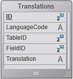

<!--REF #_command_.SET TABLE TITLES.Syntax-->**SET TABLE TITLES** {( *tableTitles* ; *tableNumbers* {; *})}<!-- END REF-->
<!--REF #_command_.SET TABLE TITLES.Params-->
| Parameter | Type |  | Description |
| --- | --- | --- | --- |
| tableTitles | Text array | &#8594;  | Table names as they must appear in dialog boxes |
| tableNumbers | Array integer | &#8594;  | Actual table numbers |
| * | Operator | &#8594;  | Use the custom names in the formula editor |

<!-- END REF-->

#### Description 

<!--REF #_command_.SET TABLE TITLES.Summary-->**SET TABLE TITLES** lets you mask, rename, and reorder the tables of your database that appear in standard 4D dialog boxes within the Application environment (i.e. when the startup mode is **Application**, or after you select **Test application** in the **Run** menu).<!-- END REF--> For example, this command can modify the display of tables in the Query editor in Application mode.

Using this command, you can also rename the table labels in your forms on the fly, if you used dynamic names. For more information about inserting dynamic field and table names in forms, refer to *Using references in static text* in the *4D Design Reference* manual.

The *tableTitles* and *tableNumbers* arrays must be synchronized. In the *tableTitles* array, you pass the names of the tables as you would like them to appear. If you do not want to show a particular table, do not include its name or new title in the array. The tables appear in the order you specify in this array. In each element of the *tableNumbers* array, you pass the actual table number corresponding to the table name or new title passed in the same element number in the *tableTitles* array.

For example, you have a database composed of the tables A, B, and C, created in that order. You want these tables to appear as X, Y, and Z. In addition you do not want to show table B. Finally, you want to show Z and X, in that order. To do so, you pass Z and X in a two-element *tableTitles* array, and you pass 3 and 1 in a two-element *tableNumbers* array.

The optional *\** parameter indicates whether or not custom names ("virtual" structures) defined using this command can be used in 4D formulas. By default, when this parameter is omitted, formulas executed in 4D cannot use these custom names; it is necessary to use the real table names. You need to pass this parameter if you want to control information provided to users and ensure interface consistency wherever formulas or expressions are used, i.e.:

* if your application provides access to the formula editor (for example via the Quick report editor),
* if your application displays expression references, such as in 4D Write Pro documents.

**Note:** When the *\** parameter is passed, the names defined by this command are used in the formulas executed by 4D. **Be careful in this case**, the custom names must not contain characters that are “forbidden” by the 4D language interpreter, like -?\*%! For example, the name "Rate\_in\_%" could not be used in a formula (for more information, refer to the *Identifiers* section).

**SET TABLE TITLES** does NOT change the actual structure of your database. It is designed to affect subsequent uses of the standard 4D editors and forms using dynamic names when they are used in Application environment. The scope of the **SET TABLE TITLES** command is the worksession. One benefit in Client/Server is that several 4D Client stations can simultaneously “see” your database in different ways. You can call **SET TABLE TITLES** as many times as you want.

Use the **SET TABLE TITLES** command for:

* Dynamically localizing a database.
* Showing tables the way you want, independent from the actual definition of your database.
* Showing tables in a way that depends on the identity or custom privileges of a user.

**WARNING:**

* **SET TABLE TITLES** does NOT override the Invisible property of a table. When a table is set to be invisible at the structure level of your database, even though it is included in a call to **SET TABLE TITLES**, it will not appear in Application mode.
* Plug-ins always access the "virtual" structure as specified by this command.

Executing **SET TABLE TITLES** without any parameters will reset the whole database virtual structure for the session (custom table and field names).

#### Example 1 

You are building a 4D application that you plan to sell internationally. Therefore, you must carefully consider localization issues. Regarding the standard 4D dialog boxes that can appear in the Application environment and your forms that use dynamic names, you can address localization needs by using a \[Translations\] table and a few project methods to create and use fields localized for any number of countries.  
  
In your database, add the following table:  



 Then, create the TRANSLATE TABLES AND FIELDS project method listed below. This method browses the actual structure of your database and creates all the necessary *\[Translations\]* records for the localization corresponding to the language passed as parameter.  

```4d
  //TRANSLATE TABLES AND FIELDS project method
  //TRANSLATE TABLES AND FIELDS (Text)
  //TRANSLATE TABLES AND FIELDS (LanguageCode)
 
 var $1 : Text //language code
 var $vlTable;$vlField : Integer
 var $Language : Text
 $Language:=$1
 
 For($vlTable;1;Last table number) //Pass through each table
    If($vlTable#(Table(->[Translations]))) //Do not translate table of translations
  //Check if there is a translation of the table name for the specified language
       QUERY([Translations];[Translations]LanguageCode=$Language;*) //desired language
       QUERY([Translations];&;[Translations]TableID=$vlTable;*) //table number
       QUERY([Translations];&;[Translations]FieldID=0) //field number = 0 means that it is a table name
       If(Is table number valid($vlTable)) //check that the table still exists
          If(Records in selection([Translations])=0)
  //Otherwise, create the record
             CREATE RECORD([Translations])
             [Translations]LanguageCode:=$Language
             [Translations]TableID:=$vlTable
             [Translations]FieldID:=0
  //The name of the translated table will need to be entered
             [Translations]Translation:=Table name($vlTable)+" in "+$Language
             SAVE RECORD([Translations])
          End if
 
          For($vlField;1;Last field number($vlTable))
  //Check if there is a translation of the field name for the specified language
             QUERY([Translations];[Translations]LanguageCode=$Language;*) //desired language
             QUERY([Translations];&;[Translations]TableID=$vlTable;*) //table number
             QUERY([Translations];&;[Translations]FieldID=$vlField) //field number
             If(Is field number valid($vlTable;$vlField))
                If(Records in selection([Translations])=0)
  //Otherwise, create the record
                   CREATE RECORD([Translations])
                   [Translations]LanguageCode:=$Language
                   [Translations]TableID:=$vlTable
                   [Translations]FieldID:=$vlField
  //The name of the translated field will need to be entered
                   [Translations]Translation:=Field name($vlTable;$vlField)+" in "+$Language
                   SAVE RECORD([Translations])
                End if
             Else
                If(Records in selection([Translations])#0)
  //If the field no longer exists, remove the translation
                   DELETE RECORD([Translations])
                End if
             End if
          End for
       Else
          If(Records in selection([Translations])#0)
  //If the table no longer exists, remove the translation
             DELETE RECORD([Translations])
          End if
       End if
    End if
 End for
```
  
  
At this point, if you execute the following line, you create as many records as needed for a Spanish localization of the tables and fields titles.  

```4d
 TRANSLATE TABLES AND FIELDS("Spanish")
```
  
  
After this call has been executed, you can then enter the *\[Translations\]Translated Name* for each of the newly created records.  
  
Finally, each time you want to show your database’s standard 4D dialog boxes or forms with dynamic titles using the Spanish localization, you execute the following line:  

```4d
 LOCALIZED TABLES AND FIELDS("Spanish")
```

with the project method LOCALIZED TABLES AND FIELDS:

```4d
  //LOCALIZED TABLES AND FIELDS global method
  //LOCALIZED TABLES AND FIELDS (Text)
  //LOCALIZED TABLES AND FIELDS (LanguageCode)
 
 var $1 : Text //Language code
 var $vlTable;$vlField : Integer
 var $Language : Text
 var $vlTableNum;$vlFieldNum : Integer
 $Language:=$1
 
  //Updating table names
 ARRAY TEXT($asNames;0) //Initialize arrays for SET TABLE TITLES and SET FIELD TITLES
 ARRAY INTEGER($aiNumbers;0)
 QUERY([Translations];[Translations]LanguageCode=$Language;*)
 QUERY([Translations];&;[Translations]FieldID=0) //thus table names
 SELECTION TO ARRAY([Translations]Translation;$asNames;[Translations]TableID;$aiNumbers)
 SET TABLE TITLES($asNames;$aiNumbers)
 
  //Updating field names
 $vlTableNum:=Last table number //Get number of tables in database
 For($vlTable;1;$vlTableNum) //Pass through each table
    If(Is table number valid($vlTable))
       QUERY([Translations];[Translations]LanguageCode=$Language;*)
       QUERY([Translations];&;[Translations]TableID=$vlTable;*)
       QUERY([Translations];&;[Translations]FieldID#0) //avoid the zero that serves as table name
       SELECTION TO ARRAY([Translations]Translation;$asNames;[Translations]FieldID;$aiNumbers)
       SET FIELD TITLES(Table($vlTable)->;$asNames;$aiNumbers)
    End if
 End for
```
  
  
Note that new localizations can be added to the database without modifying or recompiling the code.

#### Example 2 

You want to remove all defined custom field and table names:

```4d
 SET TABLE TITLES //remove all custom names
```

#### See also 

[Last table number](last-table-number.md)  
[GET TABLE TITLES](get-table-titles.md)  
[Parse formula](parse-formula.md)  
[SET FIELD TITLES](set-field-titles.md)  
[Table name](table-name.md)  

#### Properties
|  |  |
| --- | --- |
| Command number | 601 |
| Thread safe | &check; |
| Forbidden on the server ||


