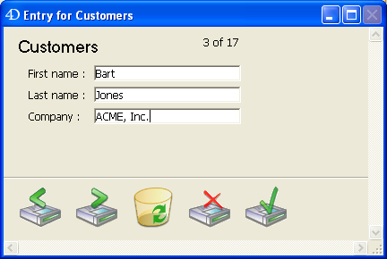
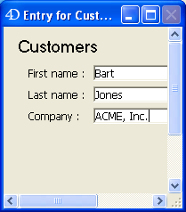

<!--REF #_command_.SET WINDOW RECT.Syntax-->**SET WINDOW RECT** ( *left* ; *top* ; *right* ; *bottom* {; *window*}{; *} )<!-- END REF-->
<!--REF #_command_.SET WINDOW RECT.Params-->
| Parameter | Type |  | Description |
| --- | --- | --- | --- |
| left | Integer | &#8594;  | Global left coordinate of window's contents area |
| top | Integer | &#8594;  | Global top coordinate of window's contents area |
| right | Integer | &#8594;  | Global right coordinate of window's contents area |
| bottom | Integer | &#8594;  | Global bottom coordinate of window's contents area |
| window | Integer | &#8594;  | Window reference number, or Frontmost window of current process, if omitted |
| * | Operator | &#8594;  | If omitted (default) = change window to foreground<br/>If passed = do not change the level of the window |

<!-- END REF-->

#### Description 

<!--REF #_command_.SET WINDOW RECT.Summary-->The SET WINDOW RECT command changes the global coordinates of the window whose reference number is passed in *window*.<!-- END REF--> If the window does not exist, the command does nothing.

If you omit the *window* parameter, SET WINDOW RECT applies to the frontmost window for the current process.

This command can resize and move the window, depending on the new coordinates passed.

The coordinates must be expressed relative to the top left corner of the contents area of the application window (Windows MDI mode) or to the main screen (macOS and Windows SDI mode). The coordinates indicate the rectangle corresponding to the contents area of the window (excluding title bars and borders).

**Warning:** Be aware that by using this command, you may move a window beyond the limits of the main window (on Windows) or of the screens (on Macintosh). To prevent this, use commands such as [Screen width](screen-width.md) and [Screen height](screen-height.md) to double-check the new coordinates of the window.

By default, executing this command automatically moves the window designated by the *window* parameter to the foreground (if this parameter is used). You can disable this by passing the *\** as the last parameter. In this case, the command no longer changes the original level ("z" coordinate) of the window.

This command does not affect form objects. If the window contains a form, the form objects are not moved or resized by the command (regardless of their properties). Only the window is modified. In order to modify a form window while taking the resizing properties and the objects it contains into account, you must use the [RESIZE FORM WINDOW](resize-form-window.md) command.

#### Example 1 

See example for the [WINDOW LIST](window-list.md) command.

#### Example 2 

Given the following window:



After execution of the following line:

```4d
 SET WINDOW RECT(100;100;300;300)
```

The window appears as follows:



#### See also 

[CONVERT COORDINATES](convert-coordinates.md)  
[DRAG WINDOW](drag-window.md)  
[GET WINDOW RECT](get-window-rect.md)  
[RESIZE FORM WINDOW](resize-form-window.md)  

#### Properties
|  |  |
| --- | --- |
| Command number | 444 |
| Thread safe | &check; |
| Forbidden on the server ||


