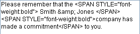

<!--REF #_command_.ST SET PLAIN TEXT.Syntax-->**ST SET PLAIN TEXT** ( {* ;} *object* ; *newText* {; *startSel* {; *endSel*}} )<!-- END REF-->
<!--REF #_command_.ST SET PLAIN TEXT.Params-->
| Parameter | Type |  | Description |
| --- | --- | --- | --- |
| * | Operator | &#8594;  | If specified, object is an object name (string) <br/>If omitted, object is a variable or a field |
| object | any | &#8594;  | Object name (if * is specified) or <br/>Variable or field (if * is omitted) |
| newText | Text | &#8594;  | Text to insert |
| startSel | Integer | &#8594;  | Start of selection |
| endSel | Integer | &#8594;  | End of selection |

<!-- END REF-->

#### Description 

<!--REF #_command_.ST SET PLAIN TEXT.Summary-->The ST SET PLAIN TEXT command inserts the text passed in the *newText* parameter into the styled text field or variable designated by the *object* parameter.<!-- END REF--> This command only applies to the plain text of the*object* parameter, without modifying any style tags that it contains. 

Unlike the [ST SET TEXT](st-set-text.md) command, ST SET PLAIN TEXT only inserts plain text. You must not pass text with style tags in *newText*. If it contains the <, > or & characters, they are considered as standard characters and converted into HTML entities:

* '&' is converted to &amp;
* '<' is converted to &lt;
* '>' is converted to &gt;

##### 

If you pass the optional *\** parameter, this indicates that the *object* parameter is an object name (string). During execution, when the object has the focus, the command only applies to the object being edited and not to its data source (field or variable). The changes are only transferred to the source (and to any other objects using this same source) when the object being edited is validated either by losing the focus or with the **Enter** key. When the object does not have the focus, the command applies directly to the data source and the changes are immediately transferred to any other objects using the same source.   
If you omit the *\** parameter, this indicates that the *object* parameter is a field or variable and you pass a field or variable reference instead of a string. The command applies directly to the field or variable and changes are immediately transferred to all the objects using this source, including the object with the focus. 

##### 

In *newText*, pass the plain text to be inserted. 

The optional *startSel* and *endSel* parameters let you designate a selection of text in *object*. The *startSel* and *endSel* values give a selection of plain text, without taking any style tags found in the text into account. The action of the command varies according to the optional *startSel* and *endSel* parameters:

* If you omit *startSel* and *endSel*, ST SET PLAIN TEXT replaces all the text of the *object* by *newText*,
* If you only pass *startSel* or if the values of *startSel* and *endSel* are equal, ST SET PLAIN TEXT inserts the *newText* text into *object* beginning at *startSel*,
* If you pass both *startSel* and *endSel*, ST SET PLAIN TEXT replaces the plain text set by these limits with the *newText* text.
* You can pass 0 in *endSel* to designate automatically the last character of the text (pass 1 in *startSel* to designate the first character of the text).

4D provides predefined constants that you can use to automatically designate the limits of the selection in the *startSel* and *endSel* parameters. These constants are available in the "*Multistyle Text*" theme: 

| Constant           | Type    | Value  | Comment                                                             |
| ------------------ | ------- | ------ | ------------------------------------------------------------------- |
| ST End highlight   | Integer | \-1001 | Designates last character of current text selection in object (\*)  |
| ST End text        | Integer | 0      | Designates last character of text contained in object               |
| ST Start highlight | Integer | \-1000 | Designates first character of current text selection in object (\*) |
| ST Start text      | Integer | 1      | Designates first character of text contained in object              |

(\*) You must pass an object name in *object* to be able to use this constant. If you pass a field or variable reference, the command is applied to all the text of the object.

The style of the first character replaced will be used for all of the *newText* text. 

If *startSel* is greater than *endSel* (except when *endSel* value is 0, see above), the text is not modified and the OK variable is set to 0.

#### Example 

Given the following rich text (multi-style) variable:


You want to insert company names that are stored in a text field. These names can contain, for example, the "&" character. In this case, you will need to use the [ST SET PLAIN TEXT](st-set-plain-text.md) command:

```4d
 ST SET PLAIN TEXT(myStyledText;[Company]Name;33;34)
```

Here is the result:


Here is the plain text contained in the variable:



You can see that the inserted text was enclosed within an additional pair of style tags. These tags correspond to the style of the characters before they were inserted. This mechanism is a way of guaranteeing the correct display of rich text fields in all cases. 

**Note:** If you had used the [ST SET TEXT](st-set-text.md) command in this case, 4D would not have inserted anything because the presence of the non-encoded "&" character would prevent the interpretation of the style tags found in the variable. For more information, refer to the description of this command. 

#### System variables and sets 

After this command is executed, the OK variable is set to 1 if no error occurred; otherwise, it is set to 0\. This is the case more particularly when style tags are not evaluated properly (incorrect or missing tags).   

In the case of an error, the variable is not changed. When an error occurs on a variable when text is being evaluated, 4D transforms the text into plain text; as a result, the <, > and & characters are converted into HTML entities.

#### See also 

[ST Get plain text](st-get-plain-text.md)  
[ST SET TEXT](st-set-text.md)  

#### Properties
|  |  |
| --- | --- |
| Command number | 1136 |
| Thread safe | &check; |
| Modifies variables | OK |
| Forbidden on the server ||


