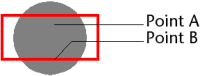

<!--REF #_command_.SVG Find element ID by coordinates.Syntax-->**SVG Find element ID by coordinates** ( {* ;} *pictureObject* ; *x* ; *y* ) : Text<!-- END REF-->
<!--REF #_command_.SVG Find element ID by coordinates.Params-->
| Parameter | Type |  | Description |
| --- | --- | --- | --- |
| * | Operator | &#8594;  | If specified, pictureObject is an object name (string) If omitted, pictureObject is a field or variable |
| pictureObject | Picture | &#8594;  | Object name (if * specified) or Field or Variable (if * omitted) |
| x | Integer | &#8594;  | X coordinate in pixels |
| y | Integer | &#8594;  | Y coordinate in pixels |
| Function result | Text | &#8592; | ID of element found at the location X, Y |

<!-- END REF-->

*This command is not thread-safe, it cannot be used in preemptive code.*

#### Description 

<!--REF #_command_.SVG Find element ID by coordinates.Summary-->The **SVG Find element ID by coordinates** command returns the ID ("id" or "xml:id" attribute) of the XML element found at the location set by the coordinates (x,y) in the SVG picture designated by the *pictureObject* parameter.<!-- END REF--> This command can be used more particularly to create interactive graphic interfaces using SVG objects.

**Note:** For more information about the SVG format, refer to the *Overview of XML Utilities Commands* section. 

If you pass the optional *\** parameter, you indicate that the *pictureObject* parameter is an object name (string). If you do not pass this parameter, you indicate that the *pictureObject* parameter is a field or variable. In this case, you do not pass a string but a field or variable reference (field or variable object only). 

Note that it is not mandatory for the picture to be displayed in a form. In this case, the "object name" type syntax is not valid and you must pass a field or variable name.

The coordinates passed in the *x* and *y* parameters must be expressed in pixels relative to the top left corner of the picture (0,0). In the context of a picture displayed in a form, you can use the values returned by the MouseX and MouseY system variables. These variables are updated in the On Clicked, On Double Clicked and On Mouse Up form events, as well as in the On Mouse Enter and On Mouse Move form events. 

**Note:** In the picture coordinate system, MouseX and MouseY always specify the same point of the picture, regardless of the picture display format (except in the case of the "Replicated" format), even when the picture has been scrolled or zoomed.

The point taken into account is the first point reached. For example, in the case below, the command will return the ID of the circle if the coordinates of point A are passed and that of the rectangle if the coordinates of point B are passed:

When the coordinates correspond to superimposed or composite objects, the command returns the ID of the first object having a valid ID attribute by going back, if necessary, among the parent elements.

The command returns an empty string if:

* the root is reached without an "id" attribute having been found,
* the coordinates point does not belong to any object,
* the "id" attribute is an empty string.

**Note:** This command cannot detect objects whose opacity value ("fill-opacity" attribute) is less than 0.01\. 

#### System variables and sets 

If *pictureObject* does not contain a valid SVG picture, the command returns an empty string and the OK system variable is set to 0\. Otherwise, if the command has been executed correctly, the OK system variable is set to 1\. 

#### See also 

[SVG Find element IDs by rect](svg-find-element-ids-by-rect.md)  