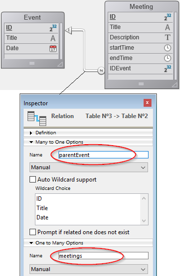

<!--REF #_command_.This.Syntax-->**This** : Object<!-- END REF-->
<!--REF #_command_.This.Params-->
| Parameter | Type |  | Description |
| --- | --- | --- | --- |
| Function result | Object | &#8592; | Current element or object |

<!-- END REF-->

#### Description 

The `This` command <!--REF #_command_.This.Summary-->returns a reference to the currently processed object.<!-- END REF-->

In most cases, the value of `This` is determined by how a function is called. It can't be set by assignment during execution, and it may be different each time the function is called.

This command can be used in different contexts, described below. Within these contexts, you will access object/collection element properties or entity attributes through **This.<*propertyPath*\>**. For example, *This.name* or *This.employer.lastName* are valid pathes to object, element or entity properties. 

In any other context, the command returns **Null**.

#### Class function

When a [class constructor](#class-constructor) function is used (with the [`new()`](API/ClassClass.md#new) function), its `This` is bound to the new object being constructed.

```4d
//Class: ob

Class Constructor  

 // Create properties on This as
 // desired by assigning to them

 This.a:=42
```

```4d
// in a 4D method  
$o:=cs.ob.new()
$val:=$o.a //42
```


> When calling the superclass constructor in a constructor using the [Super](#super) keyword, keep in mind that `This` must not be called before the superclass constructor, otherwise an error is generated. See [this example](super.md#example-1).

In any cases, `This` refers to the object the method was called on, as if the method were on the object.

```4d
//Class: ob

Function f() : Integer
 return This.a+This.b
```

Then you can write in a project method:

```4d
$o:=cs.ob.new()
$o.a:=5
$o.b:=3
$val:=$o.f() //8

```

In this example, the object assigned to the variable $o doesn't have its own *f* property, it inherits it from its class. Since *f* is called as a method of $o, its `This` refers to $o.


#### Formula object

In the context of the execution of a formula object created by the [Formula](formula.md) or [Formula from string](formula-from-string.md) commands, `This` returns a reference to the object currently processed by the formula.

For example, you want to use a project method as a formula encapsulated in an object:

```4d
 var $person : Object := New object
 $person.firstName:="John"
 $person.lastName:="Smith"
 $person.greeting:=Formula(Greeting)
 $g:=$person.greeting("hello") // returns "hello John Smith"
 $g:=$person.greeting("hi") // returns "hi John Smith"
```

With the *Greeting* project method:

```4d
 #DECLARE($greeting : Text) : Text
 return $greeting+" "+This.firstName+" "+This.lastName
```

#### List box

In the context of a list box associated to a collection or an entity selection, during the [`On Display Detail`](../Events/onDisplayDetail.md) or the [`On Data Change`](../Events/onDataChange.md) events, `This` returns a reference to the collection element or entity accessed by the list box to display the current row.  

:::note

If you use a collection of scalar values in a list box, 4D creates an object for each element with a single **value** property. Thus, the element value is returned by the **This.value** non-assignable expression.

::: 


#### Example 1 

A collection of objects, each with this structure:

```json
{  
"ID": 1234
"name": "Xavier",  
"revenues": 47300,  
"employees": [  
             "Allan",  
             "Bob", 
             "Charlie"  
            ] 
},{  
"ID": 2563
"name": "Carla",  
"revenues": 55000,  
"isFemale": true
"employees": [  
             "Igor",  
             "Jane"  
            ] 
},...
 
```

In the list box, each column refers to one of the properties of the object, either directly (This.name), indirectly (This.employees.length), or through an expression (*getPicture*) in which can be used directly. The list box looks like:


The *GetPicture* project method is automatically executed during the **On display detail** event:

```4d
  //GetPicture Method
 #DECLARE -> $genderPict : Picture
 If(This.isFemale)
    $genderPict:=Form.genericFemaleImage
 Else
    $genderPict:=Form.genericMaleImage
 End if
```

Once the form is executed, you can see the result:


#### Example 2 

You want to display entities from the following structure in a list box:



You build a list box of the "Collection or entity selection" type with the following definition:


Note that:

* *This.ID*, *This.Title* and *This.Date* directly refers to the corresponding attributes in the ds.Event dataclass.
* *This.meetings* is a related attribute (based upon the One To Many relation name) that returns an entity selection of the ds.Meeting dataclass.
* **Form.eventList** is the entity selection that is attached to the list box. The initialization code can be put in the on load form event:  

```4d  
 Case of  
    :(Form event code=On Load)  
       Form.eventList:=ds.Event.all() //returns an entity selection with all entities  
 End case  
```

Once the form is executed, the list box is automatically filled with the entity selection:


#### See also 

[Self](../commands-legacy/self.md)  
[Super](super.md)  