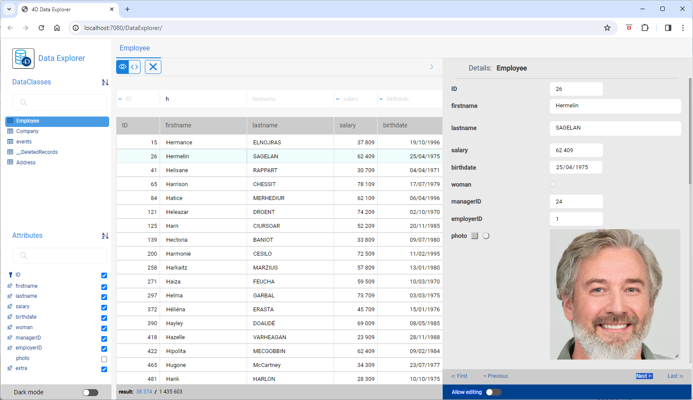
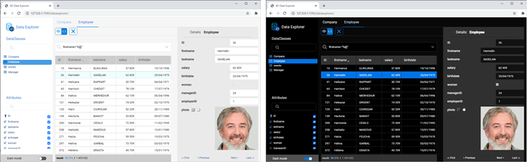
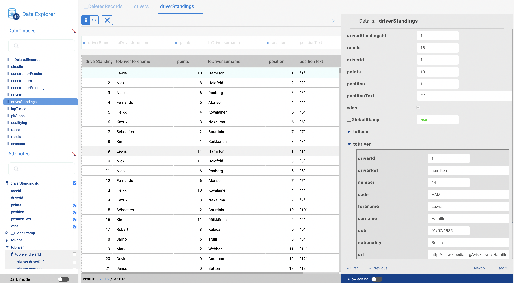
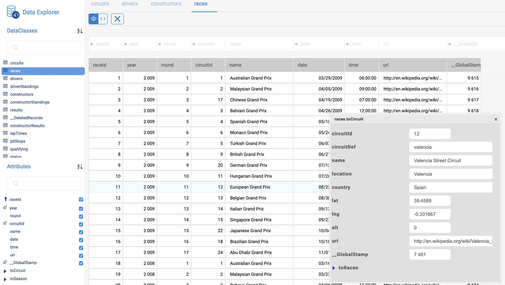
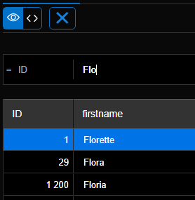
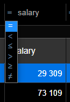
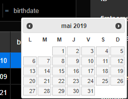

The Data Explorer provides a web interface to view, query, and edit data in your project datastore. Using this tool, you can easily browse among all your entities and search, order, or filter attribute values. It helps you quickly identifying issues at any step of the development process, as well as controlling and editing data.



## Access Configuration

The Data Explorer relies on the [`WebAdmin`](webAdmin.md) web server component for the configuration and authentication settings.

- **configuration**: the Data Explorer configuration reuses the [`WebAdmin` web server settings](webAdmin.md#webadmin-settings),
- **authentication**: access to the Data Explorer is granted when the [session user is authenticated](webAdmin.md#authentication-and-session) and has the "WebAdmin" privilege. When the Data Explorer is accessed through the **Data Explorer** menu item (see below), an automatic authentication is provided.

> The Data Explorer access can be disabled using the [`.setAdminProtection()`](API/DataStoreClass.md#setadminprotection) function.

## Opening the Data Explorer

[The `WebAdmin` web server](webAdmin.md#starting-the-webadmin-web-server) is started automatically if necessary when the Data Explorer is clicked on.

To connect to the Data Explorer web page:

- From a 4D application (with interface):
  - To open a new 4D window with the Data Explorer page displayed in a web area, select **Data Explorer** in the **Records** menu or click on the **Data** button in the main toolbar. 
  - To open the Data Explorer in an external browser tab, select **Data Explorer In Browser** in the **Records** menu or press the **Alt** key (Windows)/**Option** key (macOS) and click on the **Data** button in the main toolbar.
- From 4D Server, select **Data Explorer In Browser** in the **Window** menu (the Data Explorer can only be opened on an external browser).

- Whether you use a headless 4D application or not, you can open your web browser and enter the following address:

 `IPaddress:HTTPPort/dataexplorer`
or
 `IPaddress:HTTPSPort/dataexplorer`

 In this context, you will be prompted to enter the [access key](webAdmin.md#access-key) to open a `WebAdmin` session on the server:


> [HTTPPort](webAdmin.md#http-port) and [HTTPSPort](webAdmin.md#https-port) values are configured in the `WebAdmin` settings.


## Requirements

The Data Explorer supports the following web browsers:

- Chrome
- Safari
- Edge
- FireFox

The minimum resolution to use the Data Explorer is 1280x720. Recommended resolution is 1920x1080.


## Browsing Data

In addition to a comprehensive and customizable view of your data, the Data Explorer allows you to query and order your data.


### Basics

The Data Explorer provides an overall access to the ORDA data model with respect to the [ORDA mapping rules](ORDA/dsMapping.md#general-rules).

:::info

When the ORDA model or data is modified on the database side (table added, record edited or deleted, etc.), you just need to refresh the Data Explorer page in the browser (using the F5 key, for example).

:::

You can switch to the **dark mode** display theme using the selector at the bottom of the page:




The page contains several areas:

- On the left side are the **Dataclasses area** and **Attributes area**, allowing you can select the dataclasses and attributes to display. Attributes are ordered according to the underlying structure creation order. Primary key and indexed attributes have a specific icon. You can filter the list of proposed dataclass names and attribute names using the respective search areas.


- The central part contains the **Search area** and the **Data grid** (list of entities of the selected dataclass). Each column of the grid represents a datastore attribute.
  - By default, all entities are displayed. You can filter the displayed entities using the search area. Two query modes are available: [Query on attributes](#query-on-attributes) (selected by default), and the [Advanced query with expression](#advanced-query-with-expression). You select the query mode by clicking on the corresponding button (the **X** button allows you to reset the query area and thus stop filtering):

  - The name of the selected dataclass is added as a tab above the data grid. Using these tabs, you can switch between dataclasses that have been already selected. You can remove a referenced dataclass by clicking the "remove" icon at the right of the dataclass name.
  - You can reduce the number of columns by unchecking attributes in the left side. You can also switch the columns in the data grid using drag and drop. You can click on a column header to [sort entities](#ordering-entities) according to its values (when possible).
  - If an operation requires a long time, a progress bar is displayed. You can stop the running operation at any moment by clicking on the red button:<br/>


- On the right side is the **Details area**: it displays the attribute values of the currently selected entity as well as **related data**, if any. You can browse between the entities of the dataclass by clicking the **First** / **Previous** / **Next** / **Last** links at the bottom of the area.
  - All attribute types are displayed, including pictures, objects (expressed in json) as well as [computed](../ORDA/ordaClasses.md#computed-attributes-1) and [alias](../ORDA/ordaClasses.md#alias-attributes-1) attributes.
  - Related data (many-to-one and one-to-many relations) can be displayed through expandable/collapsable areas:<br/>

  - **Ctrl+Click** (Windows) or **Command+Click** (macOS) on a related attribute name in the right side area displays the values of the attribute in an independant, floating area:<br/>



### Ordering entities

You can reorder the displayed entity list according to attribute values. All types of attributes can be used for a sort, except picture and object.

- Click on a column header to order entities according to the corresponding attribute values. By default, the sort is ascending. Click twice for a descending sort. A column used to sort entities is displayed with a small icon and its name is in *italics*.


- You can sort attributes on several levels. For example, you can sort employees by city and then by salary. To do that, hold down the **Shift** key and click sequentially on each column header to include in the sort order.

### Query on attributes

In this mode, you can filter entities by entering values to find (or to exclude) in the areas above the attribute list. You can filter on one or several attributes. The entity list is automatically updated when you type in.



If you enter several attributes, a AND is automatically applied. For example, the following filter displays entities with *firstname* attribute starting with "flo" AND *salary* attribute value > 50000:


The **X** button allows you to remove entered attributes and thus stop filtering.

Different operators and query options are available, depending on the data type of the attribute.

> You cannot filter on picture or object attributes.

#### Numeric operators

With numeric, date, and time attributes, the "=" operator is selected by default. However, you can select another operator from the operator list (click on the "=" icon to display the list):



#### Dates

With date attributes, you can enter the date to use through a datepicker widget (click on the date area to display the calendar):



#### Booleans

When you click on a boolean attribute area, you can filter on **true**/**false** values but also on **null**/**not null** values:


- **null** indicates that the attribute value was not defined
- **not null** indicates that the attribute value is defined (thus true or false).

#### Text

Text filters are not diacritic (a = A).

The filter is of the "starts with" type. For example, entering "Jim" will show "Jim" and "Jimmy" values.

You can also use the wildcard character (@) to replace one or more starting characters. For example:

|A filter with|Finds|
|---|---|
|Bel|All values beginning with “Bel”|
|@do|All values containing “do”|
|Bel@do|All values starting with “Bel” and containing “do”|

If you want to create more specific queries, such as "is exactly", you may need to use the advanced queries feature.

### Advanced queries with expression

When you select this option, a query area is displayed above the entity list, allowing you to enter any expression to use to filter the contents:


You can enter advanced queries that are not available as attribute queries. For example, if you want to find entities with *firstname* attribute containing "Jim" but not "Jimmy", you can write:

```
firstname=="Jim"
```

You can use any ORDA query expression as [documented with the `query()` function](API/DataClassClass.md#query), with the following limitations or differences:

- For security, you cannot execute formulas using `eval()`.
- Placeholders cannot be used; you have to write a *queryString* with values.
- String values containing space characters must be embedded in double quotes ("").

For example, with the Employee dataclass, you can write:

```
firstname = "Marie Sophie" AND manager.lastname = "@th"
```

You can click on the `v` icon to display both [`queryPlan`](API/DataClassClass.md#queryplan) and [`queryPath`](API/DataClassClass.md#querypath). In the area, you can hover over the subquery blocks to have detailed information per subquery:


Right-click in the query area to display the previous valid queries:


## Editing Data

The Data Explorer allows you to modify attribute values, add or delete entities. These feature is intended to administrators, for example to test implementations or fix issues with invalid data.   

### Allow editing

For security reasons, to be able to edit data through the Data Explorer, you first need to enable the editing mode using the **Allow editing** selector. When enabled, edit action buttons are displayed to the right side:


This selector is enabled **per dataclass** and **per browser session**.

:::info

The selector is intended to prevent accidental modifications since no confirmation dialog boxes are displayed when editing data through the Data Explorer.  

:::

### Entering values

When the **Allow editing** selector is enabled for a dataclass, you can enter values for a new or selected entity through dedicated input widgets in the **Details** area for the selected dataclass. 
  
The following scalar attribute values can be edited:

- text
- boolean
- numeric
- date
- time
- image (you can upload or drag and drop an image)
- object (JSON string)

Blob attributes cannot be modified.  

New or modified values are stored in the local cache, you need to [save them explicitely](#saving-modifications) to store them in the data. 


### Creating entities

You can create a new, empty entity in the selected table by clicking on the creation button . You can then [enter values](#entering-values) for this entity.

The new entity is is kept in the local cache, you need to [save it explicitely](#saving-modifications) to store it in the data. 

:::info

Attribute values that need to be calculated by 4D (IDs, computed attributes) will be returned only after you saved the entity. 

:::

### Reloading values

The **reload** button  reloads the entity attribute values from the data file. This button is useful for example when you want to make sure the displayed values are the most recent saved values.   


### Saving modifications

Except for [deletion](#deleting-entities) (see below), entity modifications are done locally and need to be saved so that they are stored in the data file.

To save modifications or to save an entity you created in the Data Explorer, click on the **Save** button .

:::info

Modifications on an existing entity are automatically saved when you select another entity of the same dataclass.

:::


In case of conflict (e.g. another user has modified the same attribute value on the same entity), an error message is displayed at the bottom of the Data Explorer. You can click on the [**Reload** button](#reloading-values) to get the new value from the data and then, apply and save your modifications. 

### Deleting entities

You can delete entities by clicking on the **delete** button . 

To delete a set of entities, select two or more entities in the list area using **Shift+click** (continuous selection) or **Ctrl/Command+click** (discontinuous selection) and click on the **delete** button. 

:::note

If some entities could not be deleted because of a conflict (e.g. entities locked on the server), they are highlighted in the list. 

:::

:::caution

No confirmation dialog is displayed when you delete entities. Selected entities are immediately deleted from the data.  

:::