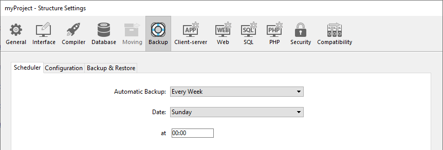
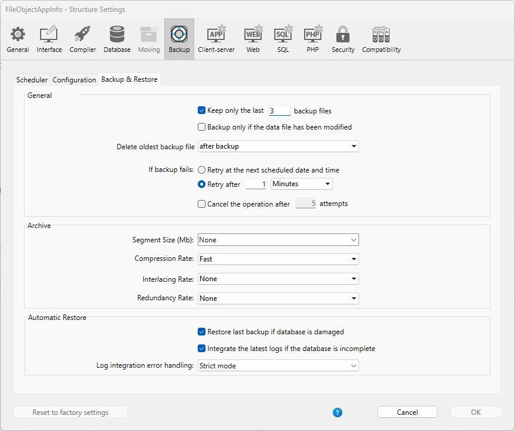

Backup settings are defined through three pages in the [Settings dialog box](../settings/overview.md). You can set:

- the scheduler for automatic backups
- the files to include in every backup
- the advanced features allowing to execute automatic tasks

> Settings defined in this dialog box are written in the *Backup.4DSettings* file, stored in the [Settings folder](Project/architecture.md#settings-folder).

## Scheduler

You can automate the backup of applications opened with 4D or 4D Server (even when no client machines are connected). This involves setting a backup frequency (in hours, days, weeks or months); for each session, 4D automatically starts a backup using the current backup settings.

If this application was not launched at the theoretical moment of the backup, the next time 4D is launched, it considers the backup as having failed and proceeds as set in the Settings (refer to [Handling backup issues](backup.md#handling-backup-issues)).

The scheduler backup settings are defined on the **Backup/Scheduler** page of the Structure Settings:

The options found on this tab let you set and configure scheduled automatic backups of the application. You can choose a standard quick configuration or you can completely customize it. Various options appear depending on the choice made in the **Automatic Backup** menu:

- **Never**: The scheduled backup feature is disabled.
- **Every Hour**: Programs an automatic backup every hour, starting with the next hour.
- **Every Day**: Programs an automatic backup every day. You can then enter the time when the backup should start.
- **Every Week**: Programs an automatic backup every week. Two additional entry areas let you indicate the day and time when the backup should start.
- **Every Month**: Programs an automatic backup every month. Two additional entry areas let you indicate the day of the month and the time when the backup should start.
- **Personalized**: Used to configure "tailormade" automatic backups. When you select this option, several additional entry areas appear:  
	+ **Every X hour(s)**: Allows programming backups on an hourly basis. You can enter a value between 1 and 24.
	- **Every X day(s) at x**: Allows programming backups on a daily basis. For example, enter 1 if you want to perform a daily backup. When this option is checked, you must enter the time when the backup should start.   
	- **Every X week(s) day at x**: Allows programming backups on a weekly basis. Enter 1 if you want to perform a weekly backup. When this option is checked, you must enter the day(s) of the week and the time when the backup should start. You can select several days of the week, if desired. For example, you can use this option to set two weekly backups: one on Wednesday and one on Friday.   
	- **Every X month(s), Xth Day at x**: Allows programming backups on a monthly basis. Enter 1 if you want to perform a monthly backup. When this option is checked, you must indicate the day of the month and the time when the backup should start.

> Switches back and forth from Standard time to Daylight saving time could temporarily affect the automatic scheduler and trigger the next backup with a one-hour time shift. This happens only once and subsequent backups are run at the expected scheduled time.

## Configuration

The Backup/Configuration page of the Structure Settings lets you set the backup files and their location, as well as that of the log file. These parameters are specific to each application opened by 4D or 4D Server.

> **4D Server:** These parameters can only be set from the 4D Server machine.

### Content  
This area allows you to set which files and/or folders to copy during the next backup.

- **Data**: Application data file. When this option is checked, the following elements are automatically backed up at the same time as the data:
	- the current log file of the application (if it exists),
	- the full `Settings` folder located [next to the data file](Project/architecture.md#settings-folder) (if it exists), i.e. the *user settings for data*.
- **Structure**: Application project folders and files. In cases where projects are compiled, this option allows you to backup the .4dz file. When this option is checked, the full `Settings` folder located [at the same level as the Project folder](Project/architecture.md#settings-folder-1), i.e. the *user settings*, is automatically backed up.
- **User Structure File (only for binary database)**: *deprecated feature*
- **Attachments**: This area allows you to specify a set of files and/or folders to be backed up at the same time as the application. These files can be of any type (documents or plug-in templates, labels, reports, pictures, etc.). You can set either individual files or folders whose contents will be fully backed up. Each attached element is listed with its full access path in the “Attachments” area.
	- **Delete**: Removes the selected file from the list of attached files.
	- **Add folder...**: Displays a dialog box that allows selecting a folder to add to the backup. In the case of a restore, the folder will be recovered with its internal structure. You can select any folder or volume connected to the machine, with the exception of the folder containing the application files.
	- **Add file...**: Displays a dialog box that allows you to select a file to add to the backup.

### Backup File Destination Folder

This area lets you view and change the location where backup files as well as log backup files (where applicable) will be stored.

To view the location of the files, click in the area in order to display their pathname as a pop-up menu.

To modify the location where these files are stored, click the **...** button. A selection dialog box appears, which allows you to select a folder or disk where the backups will be placed. The "Used Space" and "Free Space" areas are updated automatically and indicate the remaining space on the disk of the selected folder.

### Log management

The **Use Log File** option, when checked, indicates that the application uses a log file. The pathname of the log file for the current data file is specified below the option. When this option is checked, it is not possible to open the application without a log file. For more information about the log file, please refer to [log file](log.md)

By default, any project created with 4D uses a log file (option **Use Log File** checked in the **General Page** of the **Preferences**). The log file is named *data.journal* and is placed in the Data folder.

> Activating a new log file requires the data of the application to be backed up beforehand. When you check this option for the currently used data file, a warning message informs you that a backup is necessary. The creation of the log file is postponed and it will actually be created only after the next backup of the application.

## Backup & Restore

Modifying backup and restore options is optional. Their default values correspond to a standard use of the function.

### General settings

- **Keep only the last X backup files**: This parameter activates and configures the mechanism used to delete the oldest backup files, which avoids the risk of saturating the disk drive. This feature works as follows: Once the current backup is complete, 4D deletes the oldest archive if it is found in the same location as the archive being backed up and has the same name (you can request that the oldest archive be deleted before the backup in order to save space).
If, for example, the number of sets is set to 3, the first three backups create the archives MyBase-0001, MyBase-0002, and MyBase-0003 respectively. During the fourth backup, the archive MyBase-0004 is created and MyBase-0001 is deleted. By default, the mechanism for deleting sets is enabled and 4D keeps 3 backup sets.
To disable the mechanism, simply deselect the option.
>This parameter concerns both application and log file backups.

- **Backup only if the data file has been modified**: When this option is checked, 4D starts scheduled backups only if data has been added, changed or deleted since the last backup. Otherwise, the scheduled backup is cancelled and put off until the next scheduled backup. No error is generated; however the backup journal notes that the backup has been postponed. This option also allows saving machine time for the backup of applications principally used for viewing purposes. Please note that enabling this option does not take any modifications made to the project files or attached files into account.
> This parameter concerns both application and log file backups.

- **Delete oldest backup file before/after backup**: This option is only used if the "Keep only the last X backup files" option is checked. It specifies whether 4D should start by deleting the oldest archive before starting the backup (**before** option) or whether the deletion should take place once the backup is completed (**after** option). In order for this mechanism to work, the oldest archive must not have been renamed or moved.

- **If backup fails**: This option allows setting the mechanism used to handle failed backups (backup impossible). When a backup cannot be performed, 4D lets you carry out a new attempt.
	-  **Retry at the next scheduled date and time**: This option only makes sense when working with scheduled automatic backups. It amounts to cancelling the failed backup. An error is generated.
	- **Retry after X second(s), minute(s) or hour(s)**: When this option is checked, a new backup attempt is executed after the wait period. This mechanism allows anticipating certain circumstances that may block the backup. You can set a wait period in seconds, minutes or hours using the corresponding menu. If the new attempt also fails, an error is generated and the failure is noted in the status area of the last backup and in the backup journal file.
	- **Cancel the operation after X attempts**: This parameter is used to set the maximum number of failed backup attempts. If the backup has not been carried out successfully after the maximum number of attempts set has been reached, it is cancelled and the error 1401 is generated ("The maximum number of backup attempts has been reached; automatic backup is temporarily disabled"). In this case, no new automatic backup will be attempted as long as the application has not been restarted, or a manual backup has been carried out successfully.
This parameter is useful in order to avoid a case where an extended problem (requiring human intervention) that prevented a backup from being carried out would have led to the application repeatedly attempting the backup to the detriment of its overall performance. By default, this parameter is not checked.

> 4D considers a backup as failed if the application was not launched at the time when the scheduled automatic backup was set to be carried out.

### Archive
These options apply to main backup files and to log backup files.

- **Segment Size (Mb)**
4D allows you to segment archives, i.e., to cut it up into smaller sizes. This behavior allows, for example, the storing of a backup on several different disks (DVDs, usb devices, etc.). During restore, 4D will automatically merge the segments. Each segment is called MyApplication[xxxx-yyyy].4BK, where xxxx is the backup number and yyyy is the segment number. For example, the three segments of the MyApplication backup are called MyApplication[0006-0001].4BK, MyApplication[0006-0002].4BK and MyApplication[0006-0003].4BK.
The **Segment Size** menu is a combo box that allows you to set the size in MB for each segment of the backup. You can choose one of the preset sizes or enter a specific size between 0 and 2048. If you pass 0, no segmentation occurs (this is the equivalent of passing **None**).

- **Compression Rate**
By default, 4D compresses backups to help save disk space. However, the file compression phase can noticeably slow down backups when dealing with large volumes of data. The **Compression Rate** option allows you to adjust file compression:
	- **None:** No file compression is applied. The backup is faster but the archive files are considerably larger.
	- **Fast** (default): This option is a compromise between backup speed and archive size.
	- **Compact**: The maximum compression rate is applied to archives. The archive files take up the least amount of space possible on the disk, but the backup is noticeable slowed.

- **Interlacing Rate and Redundancy Rate**
4D generates archives using specific algorithms that are based on optimization (interlacing) and security (redundancy) mechanisms. You can set these mechanisms according to your needs. The menus for these options contain rates of **Low**, **Medium**, **High** and **None** (default).
	- **Interlacing Rate**: Interlacing consists of storing data in non-adjacent sectors in order to limit risks in the case of sector damage. The higher the rate, the higher the security; however, data processing will use more memory.
	- **Redundancy Rate**: Redundancy allows securing data present in a file by repeating the same information several times. The higher the redundancy rate, the better the file security; however, storage will be slower and the file size will increase accordingly.

### Automatic Restore and log integration

#### Restore last backup if database is damaged

When this option is checked, the program automatically starts the restore of the data file of the last valid backup of the application, if an anomaly is detected (corrupted file, for example) during application launch. No intervention is required on the part of the user; however, the operation is logged in the backup journal.

#### Integrate the latest logs if the database is incomplete

When this option is checked, the program automatically integrates the current log file if it contains operations that are not present in the data file. If there is a valid sequence of .journal files in the same repository, the program integrates beforehand all the .journal files needed from the oldest to the most current. This situation arises, for example, if a power outage occurs when there are operations in the data cache that have not yet been written to the disk, or after an anomaly was detected when opening the data file and a restore has occurred.

:::note

This feature implies that the program parses all the log files in the current log file folder at startup. Therefore, for performance reasons, make sure that no useless log files are stored in the folder.

:::

The user does not see any dialog box; the operation is completely automatic. The goal is to make use as easy as possible. The operation is logged in the backup journal.

> In the case of an automatic restore, only the following elements are restored:
>	- .4DD file
>	- .4DIndx file
>	- .4DSyncData file
>	- .4DSyncHeader file
>	- External Data folder
>
> If you wish to get the attached files or the project files, you must perform a [manual restore](restore.md#manually-restoring-a-backup-standard-dialog).

:::caution

If the [data file is encrypted](../MSC/encrypt.md), make sure you [saved the data encryption key](../MSC/encrypt#saving-the-encryption-key) in a `.4DKeyChain` file stored at the first level of the drive, so that 4D can access it if the automatic restore feature triggered. Otherwise, an error will be returned during the restoring sequence.

:::
